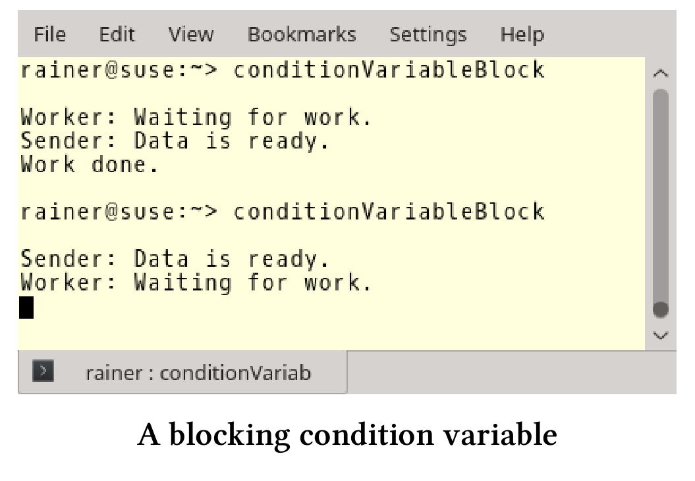
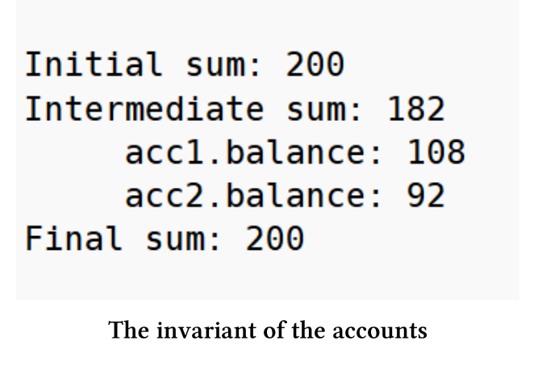
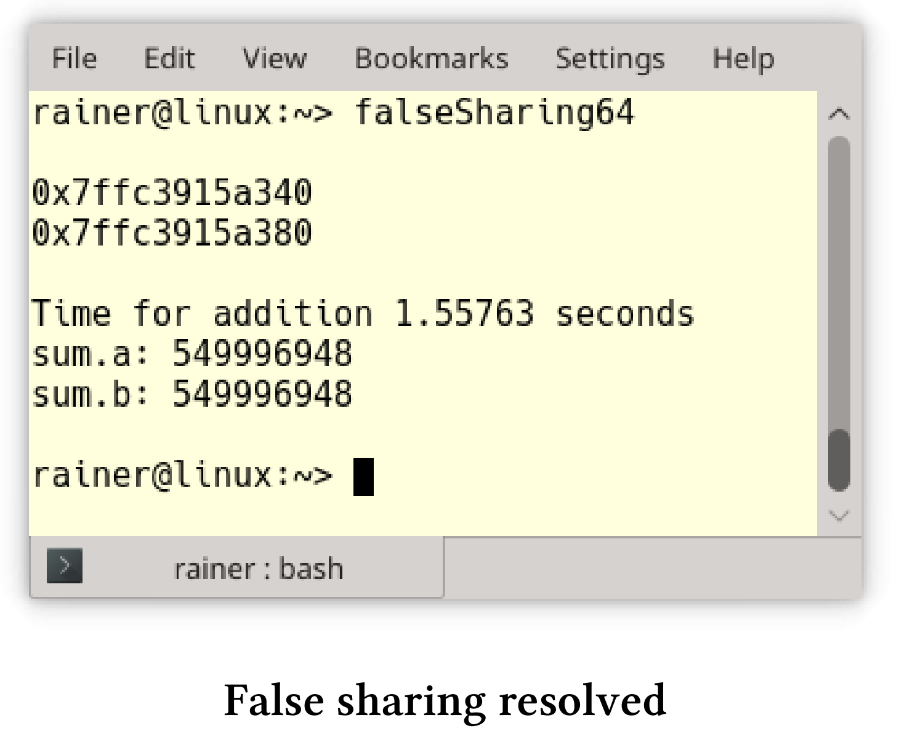
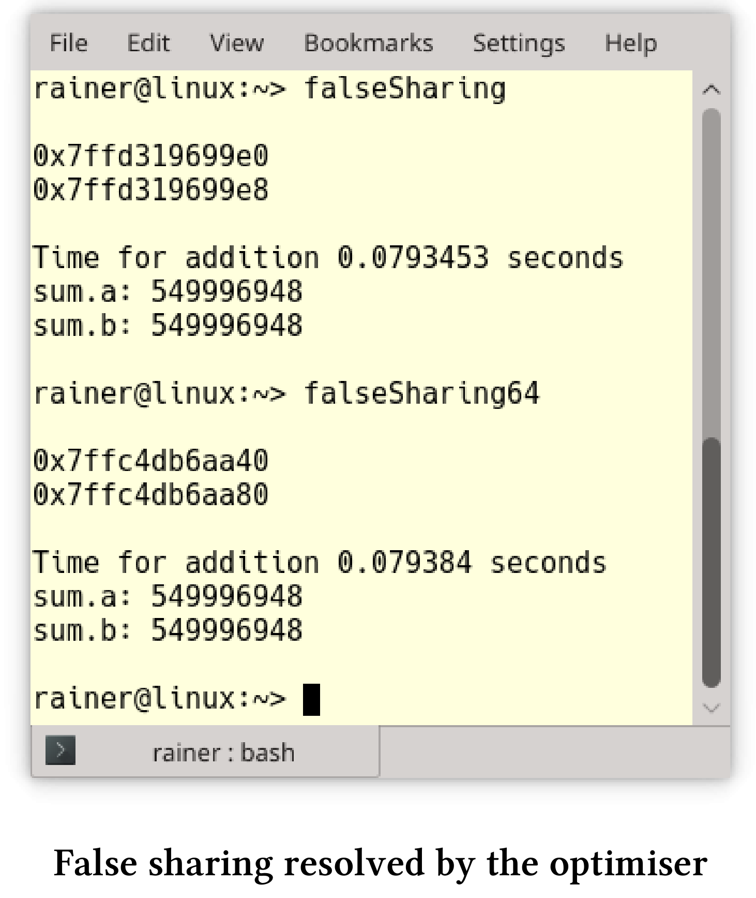
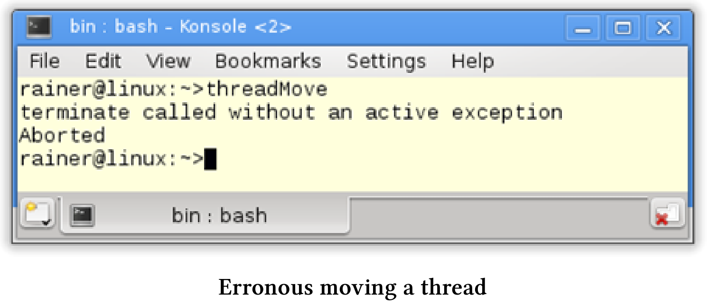
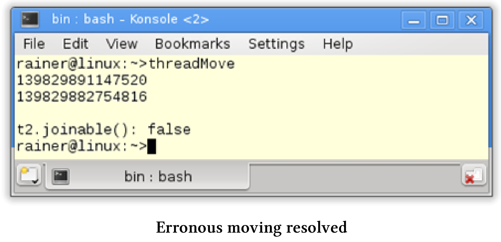

# 挑战

编写并发程序本身就很复杂，即便是使用C++11和C++14的新特性也是如此。我希望通过用一整章的篇幅来讨论并发编程的挑战，读者们可能会更清楚其中的陷阱与挑战。

## ABA问题

ABA表示读取了一个值两次，每次都返回相同的A值。因此，可以得出这样的结论：两次读取之间，相应的变量没有任何变化。然而，这忽略了一个事实，在两次读取之间，变量可能有被更新为B的时刻。

用一个简单的场景来比拟这个问题。

**一个例子**

这个场景里，你坐在车里等待交通灯变绿，绿色代表B，红色代表A。接下来会发生了什么?

1. 你看到交通灯，它是红色的(A)。
2. 因为很无聊，你开始用智能手机看新闻，而忘记了时间。
3. 你再看一次交通灯。该死！还是红色(A)。

当然，交通灯在你两次抬头看之间已经变成绿灯过。

对于线程(进程)来说，意味着什么?

1. 线程1读取值为A的变量`var`。
2. 线程1被抢占，线程2运行。
3. 线程2将变量`var`从A更改为B，再更改为A。
4. 线程1继续运行并检查变量`var`的值并得到A。因为获取到值A，线程1继续运行。

通常这不是一个问题，可以忽略。

**非关键的ABA**

```c++
// fetch_mult.cpp

#include <atomic>
#include <iostream>

template <typename T>
T fetch_mult(std::atomic<T>& shared, T mult) {
  T oldValue = shared.load();
  while (!shared.compare_exchange_strong(oldValue, oldValue * mult));
  return oldValue;
}

int main() {
  std::atomic<int> myInt{ 5 };
  std::cout << myInt << std::endl;
  fetch_mult(myInt, 5);
  std::cout << myInt << std::endl;
}
```

`compare_exchange_strong`和`compare_exchange_weak`可以在`fetch_mult`(第6行)中观察到的ABA问题。`fetch_mult`将`std::atomic<t>& shared`和`mult`相乘。

关键是，读取旧值`T oldValue = shared.load()`第8行和第9行中的新值比较之间有一个小的时间窗口。因此，另一个线程可以介入，将`oldValue`从更改为另一个值，然后再返回`oldValue`。旧值是A，另一个线程修改的值是ABA中的B。

通常，当读操作处理相同的、未更改的变量，则没有什么影响。但是，在无锁并发的数据结构中，ABA可能会产生重大影响。

**无锁数据结构**

这里不会详细介绍无锁数据结构，仅用一个使用单链表实现的无锁堆栈，来进行演示，堆栈只支持两个操作：

1. pop：弹出顶部对象，并返回指向它的指针。
2. push：将指定的对象推入堆栈。

这里使用伪代码描述pop操作，以便让您了解ABA问题。pop操作执行以下步骤：

1. 获取头节点:head
2. 获取后续节点:headNext
3. 如果head仍然是堆栈的头节点，则将headNext作为新的头结点。

下面是堆栈的前两个节点:

`Stack: TOP -> head -> headNext -> ...`

让我们构造ABA问题的情景。

**构造ABA**

我们从下面的堆栈开始:

`Stack: TOP -> A -> B -> C`

线程1处于活动状态，希望弹出堆栈的头节点。

* Thread 1操作时

  head = A

  headNext = B

在线程1完成pop前，线程2开始工作。

* Thread 2 pop A

  `Stack: TOP -> B -> C`

* Thread 2 pop B 并且删除B

  `Stack: TOP -> C`

* Thread 2把A推回去

  `Stack: TOP -> A -> C`

线程1重新调度，并检查`A == head`，因为当前`A == head`，那么`headNext`应该是B，但B已经被删除了。因此，程序具有未定义行为。

用什么来拯救ABA问题呢？接下来就介绍，ABA问题的一些补救措施。

**补救措施**

ABA的概念问题很容易理解。我们的解决方案是消除节点过早的删除。以下是一些补救措施。

**标记参考状态**

可以使用地址的低位向每个节点添加标记，以表示节点成功修改的频率。尽管检查返回true，但比较和交换(CAS)的结果会失败。这个想法并不能解决问题，因为标记位可能最终会交换。支持双字CAS操作的架构，会有更大的计数器。

引用标记状态通常用于事务内存中。

接下来的三种技术是基于延迟回收的思想。

**垃圾收集**

垃圾收集只保证在不再需要时删除变量。这听起来很有希望解决ABA问题，但有一个明显的缺点。大多数垃圾收集器不是无锁的，因此，即使有一个无锁的数据结构，整个系统也不是无锁的。

**风险指针**

维基页面： [Hazard Pointers](https://en.wikipedia.org/wiki/Hazard_pointer)

风险指针系统中，每个线程都保存一个风险指针列表，指示线程当前正在访问哪些节点(许多系统中，这个“列表”可能仅限于一两个元素)。风险指针列表中的节点不能被任何其他线程修改或释放。当一个线程想要删除一个节点时，它会将其放在一个节点列表中，进行“稍后释放”，直到没有其他线程的危险列表包含该指针时，才释放该节点的内存。一个专门的垃圾收集线程可以手工进行垃圾收集(如果“稍后释放”的列表由所有线程共享)；或者，清理“被释放”列表可以由每个工作线程，作为“pop”等操作的一部分。

**RCU 读取-复制-更新**

RCU是Read Copy Update的缩写，是一种用于只读数据结构的同步技术。RCU是由Paul McKenney创建的，自2002年以来一直在Linux内核中使用。

思想很简单，就跟缩写一样。要修改数据，需要复制数据。反之，所有的读取都使用原始数据。如果没有读取操作，那么可以安全地将数据进行修改。

要了解更多关于RCU的细节，请阅读Paul McKenney的这篇文章:[What is RCU, Fundamentally?]( https://lwn.net/Articles/262464/) 

> 两个新的提案
>
> 作为并发工具包的一部分，有两个关于未来C++标准的提案。关于风险指针的提案是[P0233r0]( http://www.modernescpp.com/open-std.org/JTC1/SC22/WG21/docs/papers/2016/p0233r0.pdf)，关于RCU的提案是[P0461R0]( http://www.open-std.org/jtc1/sc22/wg21/docs/papers/2016/p0461r0.pdf) 。

## 阻塞问题

为了说明我的观点，需要将条件变量与谓词结合使用。如果不这样做，程序可能会出现未唤醒或未唤醒的情况。

如果使用没有谓词的条件变量，则通知线程可能在等待线程等待之前发送通知。因此，等待线程将永远等待。这种现象被称为“未唤醒“。

程序如下。

```c++
// conditionVariableBlock.cpp

#include <iostream>
#include <condition_variable>
#include <mutex>
#include <thread>

std::mutex mutex_;
std::condition_variable condVar;

bool dataReady;


void waitingForWork() {

  std::cout << "Worker: Waiting for work." << std::endl;

  std::unique_lock<std::mutex> lck(mutex_);
  condVar.wait(lck);
  // do the work
  std::cout << "Work done." << std::endl;

}

void setDataReady() {

  std::cout << "Sender: Data is ready." << std::endl;
  condVar.notify_one();

}

int main() {

  std::cout << std::endl;

  std::thread t1(setDataReady);
  std::thread t2(waitingForWork);

  t1.join();
  t2.join();

  std::cout << std::endl;
}
```

程序的第一次工作得很好，第二次调用锁定是因为`notify`(第28行)发生在线程`t2`(第37行)等待之前(第19行)。



当然，死锁和活锁是竞争条件的副产物。死锁通常取决于线程的交错，有时会发生，有时不会。活锁与死锁类似，当死锁阻塞时，活锁“似乎''没有阻塞程序。

## 破坏程序的不变量

程序不变量，应该在程序的整个生命周期中”保持不变的“。

恶性竞争条件破坏程序的不变量。下面程序的不变量是所有余额的总和，例子中是200欧元，因为每个账户起步都是100欧元(第9行)。

```c++
// breakingInvariant.cpp

#include <atomic>
#include <functional>
#include <iostream>
#include <thread>

struct Account {
  std::atomic<int> balance{ 100 };
};

void transferMoney(int amount, Account& from, Account& to) {
  using namespace std::chrono_literals;
  if (from.balance >= amount) {
    from.balance -= amount;
    std::this_thread::sleep_for(1ns);
    to.balance += amount;
  }
}

void printSum(Account& a1, Account& a2) {
  std::cout << (a1.balance + a2.balance) << std::endl;
}

int main() {

  std::cout << std::endl;

  Account acc1;
  Account acc2;

  std::cout << "Initial sum: ";
  printSum(acc1, acc2);

  std::thread thr1(transferMoney, 5, std::ref(acc1), std::ref(acc2));
  std::thread thr2(transferMoney, 13, std::ref(acc2), std::ref(acc1));
  std::cout << "Intermediate sum: ";
  std::thread thr3(printSum, std::ref(acc1), std::ref(acc2));

  thr1.join();
  thr2.join();
  thr3.join();

  std::cout << "  acc1.balance: " << acc1.balance << std::endl;
  std::cout << "  acc2.balance: " << acc2.balance << std::endl;

  std::cout << "Final sum: ";
  printSum(acc1, acc2);

  std::cout << std::endl;

}
```

开始时，账户的总数是200欧元。第33行，通过使用第21 - 23行中的`printSum`函数来显示金额和。第38行使不变量可见。因为第16行有`1ns`的短睡眠，所以中间的金额是182欧元。最后，每个账户的余额都是正确的(第44行和第45行)，金额是200欧元(第48行)。

下面是程序的输出。



## 数据竞争

数据竞争，是指至少两个线程同时访问一个共享变量的情况，并且至少有一个线程尝试修改该变量。

如果程序有数据竞争，则会出现未定义行为。这意味着，所有的结果都有可能，因此，关于程序的推演就没有意义了。

来看一个数据竞赛的程序。

```c++
// addMoney.cpp

#include <functional>
#include <iostream>
#include <thread>
#include <vector>

struct Account {
  int balance{ 100 };
};

void addMoney(Account& to, int amount) {
    to.balance += amount;
}

int main() {

  std::cout << std::endl;

  Account account;

  std::vector<std::thread> vecThreads(100);


  for (auto& thr : vecThreads) thr = std::thread(addMoney, std::ref(account), 50);

  for (auto& thr : vecThreads) thr.join();


  std::cout << "account.balance: " << account.balance << std::endl;

  std::cout << std::endl;

}
```

100个线程`addMoney`函数将向相同的帐户(第20行)添加50欧元(第25行)。关键的是，对账户的写入是不同步的。因此，这里有一个数据竞争，结果是无效的。这是未定义的行为，最后的余额(第30行)会在5000欧元和5100欧元之间。


## 死锁

死锁是一种状态，因为要等待它没有得到的资源的释放，所以至少有一个线程永久阻塞。

造成死锁的主要原因有两个:

1. 互斥锁未解锁。
2. 以不同的顺序锁定互斥锁。

为了避免第二个问题，在经典C++中使用了诸如[层次锁](http://collaboration.cmc.ec.gc.ca/science/rpn/biblio/ddj/Website/articles/DDJ/2008/0801/071201hs01/071201hs01.html)之类的技术。

有关死锁，以及如何用现代C++克服死锁的详细信息，请参阅互斥量和锁的章节内容。

> **多次锁定非递归互斥锁**
>
> 多次锁定非递归互斥是未定义行为。
>
> ```c++
> // lockTwice.cpp
> 
> #include <iostream>
> #include <mutex>
> 
> int main() {
> 
>   std::mutex mut;
> 
>   std::cout << std::endl;
> 
>   std::cout << "first lock call" << std::endl;
> 
>   mut.lock();
> 
>   std::cout << "second lock call" << std::endl;
> 
>   mut.lock();
> 
>   std::cout << "third lock call" << std::endl;
> }
> ```
>
> 通常，会出现死锁。
>
> 

## False Sharing伪共享

当处理器从主存中读取一个变量(如int)时，它从内存中读取的数据要大于int的大小。处理器会从缓存中读取整个高速缓存行(通常为64字节)。

如果两个线程，同时读取位于同一高速缓存行上的不同变量a和b，则会发生伪共享。虽然a和b在逻辑上是分开的，但它们在物理上是相连的。由于a和b共享同一条高速缓存线行，因此有必要在高速缓存行上进行硬件同步。结果是得到了正确的结果，但是并发的性能下降了。正是这种现象发生在下面的程序中：

```c++
// falseSharing.cpp

#include <algorithm>
#include <chrono>
#include <iostream>
#include <random>
#include <thread>
#include <vector>

constexpr long long size{ 100'000'000 };

struct Sum {
  long long a{ 0 };
  long long b{ 0 };
};

int main() {

  std::cout << std::endl;

  Sum sum;

  std::cout << &sum.a << std::endl;
  std::cout << &sum.b << std::endl;

  std::cout << std::endl;

  std::vector<int> randValues, randValues2;
  randValues.reserve(size);
  randValues2.reserve(size);

  std::mt19937 engine;
  std::uniform_int_distribution<> uniformDist(1, 10);

  int randValue;
  for (long long i = 0; i < size; ++i) {
    randValue = uniformDist(engine);
    randValues.push_back(randValue);
    randValues2.push_back(randValue);
  }

  auto sta = std::chrono::steady_clock::now();

  std::thread t1([&sum, &randValues] {
    for (auto val : randValues) sum.a += val;
    });

  std::thread t2([&sum, &randValues2] {
    for (auto val : randValues2)sum.b += val;
    });

  t1.join(), t2.join();

  std::chrono::duration<double> dur = std::chrono::steady_clock::now() - sta;
  std::cout << "Time for addition " << dur.count()
    << " seconds" << std::endl;

  std::cout << "sum.a: " << sum.a << std::endl;
  std::cout << "sum.b: " << sum.b << std::endl;

  std::cout << std::endl;
  
}
```

第13行和第14行中的变量`a`和`b`共享同个缓存行。线程`t1(`第44行)和线程`t2`同时使用两个变量，对向量`randValues`和`randValues2`中的元素进行求和。两个向量在1到10之间都有1亿个整数。程序的输出显示了一些有趣的事情，`a`和`b`在8字节边界上对齐，因为我的操作系统中的`long long int`是8字节对齐的。


如果我将`a`和`b`的对齐方式改为64字节会发生什么?64是我系统上的高速缓存行的大小。我要对结构和做的小改动，这次不用种子来生成随机数，所以每次都得到的随机数相同。

```c++
struct Sum{
  alignas(64) long long a{0};
  alignas(64) long long b{0};
};
```



现在，`a`和`b`在64字节边界处对齐，程序速度提高了6倍多。原因是`a`和`b`现在不在同一高速缓存行上。

> **用优化器检测伪共享**
>
> 如果我用最大的优化选项编译的程序，优化器会检测到伪共享并消除它。这意味着，我得到了相同的性能数据与真共享。这也适用于Windows。以下是优化后的性能数字。
>
> 


>**C++17中的`std:: hardware_destructive_interference_size`和与`std:: hardware_constructive_interference_size`**
>
>`std::hardware_destructive_interference_size`和`std::hardware_constructive_interference_size`允许您以一种可移植的方式处理高速缓存行的大小。`std::hardware_destructive_interference_size`返回两个对象之间的最小偏移量，以避免伪共享；`std::hardware_constructive_interference_size`返回相邻内存的最大大小，以满足真共享。
>
>在C++17中，Sum可以以一种平台无关的方式编写。
>
>```c++
>struct Sum{
>  alignas(std::hardware_destructive_interference_size) long long a{0};
>  alignas(std::hardware_destructive_interference_size) long long b{0};
>};
>```

## 变量的声明周期问题

些一个具有生命周期相关问题的C++示例非常容易。让创建的线程`t`在后台运行(也就是说，它通过调用`t.detach()`来分离)，并且让它只完成一半工作。这里，创建者线程不会等待子线程完成。在这种情况下，必须非常小心，最好不要在属于子线程中使用任何东西。

```c++
// lifetimeIssues.cpp

#include <iostream>
#include <string>
#include <thread>

int main() {

  std::cout << "Begin: " << std::endl;

  std::string mess{ "Child thread" };

  std::thread t([&mess] {std::cout << mess << std::endl; });
  t.detach();

  std::cout << "End:" << std::endl;

}
```

这程序太简单了。线程`t`使用`std::cout`和变量`mess`，它们都属于主线程。结果是，在第二次运行时，我看不到子线程的输出。只有“Begin:”(第9行)和“End:”(第16行)被打印出来。


## 移动线程

移动线程会使线程的声明周期问题变得更加复杂。

线程支持移动语义，但不支持复制语义。原因是`std::thread`的复制构造函数被设置为`delete`:`thread (const thread&) = delete;`。试想，如果在线程在持有锁的情况下，能进行复制，会发生什么。

让我们移动一个线程。

错误地移动线程

```c++
// threadMoved.cpp

#include <iostream>
#include <thread>
#include <utility>

int main(){
  
  std::thread t([]{std::cout << std::this_thread::get_id();});
  std::thread t2([]{std::cout << std::this_thread::get_id();});
  
  t = std::move(t2);
  t.join();
  t2.join();
}
```

线程`t`和`t2`应该完成它们的工作：打印它们的id。除此之外，线程`t2`的所有权移动到`t`(第12行)。最后，主线程处理它的子线程并汇入它们。等一下，结果与我的预期大不相同:



出了什么问题?这里有两个问题:

1. 通过移动线程`t2`, `t`获得一个新的可调用单元，并调用它的析构函数。结果，`t`的析构函数调用`std::terminate`，原始的`t`线程仍然是可汇入的。
2. 线程`t2`没有相关的可调用单元，在没有可调用单元的线程上调用`join`会导致异常`std::system_error`。

了解了这一点，修复工作就很简单了。

```c++
// threadMovedFixed.cpp

#include <iostream>
#include <thread>
#include <utility>

int main(){
  
  std::thread t([]{std::cout << std::this_thread::get_id();});
  std::thread t2([]{std::cout << std::this_thread::get_id();});
  
  t.join();
  t = std::move(t2);
  t2.join();
  
  std::cout << "\n";
  std::cout << std::boolalpha << "t2.joinable(): " << t2.joinable() << std::endl;
  
}
```

结果是线程`t2`不可汇入。



## 竞态条件

竞态条件是一种情况，其中操作的结果取决于某些操作的交错。

竞态条件很难发现。由于取决于线程是否交错出现，这意味着内核的数量、系统的利用率或可执行文件的优化级别，都可能是导致出现竞态条件的原因。

竞态条件本身并不坏。它们以不同的方式交织在一起，这是线程的本质，但这常常会导致严重的问题。在这种情况下，称它们为**恶性竞争条件**。恶意竞争条件的典型症状表现为，影响是数据竞争、破坏程序不变量、阻塞线程或变量存在生存周期问题。