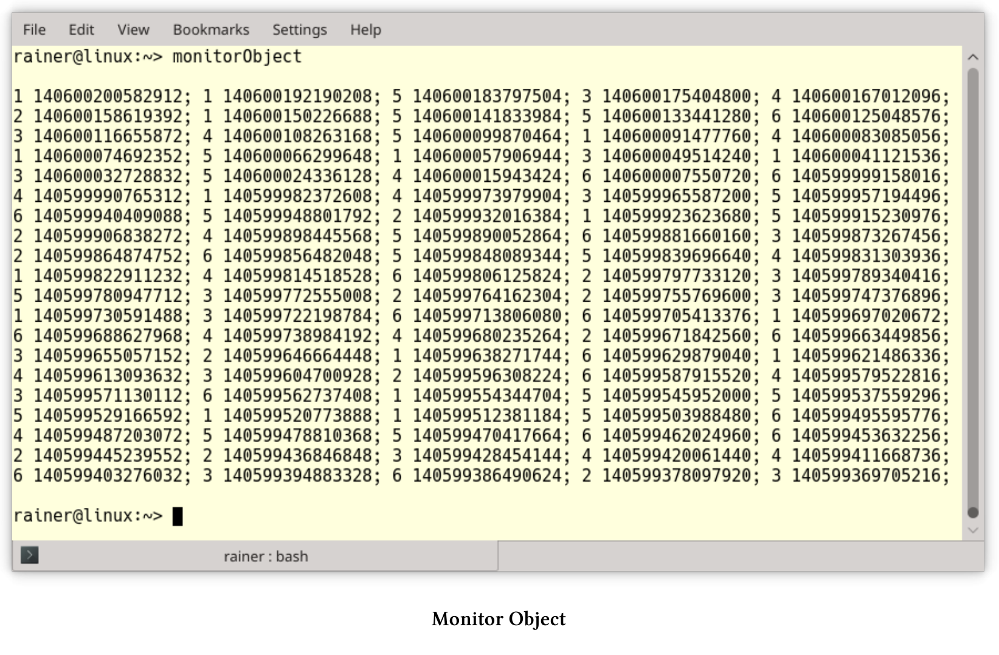

# 监控对象

监控对象模式会同步并发执行，以确保在对象中只运行一个方法。并且，还允许对象的方法协同调度执行序列。这种模式也称为线程安全的被动对象。

## 模式要求

多个线程同时访问一个共享对象时，需要满足以下要求：

1. 并发访问时，需要保护共享对象不受非同步读写操作的影响，以避免数据争用。
2. 必要的同步是实现的一部分，而不是接口的一部分。
3. 当线程处理完共享对象时，需要发送一个通知，以便下一个线程可以使用共享对象。这种机制有助于避免死锁，并提高系统的整体性能。
4. 方法执行后，共享对象的不变量必须保持不变。

监控对象对解决方案有这四个要求。客户端(线程)可以访问监控对象的同步方法。因为监控锁在任何时间点上，只能运行一个同步方法。每个监控对象都有一个通知等待客户端的监控条件。

## 组件

监控对象由四个组件组成。


1. 监控对象：支持一个或多个方法。每个客户端必须通过这些方法访问对象，每个方法都必须在客户端线程中运行。
2. 同步方法：监控对象支持同步方法。任何给定的时间点上，只能执行一个方法。线程安全接口有助于区分接口方法(同步方法)和(监控对象的)实现方法。
3.  监控锁：每个监控对象有一个监控锁，锁可以确保在任何时间点上，只有一个客户端可以访问监控对象。
4. 监控条件：允许线程在监控对象上进行调度。当前客户端完成同步方法的调用后，下一个等待的客户端将被唤醒。

虽然监控锁可以确保同步方法的独占访问，但是监控条件可以保证客户端的等待时间最少。实质上，监控锁可以避免数据竞争，条件监控可以避免死锁。

## 运行时行为

监控对象及其组件之间的交互具有不同的阶段。

* 当客户端调用监控对象的同步方法时，必须锁定全局监控锁。如果客户端成功访问，将执行同步方法，并在结束时解锁。如果客户端访问不成功，则阻塞客户端，进入等待状态。
* 当客户端阻塞时，监控对象会在解锁时，对阻塞的客户端发送通知。通常，等待是资源友好的休眠，而不是忙等。
* 当客户端收到通知时，会锁定监控锁，并执行同步方法。同步方法结束时解锁，并发送监控条件的通知，以通知下一个客户端去执行。

## 优点和缺点

监控对象的优点和缺点是什么?

* 优点:
  * 因为同步方法会完全封装在实现中，所以客户端不知道监控对象会隐式同步。
  * 同步方法将自动调度监控条件的通知/等待机制，其表现类似一个简单的调度器。
* 缺点:
  * 因为功能和同步是强耦合的，所以很难改变同步方法的机制。
  * 当同步方法直接或间接调用同一监控对象时，可能会发生死锁。

下面的程序段中定义了一个ThreadSafeQueue。

```c++
// monitorObject.cpp

#include <condition_variable>
#include <functional>
#include <queue>
#include <iostream>
#include <mutex>
#include <random>
#include <thread>

template <typename T>
class Monitor {
public:
  void lock() const {
    monitMutex.lock();
  }
  void unlock() const {
    monitMutex.unlock();
  }

  void notify_one() const noexcept {
    monitCond.notify_one();
  }
  void wait() const {
    std::unique_lock<std::recursive_mutex> monitLock(monitMutex);
    monitCond.wait(monitLock);
  }

private:
  mutable std::recursive_mutex monitMutex;
  mutable std::condition_variable_any monitCond;
};

template <typename T>
class ThreadSafeQueue : public Monitor<ThreadSafeQueue<T>> {
public:
  void add(T val) {
    derived.lock();
    myQueue.push(val);
    derived.unlock();
    derived.notify_one();
  }

  T get() {
    derived.lock();
    while (myQueue.empty()) derived.wait();
    auto val = myQueue.front();
    myQueue.pop();
    derived.unlock();
    return val;
  }
private:
  std::queue<T> myQueue;
  ThreadSafeQueue<T>& derived = static_cast<ThreadSafeQueue<T>&>(*this);
};

class Dice {
public:
  int operator()() { return rand(); }
private:
  std::function<int()>rand = std::bind(std::uniform_int_distribution<>(1, 6), 
    std::default_random_engine());
};


int main() {

  std::cout << std::endl;

  constexpr auto NUM = 100;

  ThreadSafeQueue<int> safeQueue;
  auto addLambda = [&safeQueue](int val) {safeQueue.add(val); };
  auto getLambda = [&safeQueue] {std::cout << safeQueue.get() << " "
    << std::this_thread::get_id() << ";";
  };

  std::vector<std::thread> addThreads(NUM);
  Dice dice;
  for (auto& thr : addThreads) thr = std::thread(addLambda, dice());

  std::vector<std::thread> getThreads(NUM);
  for (auto& thr : getThreads) thr = std::thread(getLambda);

  for (auto& thr : addThreads) thr.join();
  for (auto& thr : addThreads) thr.join();

  std::cout << "\n\n";

}
```

该示例的核心思想是，将监控对象封装在一个类中，这样就可以重用。监控类使用`std::recursive_mutex`作为监控锁，`std::condition_variable_any`作为监控条件。与`std::condition_variable`不同，`std::condition_variable_any`能够接受递归互斥。这两个成员变量都被声明为可变的，因此可以在常量方法中使用。监控类提供了监控对象的最小支持接口。

第34 - 55行中的`ThreadSafeQueue`使用线程安全接口扩展了第53行中的`std::queue`。`ThreadSafeQueue`继承于监控类，并使用父类的方法来支持同步的方法`add`和`get`。方法`add`和`get`使用监控锁来保护监控对象，特别是非线程安全的`myQueue`。当一个新项添加到`myQueue`时，`add`会通知等待线程，并且这个通知是线程安全的。当如`ThreadSafeQueue`这样的模板类，将派生类作为基类的模板参数时，这属于C++的一种习惯性用法，称为CRTP：`class ThreadSafeQueue: public Monitor<threadsafequeue<T>>`。理解这个习惯的关键是第54行：`ThreadSafeQueue<T>& derived = static_cast<threadsafequeue<T>&>(*this)`，该表达式将`this`指针向下转换为派生类。监控对象`safeQueue`第72行使用(第73行和第74行中的)Lambda函数添加一个数字，或从同步的`safeQueue`中删除一个数字。`ThreadSafeQueue`本身是一个模板类，可以保存任意类型的值。程序模拟的是100个客户端向`safeQueue`添加100个介于1 - 6之间的随机数(第78行)的同时，另外100个客户端从`safeQueue`中删除这100个数字。程序会显示使用的线程的编号和id。



> 奇异递归模板模式(CRTP)
>
> 奇异递归模板模式，简单地说，CRTP代表C++中的一种习惯用法，在这种用法中，Derived类派生自类模板Base，因此Base作为Derived模板参数。
>
> ```c++
>template<class T>
> class Base{
>	....
> };
> 
> class Derived : public Base<Derived>{
> 	....
> };
> ```
> 
> 理解CRTP习惯用法的关键是，实例化方法是惰性的。这意味着只有在需要时才实例化方法。CRTP有两个主要的用例。
> 
> *  静态多态性：静态多态性与动态多态性类似，但与使用虚方法的动态多态性相反，方法调用的分派在编译时进行。
>* Mixin: Mixin是设计混合代码类时的一个流行概念。`ThreadSafeQueue`使用Mixin技术来扩展它的接口。通过从`Monitor`类派生`ThreadSafeQueue`，派生类`ThreadSafeQueue`获得类`Monitor`的所有方法：`ThreadSafeQueue: public Monitor<threadsafequeue<T>>`类。
> 
>[惰性C++：CRTP]( https://www.modernescpp.com/index.php/c-is-still-lazy)一文中，有对CRTP习语有更深入地描述。

活动对象和监控对象在几个重要的方面类似，但也有不同。这两种体系结构模式，会同步对共享对象的访问。活动对象的方法在不同线程中执行，而监控对象的方法在同一线程中执行。活动对象更好地将其方法调用与执行解耦，因此更容易维护。

## 扩展阅读

* [Pattern-Oriented Software Architecture: Patterns for Concurrent and Networked Objects](https://www.dre.vanderbilt.edu/~schmidt/POSA/POSA2/)