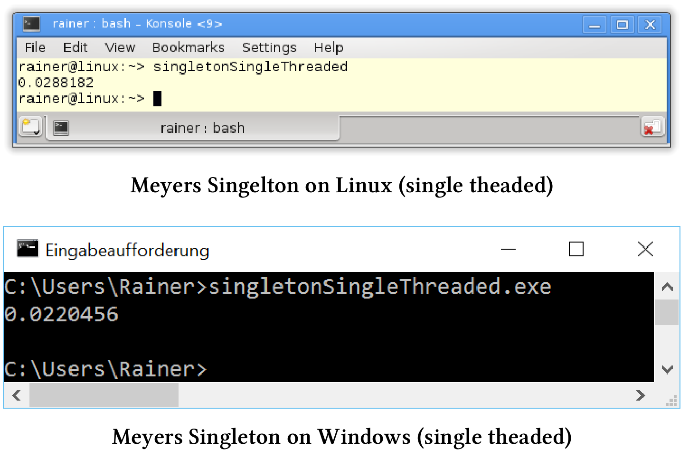
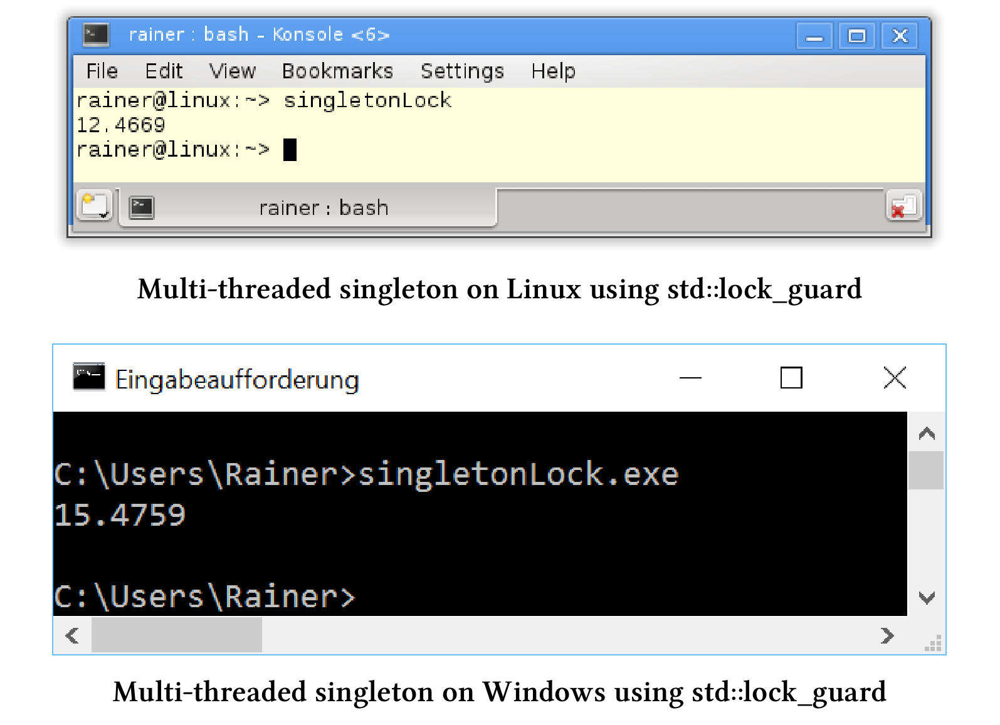

# 单例模式：线程安全的初始化

开始研究之前，说明一下：我个人并不提倡使用单例模式。因此，这里用一个警告作为本节的开始。

> 注意
>
> **对于单例模式的看法**
>
> 我只在案例研究中使用单例模式，因为它是以线程安全的方式，初始化变量的典型例子。先来了解一下单例模式的几个严重缺点：
>
> *  单例是一个经过乔装打扮的全局变量。因此，测试起来非常困难，因为它依赖于全局的状态。
> * 通过`MySingleton::getInstance()`可以在函数中使用单例，不过函数接口不会说明内部使用了单例，并隐式依赖于对单例。
> * 若将静态对象`x`和`y`放在单独的源文件中，并且这些对象的构造方式相互依赖，因为无法保证先初始化哪个静态对象，将陷入[静态初始化混乱顺序]( https://isocpp.org/wiki/faq/ctors)的情况。这里要注意的是，单例对象是**静态对象**。
> * 单例模式是惰性创建对象，但不管理对象的销毁。如果不销毁不需要的东西，那就会造成内存泄漏。
> *  试想一下，当子类化单例化，可能实现吗？这意味着什么?
> * 想要实现一个线程安全且快速的单例，非常具有挑战性。
>
> 关于单例模式的详细讨论，请参阅Wikipedia中有关[单例模式](https://en.wikipedia.org/wiki/Singleton_pattern)的文章。

我想在开始讨论单例的线程安全初始化前，先说点别的。

##双重检查的锁定模式

[双重检查锁定](http://www.cs.wustl.edu/~schmidt/PDF/DC-Locking.pdf)模式是用线程安全的方式，初始化单例的经典方法。听起来像是最佳实践或模式之类的方法，但更像是一种[反模式](https://en.wikipedia.org/wiki/Anti-pattern)。它假设传统实现中有相关的保障机制，而Java、C#或C++内存模型不再提供这种保障。这样，创建单例是原子操作就是一个错误的假设，这样看起来是线程安全的解决方案并不安全。

什么是双重检查锁定模式？实现线程安全单例的，首先会想到用锁来保护单例的初始化过程。

```c++
std::mutex myMutex;

class MySingleton {
public:
  static MySingleton& getInstance() {
    std::lock_guard<mutex> myLock(myMutex);
    if (!instance) instance = new MySingleton();
    return *instance;
  }
private:
  MySingleton() = default;
  ~MySingleton() = default;
  MySingleton(const MySingleton&) = delete;
  MySingleton& operator= (const MySingleton&) = delete;
  static MySingleton* instance;
};

MySingleton* MySingleton::instance = nullptr;
```

程序有毛病么？有毛病：是因为性能损失太大；没毛病：是因为实现的确线程安全。第7行重量级锁会保护对单例的每次访问，这也适用于读取。不过，初始构造`MySingleton`之后，就没有必要读取了。这里双重检查锁定模式就发挥了其作用，再看一下`getInstance`函数。

```c++
static MySingleton& getInstance() {
  if (!instance) { // check
    lock_guard<mutex> myLock(myMutex); // lock
    if (!instance) instance = new MySingleton(); // check
  }
  return *instance;
}
```

第2行没有使用重量级锁，而是使用指针比较。如果得到一个空指针，则申请重量级锁的单例(第3行)。因为，可能有另一个线程也在初始化单例，并且到达了第2行或第3行，所以需要额外的指针在第4行进行比较。顾名思义，其中两次是检查，一次是锁定。

牛B不？牛。线程安全？不安全。

问题出在哪里？第4行中的`instance= new MySingleton()`至少包含三个步骤。

1. 为`MySingleton`分配内存。
2. 初始化`MySingleton`对象。
3. 引用完全初始化的`MySingleton`对象

能看出问在哪了么？

C++运行时不能保证这些步骤按顺序执行。例如，处理器可能会将步骤重新排序为序列1、3和2。因此，在第一步中，内存被分配，在第二步中实例引用一个非初始化的单例。如果此时另一个线程t2试图访问该单例对象并进行指针比较，则比较成功。其结果是线程`t2`引用了一个非初始化的单例，并且程序行为未定义。

## 性能测试

我要测试访问单例对象的开销。对引用测试时，使用了一个单例对象，它被连续访问了4000万次。当然，第一个访问的线程会初始化单例对象，四个线程的访问是并发进行的。我只对性能数字感兴趣，因此我汇总了这四个线程的执行时间。使用一个带范围(`Meyers Singleton`)的静态变量、一个锁`std::lock_guard`、函数`std::call_once`和`std::once_flag`以及具有顺序一致和获取-释放语义的原子变量进行性能测试。

程序在两台电脑上运行。读过上一节的朋友肯定知道，我的Linux(GCC)电脑上有四个核心，而我的Windows(cl.exe)电脑只有两个核心，用最大级别的优化来编译程序。相关设置的详细信息，参见本章的开头。

接下来，我需要回答两个问题：

1. 各种单例实现的性能具体是多少?
2. Linux (GCC)和Windows (cl.exe)之间的差别是否显著?

最后，我会将所有数字汇总到一个表中。

展示各种多线程实现的性能数字前，先来看一下串行的代码。C++03标准中，`getInstance`方法线程不安全。

```c++
// singletonSingleThreaded.cpp

#include <chrono>
#include <iostream>

constexpr auto tenMill = 10000000;

class MySingLeton {
public:
  static MySingLeton& getInstance() {
    static MySingLeton instance;
    volatile int dummy{};
    return instance;
  }
private:
  MySingLeton() = default;
  ~MySingLeton() = default;
  MySingLeton(const MySingLeton&) = delete;
  MySingLeton& operator=(const MySingLeton&) = delete;

};

int main() {

  constexpr auto fourtyMill = 4 * tenMill;

  const auto begin = std::chrono::system_clock::now();

  for (size_t i = 0; i <= fourtyMill; ++i) {
    MySingLeton::getInstance();
  }

  const auto end = std::chrono::system_clock::now() - begin;

  std::cout << std::chrono::duration<double>(end).count() << std::endl;

}
```

作为参考实现，我使用了以[Scott Meyers]( https://en.wikipedia.org/wiki/Scott_Meyers)命名的Meyers单例。这个实现的优雅之处在于，第11行中的`singleton`对象是一个带有作用域的静态变量，实例只初始化一次，而初始化发生在第一次执行静态方法`getInstance`(第10 - 14行)时。

> 知识点
>
> 使用volatile声明变量dummy
>
> 因为调用不调用都没有效果，当我用最高级别的优化选项来编译程序时，编译器删除了第30行中的`MySingleton::getInstance()`，我得到了非常快的执行，但结果错误的性能数字。通过使用`volatile`声明变量`dummy`(第12行)，明确告诉编译器不允许优化第30行中的`MySingleton::getInstance()`调用。

下面是单线程用例的性能结果。



C++11中，Meyers单例已经线程安全了。

## 线程安全的Meyers单例

C++11标准中，保证以线程安全的方式初始化具有作用域的静态变量。Meyers单例使用就是有作用域的静态变量，这样就成了！剩下要做的工作，就是为多线程用例重写以前使用的经典Meyers单例。

多线程中的Meyers单例

```c++
// singletonMeyers.cpp

#include <chrono>
#include <iostream>
#include <future>

constexpr auto tenMill = 10000000;

class MySingLeton {
public:
  static MySingLeton& getInstance() {
    static MySingLeton instance;
    volatile int dummy{};
    return instance;
  }
private:
  MySingLeton() = default;
  ~MySingLeton() = default;
  MySingLeton(const MySingLeton&) = delete;
  MySingLeton& operator=(const MySingLeton&) = delete;

};

std::chrono::duration<double> getTime() {

  auto begin = std::chrono::system_clock::now();
  for (size_t i = 0; i <= tenMill; ++i) {
    MySingLeton::getInstance();
  }
  return std::chrono::system_clock::now() - begin;

}

int main() {

  auto fut1 = std::async(std::launch::async, getTime);
  auto fut2 = std::async(std::launch::async, getTime);
  auto fut3 = std::async(std::launch::async, getTime);
  auto fut4 = std::async(std::launch::async, getTime);

  const auto total = fut1.get() + fut2.get() + fut3.get() + fut4.get();

  std::cout << total.count() << std::endl;

}
```

函数`getTime`中使用单例对象(第24 - 32行)，函数由第36 - 39行中的四个promise来执行，相关future的结果总结在第41行。


我们来看看最直观的一种方式——锁。

## std::lock_guard

`std::lock_guard`中的互斥量，保证了单例对象能以线程安全的方式初始化。

```c++
// singletonLock.cpp

#include <chrono>
#include <iostream>
#include <future>
#include <mutex>

constexpr auto tenMill = 10000000;

std::mutex myMutex;

class MySingleton {
public:
  static MySingleton& getInstance() {
    std::lock_guard<std::mutex> myLock(myMutex);
    if (!instance) {
      instance = new MySingleton();
    }
    volatile int dummy{};
    return *instance;
  }
private:
  MySingleton() = default;
  ~MySingleton() = default;
  MySingleton(const MySingleton&) = delete;
  MySingleton& operator=(const MySingleton&) = delete;

  static MySingleton* instance;
};

MySingleton* MySingleton::instance = nullptr;

std::chrono::duration<double> getTime() {

  auto begin = std::chrono::system_clock::now();
  for (size_t i = 0; i <= tenMill; ++i) {
    MySingleton::getInstance();
  }
  return std::chrono::system_clock::now() - begin;

}

int main() {

  auto fut1 = std::async(std::launch::async, getTime);
  auto fut2 = std::async(std::launch::async, getTime);
  auto fut3 = std::async(std::launch::async, getTime);
  auto fut4 = std::async(std::launch::async, getTime);

  const auto total = fut1.get() + fut2.get() + fut3.get() + fut4.get();

  std::cout << total.count() << std::endl;

}
```

这种方式非常的慢。



线程安全单例模式的下一个场景，基于多线程库，并结合`std::call_once`和`std::once_flag`。

## 使用std::once_flag的std::call_once

`std::call_once`和`std::once_flag`可以一起使用，这样就以线程安全的方式，执行一个可调对象了。

```c++
// singletonCallOnce.cpp

#include <chrono>
#include <iostream>
#include <future>
#include <mutex>
#include <thread>

constexpr auto tenMill = 10000000;

class MySingleton {
public:
  static MySingleton& getInstance() {
    std::call_once(initInstanceFlag, &MySingleton::initSingleton);
    volatile int dummy{};
    return *instance;
  }
private:
  MySingleton() = default;
  ~MySingleton() = default;
  MySingleton(const MySingleton&) = delete;
  MySingleton& operator=(const MySingleton&) = delete;

  static MySingleton* instance;
  static std::once_flag initInstanceFlag;

  static void initSingleton() {
    instance = new MySingleton;
  }
};

MySingleton* MySingleton::instance = nullptr;
std::once_flag MySingleton::initInstanceFlag;

std::chrono::duration<double> getTime() {

  auto begin = std::chrono::system_clock::now();
  for (size_t i = 0; i <= tenMill; ++i) {
    MySingleton::getInstance();
  }
  return std::chrono::system_clock::now() - begin;

}

int main() {

  auto fut1 = std::async(std::launch::async, getTime);
  auto fut2 = std::async(std::launch::async, getTime);
  auto fut3 = std::async(std::launch::async, getTime);
  auto fut4 = std::async(std::launch::async, getTime);

  const auto total = fut1.get() + fut2.get() + fut3.get() + fut4.get();

  std::cout << total.count() << std::endl;

}
```

下面是具体的性能数字：


使用原子变量继续来实现线程安全的单例。

## 原子变量

使用原子变量，让实现变得更具有挑战性，我甚至可以为原子操作指定内存序。基于前面提到的双重检查锁定模式，实现了以下两个线程安全的单例。

**顺序一致**

第一个实现中，使用了原子操作，但没有显式地指定内存序，所以默认是顺序一致的。

```c++
// singletonSequentialConsistency.cpp

#include <chrono>
#include <iostream>
#include <future>
#include <mutex>
#include <thread>

constexpr auto tenMill = 10000000;

class MySingleton {
public:
  static MySingleton& getInstance() {
    MySingleton* sin = instance.load(); 
    if (!sin) {
      std::lock_guard<std::mutex>myLock(myMutex);
      sin = instance.load(std::memory_order_relaxed);
      if (!sin) {
        sin = new MySingleton();
        instance.store(sin);
      }
    }
    volatile int dummy{};
    return *instance;
  }
private:
  MySingleton() = default;
  ~MySingleton() = default;
  MySingleton(const MySingleton&) = delete;
  MySingleton& operator=(const MySingleton&) = delete;

  static std::atomic<MySingleton*> instance;
  static std::mutex myMutex;
};


std::atomic<MySingleton*> MySingleton::instance;
std::mutex MySingleton::myMutex;

std::chrono::duration<double> getTime() {

  auto begin = std::chrono::system_clock::now();
  for (size_t i = 0; i <= tenMill; ++i) {
    MySingleton::getInstance();
  }
  return std::chrono::system_clock::now() - begin;

}

int main() {

  auto fut1 = std::async(std::launch::async, getTime);
  auto fut2 = std::async(std::launch::async, getTime);
  auto fut3 = std::async(std::launch::async, getTime);
  auto fut4 = std::async(std::launch::async, getTime);

  const auto total = fut1.get() + fut2.get() + fut3.get() + fut4.get();

  std::cout << total.count() << std::endl;

}
```

与双重检查锁定模式不同，由于原子操作的默认内存序是顺序一致的，现在可以保证第19行中的`sin= new MySingleton()`表达式出现在第20行中的表达式`instance.store(sin)`之前。看一下第17行：`sin = instance.load(std::memory_order_relax)`，因为另一个线程可能会在第14行第一个load和第16行锁的使用之间，介入并更改instance的值，所以这里的load是必要的。


我们进一步的对程序进行优化。

**获取-释放语义**

仔细看看之前使用原子实现单例模式的线程安全实现。第14行中单例的加载(或读取)是一个获取操作，第20行中存储(或写入)是一个释放操作。这两种操作都发生在同一个原子上，所以不需要顺序一致。C++11标准保证释放与获取操作在同一原子上同步，并建立顺序约束。也就是，释放操作之后，不能移动之前的所有读和写操作，并且在获取操作之前不能移动之后的所有读和写操作。

这些都是实现线程安全单例的最低保证。

```c++
// singletonAcquireRelease.cpp

#include <chrono>
#include <iostream>
#include <future>
#include <mutex>
#include <thread>

constexpr auto tenMill = 10000000;

class MySingleton {
public:
  static MySingleton& getInstance() {
    MySingleton* sin = instance.load(std::memory_order_acquire);
    if (!sin) {
      std::lock_guard<std::mutex>myLock(myMutex);
      sin = instance.load(std::memory_order_release);
      if (!sin) {
        sin = new MySingleton();
        instance.store(sin);
      }
    }
    volatile int dummy{};
    return *instance;
  }
private:
  MySingleton() = default;
  ~MySingleton() = default;
  MySingleton(const MySingleton&) = delete;
  MySingleton& operator=(const MySingleton&) = delete;

  static std::atomic<MySingleton*> instance;
  static std::mutex myMutex;
};


std::atomic<MySingleton*> MySingleton::instance;
std::mutex MySingleton::myMutex;

std::chrono::duration<double> getTime() {

  auto begin = std::chrono::system_clock::now();
  for (size_t i = 0; i <= tenMill; ++i) {
    MySingleton::getInstance();
  }
  return std::chrono::system_clock::now() - begin;

}

int main() {

  auto fut1 = std::async(std::launch::async, getTime);
  auto fut2 = std::async(std::launch::async, getTime);
  auto fut3 = std::async(std::launch::async, getTime);
  auto fut4 = std::async(std::launch::async, getTime);

  const auto total = fut1.get() + fut2.get() + fut3.get() + fut4.get();

  std::cout << total.count() << std::endl;

}
```

获取-释放语义与顺序一致内存序有相似的性能。


x86体系结构中这并不奇怪，这两个内存顺序非常相似。我们可能会在[ARMv7](https://en.wikipedia.org/wiki/ARM_architecture)或[PowerPC架构](https://en.wikipedia.org/wiki/PowerPC)上的看到性能数字上的明显差异。对这方面比较感兴趣的话，可以阅读Jeff Preshings的博客[Preshing on Programming](http://preshing.com)，那里有更详细的内容。

##各种线程安全单例实现的性能表现总结

数字很明确，Meyers 单例模式是最快的。它不仅是最快的，也是最容易实现的。如预期的那样，Meyers单例模式比原子模式快两倍。锁的量级最重，所以最慢。`std::call_once`在Windows上比在Linux上慢得多。

| 操作系统(编译器) | 单线程 | Meyers单例 | `std::lock_guard` | `std::call_once` | 顺序一致 | 获取-释放语义 |
| :--------------: | :----: | :--------: | :---------------: | :--------------: | :------: | :-----------: |
|    Linux(GCC)    |  0.03  |    0.04    |       12.48       |       0.22       |   0.09   |     0.07      |
| Windows(cl.exe)  |  0.02  |    0.03    |       15.48       |       1.74       |   0.07   |     0.07      |

关于这些数字，我想强调一点：这是四个线程的性能总和。因为Meyers单例模式几乎与单线程实现一样快，所以并发Meyers单例模式具有最佳的性能。