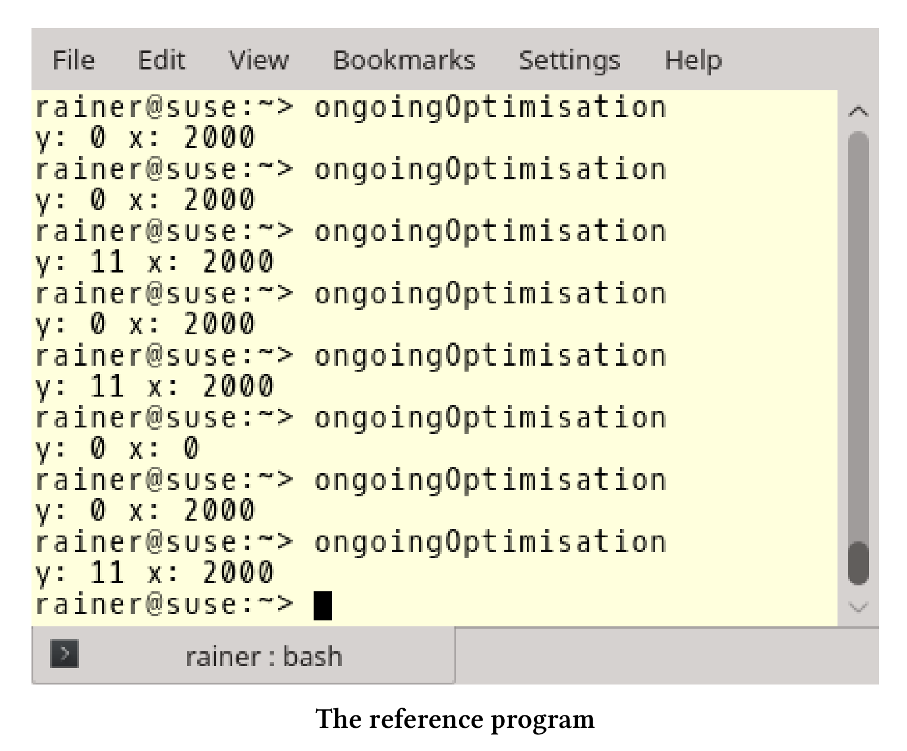
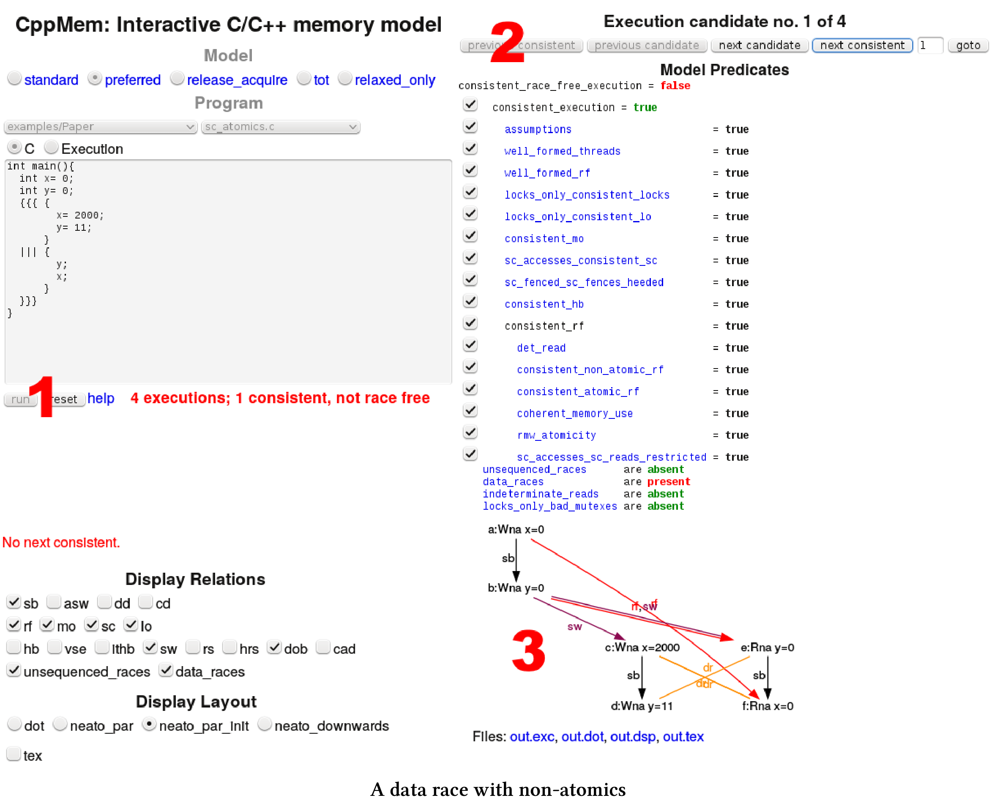
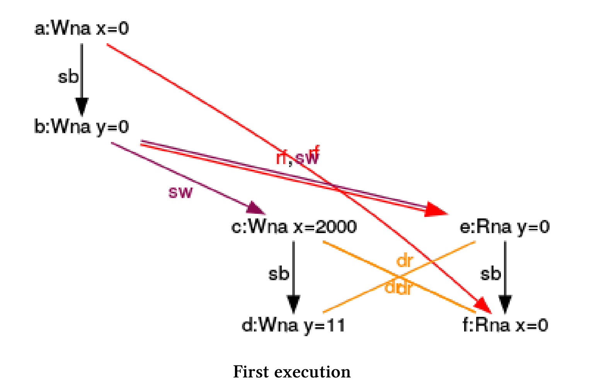
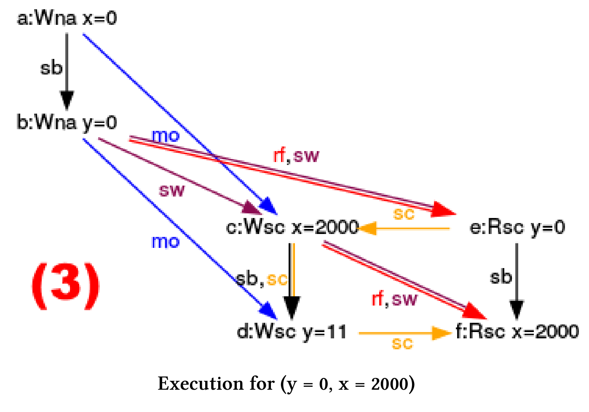
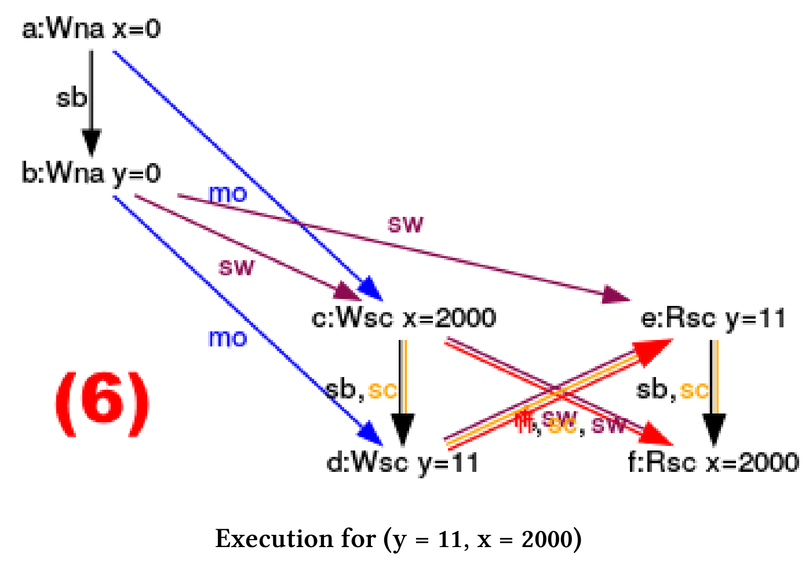
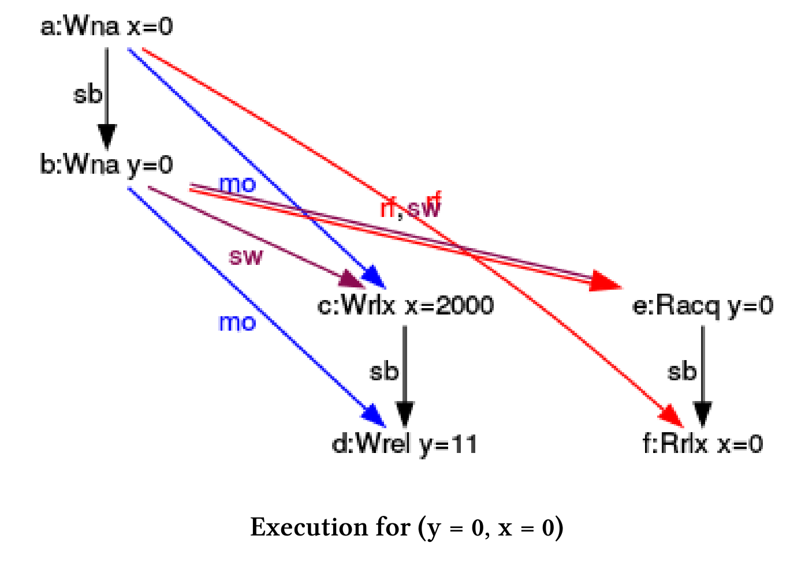
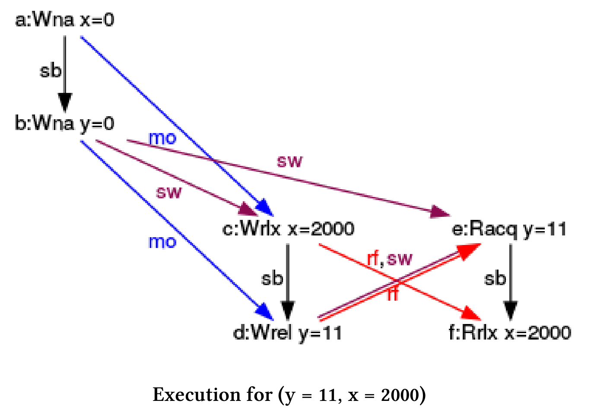
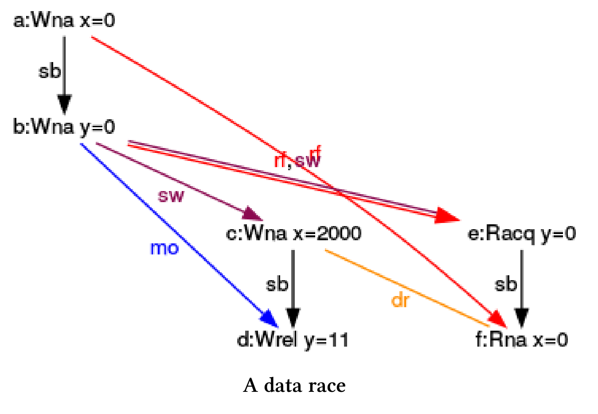
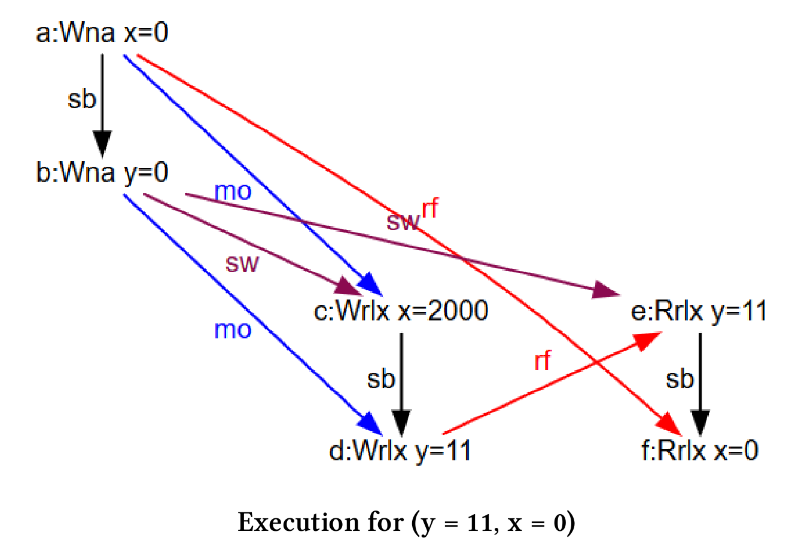

# 使用CppMem进行优化

我们从一个简单的程序开始，然后对其不断地进行改进。这里，使用CppMem验证的每个步骤。[CppMem](http://svr-pes20-cppmem.cl.cam.ac.uk/cppmem)是一个交互式工具，用于研究小代码段中C++内存模型的行为。

首先，来写个简单的程序：

```c++
// ongoingOptimisation.cpp

#include <iostream>
#include <thread>

int x = 0;
int y = 0;

void writing() {
  x = 2000;
  y = 11;
}

void reading() {
  std::cout << "y: " << y << " ";
  std::cout << "x: " << x << std::endl;
}

int main() {
  std::thread thread1(writing);
  std::thread thread2(reading);
  thread1.join();
  thread2.join();
}
```

程序很简单，由两个线程`thread1`和`thread2`构成。`thread1`写入x和y，`thread2`以相反的顺序读取值y和x。这看起来很简单，但这个简单的程序，却会给了我们三个不同的结果:



对程序优化之前，需要确定两个问题：

1. 程序的定义都明确吗？是否存在数据竞争？
2. x和y可能是哪些值?

第一个问题往往很难回答。首先，考虑第一个问题的答案；其次，使用CppMem验证推理。当我想到了第一个问题的答案，就可以很容易地确定第二个问题的答案。我在一个表中给出了x和y的可能值。

但是，还没有解释持续优化是什么意思。其实很简单，通过弱化C++的内存序来不断优化程序。以下是优化步骤：

* 非原子变量
* 锁
* 使用顺序一致语义的原子变量
* 使用获取-释放语义的原子变量
* 使用自由语义的原子变量
* Volatile变量

开始持续优化之旅之前，应该先对CppMem有一个基本的了解。在CppMem章节中，会提供了一个简单的介绍。

## CppMem: 非原子变量

使用`run`按钮可以立即显示数据竞争。更准确地说，上面的程序有两个数据竞争，因为变量`x`和`y`的访问都不受保护。因此，该程序具有未定义行为。在C++术语中，这意味着程序在玩火，你的电脑甚至会着火(笑)。

因此，我们不能得到x和y的准确值。

> **关于int型的变量**
>
> 只要int变量是自然对齐的，那么大多数主流架构对int变量的访问都是原子性的。自然对齐意味着在32位或64位体系结构中，32位int变量必须有一个能被4整除的地址。这是因为，C++11中可以调整数据类型的对齐方式。
>
> 必须强调的是，我并不是建议你像使用原子int那样使用int型变量。我只是想指出，在这种情况下，编译器比C++11标准提供了更多保证。如果过于依赖于编译器，那么程序就很可能不符合C++标准，因此可能会在其他硬件平台上运行出错。

这就是我的推理内容。现在，我们应该看看CppMem关于程序未定义行为的报告。

CppMem允许我将程序剪裁到最小。

```c++
int main() {
  int x = 0;
  int y = 0;
  { { { {
        x = 2000;
        y = 11;
        }
    |||{
        y;
        x;
       }
  } } }
}
```

可以使用大括号(第4行和第12行)和管道符号(第8行)在CppMem中定义一个线程。因为我对变量x和y的输出不感兴趣，所以只在第9行和第10行读取它们。

这是CppMem的理论部分，下面就来实践一下。

**分析**

执行程序时，CppMem会在(1)处提示，线程交错有四种可能性，其中有一种有竞争的。只有在第一次执行时，结果是一致的。现在，我可以使用CppMem在四个执行(2)之间进行切换，并分析示意图(3)。



通过分析图表，可以最大程度地利用CppMem。

**第一次执行**



节点表示程序的表达式，箭头表示表达式之间的关系。从图中的注释中我可以得出什么结论呢?

*  a:Wna x = 0：第一个表达式(a)，向非原子变量x中写入0。
* sb (前序，sequenced-before)：第一个表达式(a)执行的顺序在第二个表达式(b)之前就能确定。表达式(c)和(d)、(e)和(f)之间也存在这种关系。
* rf (读取，read from)：(e)从(b)中读取y的值，(f)从(a)中读取x的值。
* sw (同步，synchronizes-with)：因为表达式(f)在一个单独的线程中执行，所以(a)与(f)同步。线程创建之前发生的所有事情都是可见的，而线程的创建可以看作是一个同步点。由于对称性，(b)和(e)之间也存在同样的关系。
* dr (数据竞争，data race)：变量x和y的读写之间有数据竞争，所以程序有未定义行为。

> **为什么顺序一致的执行?**
>
> 因为x和y在主线程中初始化(a)和(b)，所以执行顺序一致。(c)和(d)中的x和y在内存模型上不是顺序一致的。

接下来的三次执行，都不是顺序一致的。

**第二次执行**


(e)从(d)中读取“不一致”的y值，并且(d)的写入与(e)的读取同时发生。

**第三次执行**


与前一个执行对称，(f)同时从(c)中读取x。

**第四次执行**


现在，就开始乱套了。(e)和(f)同时从表达式(d)和(c)中读出x和y。

**简单的总结一下**

虽然我只是使用了CppMem的默认配置，但是获得了很多有价值的信息。特别是CppMem的图形化显示：

*  x和y的所有可能的组合：(0,0)、(11,0)、(0,2000)和(11,2000)。
* 该程序至少有一个数据竞争，因此会触发未定义行为。
*  四种可能的执行方式中，只有一种是顺序一致的。

> **使用volatile**
>
> 从内存模型的角度来看，对x和y使用限定符volatile与x和y的非同步访问没有区别。
>
> CppMem: 使用volatile的不同步访问
>
> ```c++
>int main() {
> volatile int x = 0;
> volatile int y = 0;
>  {{{ {
>  x = 2000;
>  y = 11;
>   }
>   ||| {
>   y;
>  x;
>   }
>   }}}
>   }
>  ```
> 
> CppMem生成与前一个示例相同的图。原因很简单，C++中volatile不具备多线程语义功能。

这个例子中，x和y的访问没有同步，因此会出现数据竞争，产生未定义行为。最直接的同步方式，当然是使用锁。

## CppMem: 锁

两个线程`thread1`和`thread2`都使用了相同的互斥锁，且包装在`std::lock_guard`中。

```c++
// ongoingOptimisationLock.cpp

#include <iostream>
#include <mutex>
#include <thread>

int x = 0;
int y = 0;

std::mutex mut;

void writing() {
  std::lock_guard<std::mutex> guard(mut);
  x = 2000;
  y = 11;
}

void reading() {
  std::lock_guard<std::mutex> guard(mut);
  std::cout << "y: " << y << " ";
  std::cout << "x: " << x << std::endl;
}

int main() {
  std::thread thread1(writing);
  std::thread thread2(reading);
  thread1.join();
  thread2.join();
}
```

程序没啥问题，根据(thread1与thread2)执行顺序，要么是读后写，要么是先写后读。下面展示了x和y值的几种可能：

|  y   |  x   | 有可能吗？ |
| :--: | :--: | :--------: |
|  0   |  0   |     有     |
|  11  |  0   |            |
|  0   | 2000 |            |
|  11  | 2000 |     有     |

> **CppMem中使用`std::lock_guard`**
>
> 我没找到在CppMem中使用`std::lock_guard`的方法。如果你知道如何实现它，请告诉我一下 ：）

锁的易用性比较好，但同步性价比太低。接下来使用原子变量，并尝试一种更轻量级的策略。

## CppMem: 顺序一致语义的原子变量

如果没有指定的内存序，则使用顺序一致。顺序一致保证每个线程按照源代码顺序执行，并且所有线程都遵循相同的全局序。

这里有个使用原子的优化版本。

```c++
// ongoingOptimisationSequentialConsistency.cpp

#include <atomic>
#include <iostream>
#include <thread>

std::atomic<int> x{ 0 };
std::atomic<int> y{ 0 };

void writing(){
  x.store(2000);
  y.store(11);
}

void reading() {
  std::cout << y.load() << " ";
  std::cout << x.load() << std::endl;
}

int main() {
  std::thread thread1(writing);
  std::thread thread2(reading);
  thread1.join();
  thread2.join();
}
```

我们来分析一下这段代码。因为x和y是原子变量，所以没有数据竞争。因此，只剩下一个问题需要回答。x和y可能的值是什么？这个问题也不难，由于顺序一致，所有线程都必须遵循相同的全局序。

实际执行的情况：

* `x.store(2000);`先行于` y.store(11);`
* `std::cout << y.load() << " ";`先行于`std::cout << x.load() << std::endl;`

因此，如果`y.load()`的值为11，则`x.load()`的值肯定不能为0，因为`x.store(2000)`在`y.store(11)`之前已经执行了。

x和y的其他所有值都是有可能，下面是导致x和y有三组不同值的原因：

1. `thread1`先行完成于`thread2 `
2. `thread2`先行完成于`thread1`
3. `thread1` 执行`x.store(2000)`先行于`thread2`执行完成

那么x和y的所有可能性：

|  y   |  x   | 有可能吗？ |
| :--: | :--: | :--------: |
|  0   |  0   |     有     |
|  11  |  0   |            |
|  0   | 2000 |     有     |
|  11  | 2000 |     有     |

接下来使用CppMem验证一下我的猜想。

**CppMem**

```c++
int main() {
  atomic_int x = 0; 
  atomic_int y = 0;
  {{{ {
        x.store(2000);
        y.store(11);
      }
  |||{
        y.load();
        x.load();
      }
  }}};
  return 0; }
```

首先介绍一些语法知识，CppMem为`std::atomic<int>`专门定义有`atomic_int`类型。

执行程序时，我被候选执行程序的数量(384个)吓了一跳。


有384个可能的执行候选，只有6个是顺序一致的，没有候选有数据竞争。不过，我只对6个顺序一致的候选感兴趣。

我使用选项(2)获得六个带注解的示意图。

我们已经知道，因为顺序一致，除了`y = 11`和`x = 0`外，其他可能值都是可能的。现在我很好奇，哪些线程交错会产生不同的x和y呢?

**(y = 0, x = 0)**


**(y = 0, x = 2000)**





**(y = 11, x = 2000)**



分析还没结束，我感兴趣的是：指令序列与这六个图如何对应?

**指令序列**

我给每个指令序列分配了相应的图示。


让我们从简单的例子开始分析：

* (1)：x和y的值为0，因为`y.load()`和`x.load()`在操作`x.store(2000)`和`y.store(11)`之前完成。
* (6): 所有的加载操作都发生在存储操作之后，所以y的值是11，x的值是2000。
* (2), (3), (4), (5): 这几个是更有趣的例子，y的值是0，x的值是2000。图中的黄色箭头(sc)是我推理的关键，它们代表指令序列。让我们看看(2)是怎么执行的：
  * (2)中黄色箭头(sc)的顺序是：`写入x = 2000` ⇒ `读取 y = 0 `⇒ `写入 y = 11` ⇒ `读取 x = 2000`。该序列对应于第二次线程交错(2)时的指令序列。

接下来，让我们打破顺序一致的束缚，使用获取-释放语义。

## CppMem：获取-释放语义的原子变量

与线程之间进行同步的顺序一致不同，获取-释放语义的同步，发生在同一原子变量的(原子)操作之间。基于这个前提，获取-释放语义更轻，也更快。

展示一段使用获取-释放语义的代码。

```c++
// ongoingOptimisationAcquireRelease.cpp

#include <atomic>
#include <iostream>
#include <thread>

std::atomic<int>x{ 0 };
std::atomic<int> y{ 0 };

void writing() {
  x.store(2000, std::memory_order_relaxed);
  y.store(11, std::memory_order_release);
}

void reading() {
  std::cout << y.load(std::memory_order_acquire) << " ";
  std::cout << x.load(std::memory_order_relaxed) << std::endl;
}

int main() {
  std::thread thread1(writing);
  std::thread thread2(reading);
  thread1.join();
  thread2.join();
}
```

所有的操作都是原子的，所以程序没啥问题。再多看几眼，你会发现更多东西，`y`上的原子操作附加了`std::memory_order_release`(第12行)和`std::memory_order_acquire`标记(第16行)。与之相反，`x`上的原子操作是用`std::memory_order_relax`标记(第11行和第17行)，所以`x`没有同步和顺序约束。`x`和`y`可能值，只能由`y`给出答案了。

* `y.store(11,std::memory_order_release)`同步于`y.load(std::memory_order_acquire)`
* `x.store(2000,std::memory_order_relaxed)`先见于`y.store(11, std::memory_order_release)`
* `y.load(std::memory_order_acquire)`先见于`x.load(std::memory_order_relaxed)`

进行更详细的描述：关键点在于，第12行`y`的存储与第16行`y`的加载是同步的。因为操作发生在相同的原子变量上，所以使用的是获取-释放语义。`y`在第12行中使用`std::memory_order_release`，第16行中使用`std::memory_order_acquire`，因此`x.store(2000, std:: memory_order_relax)`不能在`y.store (std::memory_order_release)`之后执行，而`x.load()`也不能在`y.load()`之前执行。

获取-释放语义的推理比之前的顺序一致的推理复杂许多，但是`x`和`y`的可能值是相同的。只有`y == 11`和`x == 0`的组合是不可能的。

有三种可能的线程交错，它们会产生不同`x`和`y`：

* `thread1`先于 `thread2`执行
* `thread2`先于` thread1`执行
* `thread1`执行` x.store(2000)`先于`thread2`执行

以下是x和y的所有可能值：

|  y   |  x   | 有可能吗？ |
| :--: | :--: | :--------: |
|  0   |  0   |     有     |
|  11  |  0   |            |
|  0   | 2000 |     有     |
|  11  | 2000 |     有     |

继续使用CppMem验证猜想。

**CppMem**

```c++
int main() {
  atomic_int x = 0; 
  atomic_int y = 0;
  {{{ {
        x.store(2000,memory_order_relaxed);
        y.store(11,memory_order_release);
      }
  |||{
        y.load(memory_order_acquire);
        x.load(memory_order_relaxed);
      }
  }}};
}
```

我们已经知道，除了(y = 11, x = 0)之外，其他结果都有可能。

**可能的执行顺序**

这里只引用执行一致的三个图。从图中可以看出，`y`的存储-释放操作与`y的`加载- 获取操作之间，有获取-释放语义存在。在主线程或单独的线程中读取`y`(rf)是没有区别的。图中显示了同步关系，是用一个带sw注释的箭头进行表示的。

**(y = 0, x = 0)**



**(y = 0, x = 2000)**


**(y = 11, x = 2000)**



`x`不一定是原子的?! 好吧，这是我第一个错误的假设，来看下原因。

## CppMem：原子变量和非原子变量混用

获取-释放语义中，典型的误解是假定获取操作正在等待释放操作。基于这个错误的假设，你可能认为`x`不必是一个原子变量，从而可以进一步优化程序。

```c++
// ongoingOptimisationAcquireReleaseBroken.cpp

#include <atomic>
#include <iostream>
#include <thread>

int x = 0;
std::atomic<int> y{ 0 };

void writing() {
  x = 2000;
  y.store(11, std::memory_order_release);
}

void reading() {
  std::cout << y.load(std::memory_order_acquire) << " ";
  std::cout << x << std::endl;
}

int main() {
  std::thread thread1(writing);
  std::thread thread2(reading);
  thread1.join();
  thread2.join();
}
```

该程序在`x`上有一个数据竞争，因此存在未定义行为。获取-释放语义能够保证`y.store(11, std::memory_order_release)`(第12行)在`y.load(std::memory_order_acquire)`(第16行)之前执行，即`x = 2000`在第17行读取x之前执行。如果没有，读取`x`的同时，对`x`进行写入。所以会并发访问一个共享变量，并且其中一个操作是写操作。从程序定义上来说，这就是一场数据争霸。

使用CppMem更清楚地展示我的观点。

**CppMem**

```c++
int main() {
  int x = 0;
  atomic_int y = 0; 
  {{{ {
         x = 2000;
         y.store(11, memory_order_release);
      }
  ||| {
         y.load(memory_order_acquire);
         x;
      }
  }}}
}
```

当一个线程正在写`x = 2000`，而另一个线程正在读x时，就会发生数据竞争。我们在相应的黄色箭头上得到一个dr(数据竞争)。



接下来，就是优化过程中的最后一步了——自由语序。

## CppMem: 自由语序的原子变量

宽松的语义对原子操作没有同步和排序约束，仅保证操作的原子性。

```c++
// ongoingOptimisationRelaxedSemantic.cpp

#include <atomic>
#include <iostream>
#include <thread>

std::atomic<int> x{ 0 };
std::atomic<int> y{ 0 };

void writing() {
  x.store(2000, std::memory_order_relaxed);
  y.store(11, std::memory_order_relaxed);
}

void reading() {
  std::cout << y.load(std::memory_order_relaxed) << " ";
  std::cout << x.load(std::memory_order_relaxed) << std::endl;
}

int main() {
  std::thread thread1(writing);
  std::thread thread2(reading);
  thread1.join();
  thread2.join();
}
```

对于自由语义，之前的基本问题很容易回答。还记得问题是什么吗

1. 程序是否有定义良好的行为?
2. `x`和`y`有哪些可能?

一方面，`x`和`y`的所有操作都是原子的，所以程序是定义良好的。另一方面，对线程可能的交错没有限制。结果可能是`thread2`以不同的顺序看到`thread1`上的操作。这是在我们在优化过程中，`thread2`第一次可以显示`x == 0`和`y == 11`，因此所有x和y的组合都有可能。

|  y   |  x   | 有可能吗？ |
| :--: | :--: | :--------: |
|  0   |  0   |     有     |
|  11  |  0   |     有     |
|  0   | 2000 |     有     |
|  11  | 2000 |     有     |

我想知道`x = 0`和`y = 11`时，CppMem的示意图是怎样的?

**CppMem**

```c++
int main() {
  atomic_int x = 0;
  atomic_int y = 0; 
  {{{ {
         x.store(2000, memory_order_relaxed);
         y.store(11, memory_order_release);
      }
  ||| {
         y.load(memory_order_acquire);
         x.load(memory_order_relaxed);
      }
  }}}
}
```

这就是CppMem的程序段，现在来看看产生的关系图表。



尽管`x`(第5行)的写入顺序排在`y`(第6行)的写入顺序之前，但仍然会发生`x`读取值0(第10行)，`y`读取值11(第9行)的情况。