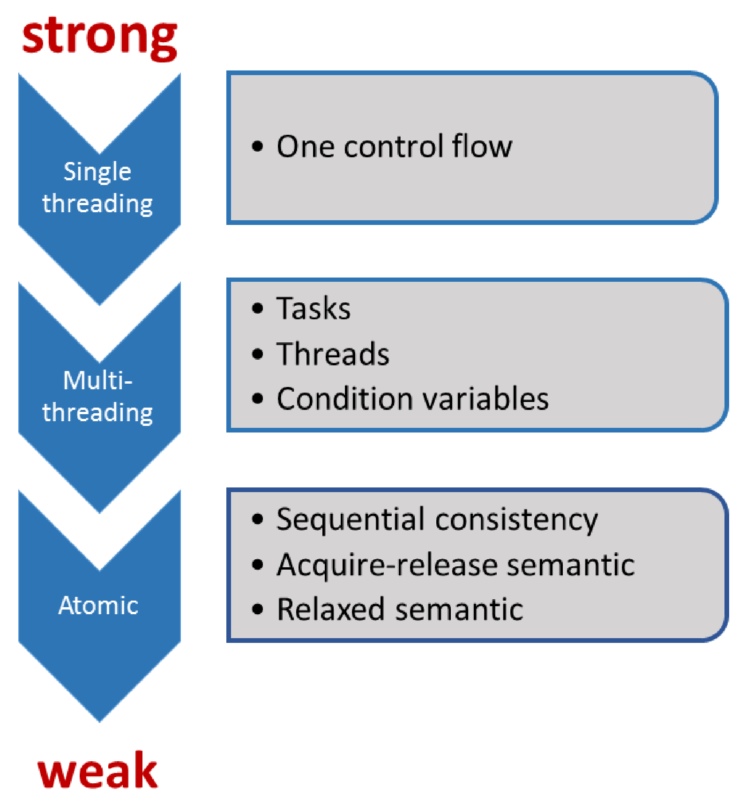

# 编程协议

这个协议是程序开发者和系统之间的。系统由生成机器码的编译器、执行机器码的处理器和存储程序状态的不同缓存组成。每个参与者都想优化自己的部分。例如，编译器使用寄存器或修改循环；处理器乱序执行或分支预测；缓存指令的预取或缓冲。结果(在好的情况下)一个良好的可执行文件，是已经针对硬件平台进行了优化。确切地说，这里不仅只有一个协议，还有一组细粒度的协议。或者换句话说：遵循越弱的规则，则程序的可优化潜力越大。

有一个经验法则。协议越强，可优化的空间越少。当程序开发者使用非常弱的协议或内存模型时，相应就会有许多优化选择。其结果是，这个项目只能由少数专家来维护，而你我可能都不属于专家的行列。

粗略地说，C++11中有三个协议级别。

C++11之前，只有一个协议。C++不包括多线程或原子。系统只知道控制流，因此优化的潜力非常有限。该系统的关键是，保证程序开发者所观察到的程序行为与源代码中指令的顺序一致。当然，这就意味着没有内存模型，而是序列点的概念。序列点是程序中的点，在这些点上的所有指令的效果必须是可见的。函数执行的开始点或结束点都是序列点。当使用两个参数调用一个函数时，C++并不保证先计算哪个参数，因此其行为是未指定的。原因很简单——逗号操作符不是一个序列点，而且在C++中，这一点不会改变。

在C++ 11中，这些都发生了变化。C++11是C++第一个支持多线程的标准。C++内存模型深受[Java内存模型]( https://en.wikipedia.org/wiki/Java_memory_model)的启发，但C++内存模型做了更多的工作。为了得到定义良好的程序，程序开发者在处理共享变量时必须遵守一些规则。如果存在数据竞争，则程序行为是未定义的。如前所述，如果线程共享可变数据，必须注意数据竞争。从而，任务比线程或条件变量更容易使用。

原子操作，让我们能感知的更多。当C++内存模型越弱，这种感觉越强烈。我们在使用原子的时候，经常会讨论无锁编程。我在本小节中谈到了弱规则和强规则。事实上，顺序一致性被称为**强内存模型**，放松语义被称为**弱内存模型**。

## 基础

C++内存模型需要保证以下操作：

* 原子操作：需要不受中断地执行。
* 部分排序操作：操作序列的顺序不能重新排序。
* 可见操作：保证共享变量上的操作对其他线程可见。

协议的基础是对原子的操作，操作有两个特征：根据定义，它们是原子的或不可分割的，并且它们在执行上会创建同步和约束顺序。同步和约束顺序，也适用于非原子的操作。一方面，原子上的操作总是原子性的；另一方面，可以根据需要定制同步和约束顺序。

## 挑战

内存模型越弱，我们就越会把越多的注意力转放到其他事情上，比如：

* 程序的优化潜力。
* 程序的控制流数量增长。
* 要了解更多底层专业知识。
* 程序行为与我们的想法是否相同。
* 我们要使用更加微观的优化手段。

我们应该是处理多线程的专家。如果想要处理原子(顺序一致性)，我们应该打开通向下一个专业级别的大门。想要知道使用“获得-释放”语义或“松散”语义时会发生什么，我们就得向(或更深地)下一个专业水平迈进了。

现在，我们从无锁编程开始，深入研究C++内存模型。当我们完成了基础知识，内存模型的不同级别就会随之而来。起点是顺序一致性，接着是“获得-释放”语义，而“松散”语义则是我们旅程的终点。

让我们一起开启原子操作之旅吧！