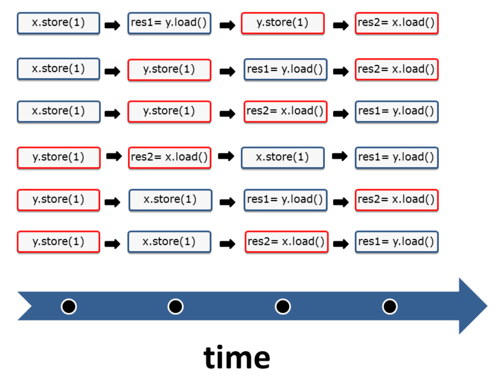

# 原子操作

原子操作是C++内存模型的基础。默认情况下，强内存模型支持原子操作；因此，理解强内存模型的特征很有意义。

##强/弱内存模型

您可能已经从编程协议的小节中了解到：强内存模型中的是顺序一致性，在弱内存模型中的松散语义。

###强内存模型

2004年Java 5.0有了内存模型，2011年C++添加了内存模型。在此之前，Java有一个错误的内存模型，而C++则没有内存模型。多线程编程已经有40~50年的历史了。在1979年，[Leslie Lamport](https://en.wikipedia.org/wiki/Leslie_Lamport) 就定义了顺序一致性的概念。

顺序一致性提供了两个保证:

* 指令按源码顺序执行。
*  线程上的所有操作都遵循一个全局顺序。

在深入研究这两个保证之前，我想强调一下，这些声明只适用于原子操作，但影响并不止于原子操作。

下面图形显示了两个线程。每个线程分别将值存储到变量x或y中，加载另一个变量y或x，并将它们存储在变量res1或res2中。


> 两个原子操作

通常，原子操作保证顺序一致性。问题是：这些语句以什么顺序执行?

顺序一致性的第一个保证是，指令按照源代码中定义的顺序执行。这很容易，任何存储操作都无法在加载操作之前进行。

顺序一致性的第二个保证是，所有线程的所有指令必须遵循全局顺序。上图中的情况，意味着线程2看到线程1的操作的顺序与线程1执行它们的顺序相同，这很关键。线程2按照线程1的源代码顺序查看线程1的所有操作，从线程1的角度来看也是如此。你可以将这个特性，想象成一个所有线程都必须遵守的全局时钟。全局时钟就是全局顺序。时钟每发出一次滴答声，就会发生一个原子操作，但你永远不知道是哪个。

我们的谜题还没有解开。我们仍然需要观察，这两个线程交错的执行方式。因此，这两个线程有以下六种交运行方式。



> 两条线的六个交错执行可能

很简单，对吧？这就是顺序一致性，也称为**强内存模型**。

### 弱内存模型

我们再参考一下程序开发者和系统之间的“协议”。

这个特殊的例子中，程序开发者使用了原子操作(开发者遵循协议的相应部分)。系统保证程序的行为，从而不会存在数据竞争。另外，系统可以在每个组合中执行四个操作。如果程序开发者使用松散语义，协议的基础部分就会发生巨大的变化。一方面，程序开发者可能很难理解两个线程之间的交错。另一方面，系统有了更多优化的空间。

使用松散语义(也称为弱内存模型)，可使这四种操作有更多的组合。有种很难理解的行为是，线程1可以以不同的顺序查看线程2的操作，这样全局时序图就不存在了。从线程1的角度来看，操作`res2= x.load()`可能在`y.store(1)`之前执行。甚至是，线程1或线程2没有按照源代码中的顺序执行。例如，线程2可以先执行`res2= x.load()`，再执行`y.store(1)`。

“序列一致性”和“松散语义”之间还有一些模型，其中最重要的是“获取-释放”语义。“获取-释放”语义中，程序开发人员需要遵守比“顺序一致性”更弱的规则。相较之下，系统有更多优化的空间。因为线程是在特定同步点上进行同步，所以“获取-释放”语义是理解多线程编程中，同步和部分排序的关键。没有这些同步点，就不可能有(定义良好的)线程、任务或条件变量。

上一节中，介绍了原子操作的默认行为——顺序一致性(为每个原子操作指定内存顺序)。如果没有指定内存顺序，则应用保持顺序一致性，这就意味着`std::memory_order_seq_cst`将默认应用于每个原子操作上。

下面两端代码是等价的：

```c++
x.store(1);
res = x.load();
```

```c++
x.store(1, std::memory_order_seq_cst);
res = x.load(std::memory_order_seq_cst);
```

简单起见，本书使用第一种形式。现在，是深入了解C++内存模型原子性的时候了。就从`std::atomic_flag`开始吧。

## 原子标志

`std::atomic_flag`是原子布尔类型。可以对其进行状态的设置和清除。为了简化说明，我将`clear`状态称为`false`，将`set`状态称为`true`。它的`clear`方法可将其值设置为`false`。使用`test_and_set`方法，可以将值设置回`true`，并返回先前的值。没有方法获取当前值。使用`std::atomic_flag`时，必须使用常量`ATOMIC_FLAG_INIT`将其初始化为`false`。

> 注意：
>
> **ATOMIC_FLAG_INIT**
>
> `std::atomic_flag` 标示需要进行初始化，可以是这样`std::atomic_flag flag = ATOMIC_FLAG_INIT`。不过，不能这样初始化`std::atomic_flag flag(ATOMIC_FLAG_INIT) `。

`std::atomic_flag`有两个突出的特性：

* 唯一的无锁原子类型。程序是系统级别进程的话，那么执行的非阻塞算法就是无锁的。
* 更高级别的线程构建块。

除了`std::atomic_flag`之外，C++标准中的原子内部都会使用互斥锁。这些原子类型有一个`is_lock_free`成员函数，可用来检查原子内部是否使用了互斥锁。在时下流行的微处理器架构上，能得到是“使用了互斥锁”的结果。如果想要无锁编程，那么就要使用该成员函数进行检查，确定是否使用了锁。

> 贴士：
>
> **`std::is_always_lock_free`**
>
> 可以使用`obj.is_lock_free()`，在运行时检查原子类型的实例`obj`是否无锁。在C++17中，可以通过`constexpr`(常量)[`atomic<type>::is_always_lock_free`](https://zh.cppreference.com/w/cpp/atomic/atomic/is_always_lock_free)，在编译时对每个原子类型进行检查，支持该操作的所有硬件实现都无锁时，此检查才返回true。

`std::atomic_flag`的接口非常强大，能够构建自旋锁。自旋锁可以像使用互斥锁一样保护临界区。

> 知识点
>
> **自旋锁**
>
> 自旋锁与互斥锁不同，它并不再等待获取锁。而是，通过频繁地请求锁来获取访问临界区的权利。不过，这会将上下文频繁切换(从用户空间到内核空间)，虽然充分使用了CPU，但也浪费了非常多的时钟周期。线程短时间阻塞时，自旋锁非常有效。通常，会将自旋锁和互斥锁组合着使用。首先，在有限的时间内使用自旋锁，如果不成功，则将线程置于等待(休眠)状态。
>
> 自旋锁不应该在单处理器系统上使用。否则，自旋锁仅是浪费资源，减慢程序处理的速度(最好的情况)，或出现死锁(最坏的情况)。

下面的示例展示了，使用`std::atomic_flag`实现自旋锁

```c++
// spinLock.cpp

#include <atomic>
#include <thread>

class Spinlock{
  std::atomic_flag flag = ATOMIC_FLAG_INIT;
public:
  void lock(){
    while(flag.test_and_set());
  }
  
  void unlock(){
    flag.clear();
  }
};

Spinlock spin;

void workOnResource(){
  spin.lock();
  // shared resource
  spin.unlock();
}

int main(){
  std::thread t(workOnResource);
  std::thread t2(workOnResource);
  
  t.join();
  t2.join();
}
```

线程t和t2(第31行和第32行)在争夺临界区的访问权。简单起见，第24行只有一条注释。自旋锁是如何工作的呢？自旋锁也有上锁和解锁。

当线程t执行函数`workOnResource`时，可能会发生以下情况。

1.  因为锁成功获取，所以线程`t`获取锁。若第11行的标志初始值为false，则锁调用成功。这种情况下，线程`t`的原子操作将其设置为true。所以，当`t`线程获取锁后，true将会让while陷入不停的循环，使得线程`t2`陷入了激烈的竞争当中。线程`t2`不能将标志设置为false，因此`t2`必须等待，直到线程`t1`执行`unlock`(解锁)并将标志设置为false(第14 - 16行)。
2.  线程`t`没有得到锁时，情况1中的`t2`一样，需要等待。

我们将注意力放在`std::atomic_flag`的`test_and_set`成员函数上。`test_and_set`函数包含两个操作：读和写。原子操作就是对这两种操作进行限制的。如果没有限制，我们将对共享资源同时进行读和写操作(第24行)。根据定义，这就是“数据竞争”，程序有产生未定义的行为。

将自旋锁的主动等待和互斥锁的被动等待做一下比较，应该会非常有趣。

### 自旋锁 vs. 互斥锁

如果函数`workOnResource`在第24行停顿2秒，那CPU负载会发生怎样的变化?

```c++
// spinLockSleep.cpp

#include <atomic>
#include <thread>

class Spinlock{
  std::atomic_flag flag = ATOMIC_FLAG_INIT;
public:
  
  void lock(){
    while(flag.test_and_set());
  }
  
  void unlock(){
    flag.clear();
  }
  
};

Spinlock spin;

void workOnResource(){
  spin.lock();
  std::this_thread::sleep_for(std::chrono::milliseconds(2000));
  spin.unlock();
}

int main(){
  
  std::thread t(workOnResource);
  std::thread t2(workOnResource);
  
  t.join();
  t2.join();
  
}
```

如下图所示，每次四个核中的一个是跑满了的。


我的PC上有一个核的负载达到100%，每次不同的核心执行”忙等待“。

我现在用互斥锁来替换自旋锁。让我们看下会发生什么。

```c++
// mutex.cpp

#include <mutex>
#include <thread>

std::mutex mut;

void workOnResource(){
  mut.lock();
  std::this_thread::sleep_for(std::chrono::milliseconds(5000));
  mut.unlock();
}

int main(){
  
  std::thread t(workOnResource);
  std::thread t2(workOnResource);
  
  t.join();
  t2.join();
}
```

虽然执行了好几次，但是并没有观察到任何一个核上有显著的负载。

这样就能看出二者间的区别了吧。


接下来，让我们了解下高级的`std::atomic`模板。

##  `std::atomic`模板

`std::atomic`的有各种各样的变体。

直接使用模板类：`std::atomic<bool>`和`std::atomic<user-defined type>`。

部分特化可用于指针类：`std::atomic<t*>`。

完全特化只能用于整型：`std::atomic<integral type>`。

布尔原子类型和用户定义原子类型具有相同的接口，原子指针扩展了布尔原子类型，以及整数原子类型的接口。因其扩展了原子指针的接口，所以同样适用于整数原子类型。

不过，不保证`std::atomic`的各种变体都是无锁的。

让我们从最简单的`std::atomic<bool>`开始说起吧。

### `std::atomic<bool>`

`std::atomic<bool>`的功能比`std::atomic_flag`强大很多。并且，可以显式地将其设置为true或false。

> 注意：
>
> **原子类型不可为volatile**
>
> C#和Java中的关键字`volatile`与C++中的关键字`volatile`的区别，这是`volatile`关键字和`std::atomic`之间的区别。
>
> * `volatile`：表示不允许对特定的对象进行读写优化。
> * `std::atomic`：用来定义线程安全的原子变量。
>
> 关键字`volatile`在Java和C#中，与`std::atomic`在C++中的含义相同。另外，在C++多线程语义中，没有`volatile`。
>
> `volatile`多嵌入式编程中，表示可以(独立于常规程序流)进行更改的对象，例如：表示外部设备的对象(内存映射I/O)。由于这些对象可以(独立于常规程序流)进行更改，并且直接写入主内存，因此不会在缓存中进行优化存储。

这对于同步两个线程已经足够了，可以用`std::atomic<bool>`实现一种条件变量。

因此，我们先要使用条件变量。

```c++
// conditionVariable.cpp

#include <condition_variable>
#include <iostream>
#include <thread>
#include <vector>

std::vector<int> mySharedWork;
std::mutex mutex_;
std::condition_variable condVar;

bool dataReady{false};

void waitingForWork(){
  std::cout << "Waiting " << std::endl;
  std::unique_lock<std::mutex> lck(mutex_);
  condVar.wait(lck, []{return dataReady;});
  mySharedWork[1] = 2;
  std::cout << "Work done " << std::endl;
}

void setDataReady(){
  mySharedWork = {1, 0, 3};
  {
    std::lock_guard<std::mutex> lck(mutex_);
    dataReady = true;
  }
  std::cout << "Data prepared" << std::endl;
  condVar.notify_one();
}

int main(){
  std:cout << std::endl;
  
  std::thread t1(waitingForWork);
  std::thread t2(setDataReady);
  
  t1.join();
  t2.join();
  
  for (auto v : mySharedWork){
    std::cout << v << " ";
  }
  
  std::cout << "\n\n";
}
```

简单说一下这段代码。如要深入讨论条件变量，请阅读本书有关条件变量的章节。

线程t1在(第17行)等待线程t2的通知。两个线程使用相同的条件变量`condVar`，并在同一个互斥锁上进行同步。工作流如下所示：

* 线程t1
  * 当获取锁lck时，等待数据准备好的通知 `condVar.wait(lck, []{ return dataReady; })` 。
  * 在得到通知后，执行`mySharedWork[1] = 2`。

* 线程t2
  * 准备数据`mySharedWork = {1, 0, 3}`
  * 将非原子布尔类型的`dataReady`置为true。
  * 通过`condVar.notify_one`发布通知。

线程t2将`dataReady`设置为true，线程t1使用lambda对`dataReady`进行检查。不过，条件变量可能会出现两种不好的情况:

1. 伪唤醒：接受者在没有收到通知时被唤醒。
2. 超前唤醒：接收方在未处于等待状态时获得通知。

现在使用`std::atomic<bool> `进行实现：

```c++
// atomicCondition.cpp

#include <atomic>
#include <chrono>
#include <iostream>
#include <thread>
#include <vector>

std::vector<int> mySharedWork;
std::atomic<bool> dataReady(false);

void waitingForWork(){
  std::cout << "Waiting " << std::endl;
  while(!dataReady.load()){
    std::this_thread::sleep_for(std::chrono::milliseconds(5)); 
  }
  mySharedWork[1] = 2;
  std::cout << "Work done " << std::endl;
}

void setDataReady(){
  mySharedWork = {1,0,3};
  dataReady = true;
  std::cout << "Data prepared" << std::endl;
}

int main(){
  
  std::cout << std::endl;
  
  std::thread t1(waitingForWork);
  std::thread t2(setDataReady);
  
  t1.join();
  t2.join();
  
  for (auto v : mySharedWork){
    std::cout << v << " "; 
  }
  
  std::cout << "\n\n";
}
```

如何保证第17行在第14行之后执行？或者说，线程t1在线程t2执行`mySharedWork ={1,0,3}`(第22行)后执行`mySharedWork[1] = 2`(第17行)。

* 22行先于23行执行。
* 14行先于17行执行。
* 14 23行与14行同步
* 因为同步建立了先行关系，并且先行关系可以传递，所以`mySharedWork = {1,0,3}`先于`mySharedWork[1] = 2`执行。

很容易理解，对吧？为了简单，忽略了同步创建的线程间的先行关系，以及线程间的先行建立的先行关系。如果你对这里的细节感兴趣，可以参考这里进行延伸阅读：[内存序(memory_order)](http://en.cppreference.com/w/cpp/atomic/memory_order)。

明确一下关键点：使用条件变量`condVar`或原子类型对共享变量`mySharedWork`的访问进行保护。尽管，`mySharedWork`本身不受锁或原子的保护，但当前的方式也是可行的。

两段程序产生了相同的结果。


> 知识点
>
> **推拉原理**
>
> 其实这里还有些不同。具有条件变量线程的同步与`std::atomic<bool>`之间有一个关键性的区别。条件变量通知等待的线程(`condVar.notify()`)，让其继续工作。使用检查`std::atomic<bool>`的等待线程，只是为了确定发送方是否完成了其工作(`dataRead = true`)。
>
> 条件变量通知等待线程对应"推原则(push principle)"，而原子布尔值的重复轮询值对"拉原则(pull principle)"。

`std::atomic<bool>`和`std::atomic`的其他全/部分特化都支持的原子操作：`compare_exchange_strong`和`compare_exchange_strong`。

> 知识点
>
> **compare_exchange_strong和compare_exchange_weak** 
>
> compare_exchange_strong的声明为`bool compare_exchange_strong(T& expected, T& desired)`。此操作为比较和交换值，因此也将其称为*比较-交换*(compare and swap，CAS)操作。这种操作在许多编程语言中都有用到，并且是非阻塞算法的基础。当然，C++中的行为可能会与其他语言中有一些不同。`atomicValue.compare_exchange_strong(expected, desired)`具有以下行为。
>
> *  如果`atomicValue`的值与期望值(expected)的比较返回true，则在相同的原子操作中将`atomicValue`设置为所需值(desired)。
> * 如果比较返回false，则expected值设置为`atomicValue`的值。
>
> compare_exchange_strong称为**strong**的原因显而易见。当然，还有一个compare_exchange_weak，**weak**版本可能会伪失败。这意味着，虽然`*atomicValue == expected`成立，但`atomicValue`没有被设置成`desired`，函数返回`false`，因此必须在循环中进行检查：`while (!atomicValue.compare_exchange_weak(expected, desired))`。弱形式的存在原因是，因为一些处理器(硬件)不支持原子比较交换指令。在循环调用时，也应该首选弱形式。并且在某些平台上，弱形式运行得更快。
>
> CAS操作对于[ABA问题](https://lumian2015.github.io/lockFreeProgramming/aba-problem.html)，解决方式是开放的。先描述一下这个问题：读取一个值两次，每次都返回相同的值A；因此得出结论，在这两者之间没有变化。但是，忽略了两次读取过程中数值可能已经更改为B了。

弱版本允许伪失败，也就是说，即使它们是相等的，结果也要和`*this !=expected`一样。当比较-交换操作处于循环中时，弱版本可能在某些平台上具有更好的性能。

除了布尔值之外，还有指针、整型和用户定义类型的原子操作。用户定义类型的规则是唯一的。

所有`std::atomic`的变种类型都支持CAS操作。

### 用户定义类型的原子操作`std::atomic<user-defined type>`

因为`std::atomic`是模板类，所以可以使用自定义的原子类型。

使用用户定义的类型用于原子类型`std::atomic<user-defined type>`，会受到很多限制。原子类型`std::atomic<user-defined type`>与`std::atomic<bool>`具有相同的接口。

以下是用户定义类型成为原子类型的限制：

* 用户定义类型对所有基类和有非静态成员的复制赋值操作必须非常简单。这意味着不能定义复制赋值操作符，但是可以使用[default](http://en.cppreference.com/w/cpp/keyword/default)让编译器来完成这个操作符的定义。
* 用户定义的类型不能有虚方法或虚基类
* 用户定义的类型必须可按位比较，这样才能使用C函数[memcpy](http://en.cppreference.com/w/cpp/string/byte/memcpy)或[memcmp]( http://en.cppreference.com/w/cpp/string/byte/memcmp)。

主流平台都可以对`std::atomic<user-defined type>`进行原子操作，前提是用户定义类型的大小不大于`int`。

> 知识点
>
> **编译时检查类型属性**
>
> 可以使用以下函数，在编译时检查用户定义类型的类型属性：`std::is_trivially_copy_constructible`, `std:: is_polymorphic`和`std::is_trivial`。所有这些函数都是类型特征库([type-traits library]( http://en.cppreference.com/w/cpp/header/type_traits))的一部分。

**`std::atomic<T*>`**

`std::atomic<T*>`是`std::atomic`类模板的偏特化类型。原子指针`std::atomic<T*>` 支持与`std::atomic<bool>` 或` std::atomic<user-defined type> `相同的成员函数。它的行为就像一个普通的指针`T*`。`std::atomic<T*> `支持指针运算和前后递增或前后递减操作。

来看个简单的例子。

```c++
int intArray[5];
std::atomic<int*> p(intArray);
p++;
assert(p.load() == &intArray[1]);
p+=1;
assert(p.load() == &intArray[2]);
--p;
assert(p.load() == &intArray[1]);
```

在C++11中，整型有原子类型。

**`std::atomic<integral type>`**

For each integral type there is a full specialisation std::atomic<integral type> of std::atomic . An std::atomic<integral type> supports all operations that std::atomic<T*> support, and more. First of all. Which specialisations for integral types exists? Here are the details:

对于每个整数类型，都有一个全特化`std::atomic<integral type>`版本。首先，对于哪些整型存做了全特化？让我们来看一下:

* 字符类型: char , char16_t , char32_t 和 wchar_t
* 标准有符号整型: signed char , short , int , long 和 long long
*  标准无符号整型: unsigned char , unsigned short , unsigned int , unsigned long 和 unsigned long long
*  还有很多整型，都定义在[<cstdint>](http://en.cppreference.com/w/cpp/header/cstdint)中
  * int8_t , int16_t , int32_t 和 int64_t (8, 16, 32 和 64位的有符号整型)
  * uint8_t , uint16_t , uint32_t 和 uint64_t (8, 16, 32 和 64位的无符号整型)
  * int_fast8_t , int_fast16_t , int_fast32_t 和 int_fast64_t (8, 16, 32 和 64位的高速有符号整型)
  * uint_fast8_t , uint_fast16_t , uint_fast32_t 和 uint_fast64_t (8, 16, 32 和 64 位的高速无符号整型)
  * int_least8_t , int_least16_t , int_least32_t 和 int_least64_t (8, 16, 32 和 64 位的最小有符号整型)
  * uint_least8_t , uint_least16_t , uint_least32_t 和 uint_least64_t (8, 16, 32 和 64 位的最小无符号整型)
  * intmax_t 和 uintmax_t (最大有符号整数和无符号整数)
  * intptr_t 和 uintptr_t (用于存放有符号整数和无符号整数指针)

`std::atomic<integral type>`支持复合赋值运算符`+=`、`-=`、`&=`、`|=`和`^=`，以及它们的获取机制：`fetch_add`、`fetch_sub`、`fetch_and`、`fetch_or`和`fetch_xor`。复合赋值和取值有一个小的区别。复合赋值运算符返回新值；fetch变量返回旧值。此外，还支持前增量和后增量，以及前减量和后减量(++x, x++，--x和x--)。

更深入的研究前需要了解的是：没有原子乘法、原子除法，也没有原子移位操作。这不是重要的限制，因为这些操作很少需要，并且很容易实现。下面是一个实现原子`fetch_mult`函数的例子。

```c++
// fetch_mult.cpp

#include <atomic>
#include <iostream>

template <typename T>
T fetch_mult(std::atomic<T>& shared, T mult){
  T oldValue = shared.load();
  while(!shared.compare_exchange_strong(oldValue, oldValue * mult));
  return oldValue;
}

int main(){
  std::atomic<int> myInt{5};
  std::cout << myInt << std::endl;
  fetch_mult(myInt, 5);
  std::cout << myInt << std::endl;
}
```

值得一提的是，第9行的乘法只在关系`oldValue == shared`成立时才会发生。我将乘法放在`while`循环中，以确保乘法总是发生，因为在第8行中有两条读取`oldValue`的指令。


> 知识点
>
> **fetch_mult 算法无锁**
>
> fetch_mult(第6行)将`std::atomic`变量与`mult`相乘。关键在读取旧值`T oldValue = shared Load`(第8行)和比较第9行中的新值之间，有一个窗口时间。因此，其他线程总是可以介入并更改`oldValue`。如果线程间有糟糕的交错，那您会发现每个线程可能都有自己的结果。
>
> 该算法是无锁的，但不是无等待的。

### 类型别名

对于所有`std::atomic<bool>`和`std::atomic<integral type>`(如果integral类型可用)，C++标准提供类型别名。

`std::atomic<bool>`和`std::atomic<integral type>`的类型别名如下：

|           类型别名           |              具体定义              |
| :--------------------------: | :--------------------------------: |
|      `std::atomic_bool`      |        `std::atomic<bool>`         |
|      `std::atomic_char`      |        `std::atomic<char>`         |
|     `std::atomic_schar`      |     `std::atomic<signed char>`     |
|     `std::atomic_uchar`      |    `std::atomic<unsigned char>`    |
|     `std::atomic_short`      |        `std::atomic<short>`        |
|     `std::atomic_ushort`     |   `std::atomic<unsigned short>`    |
|      `std::atomic_int`       |         `std::atomic<int>`         |
|      `std::atomic_uint`      |    `std::atomic<unsigned int>`     |
|      `std::atomic_long`      |        `std::atomic<long>`         |
|     `std::atomic_ulong`      |    `std::atomic<unsigned long>`    |
|     `std::atomic_llong`      |      `std::atomic<long long>`      |
|     `std::atomic_ullong`     | `std::atomic<unsigned long long>`  |
|    `std::atomic_char16_t`    |      `std::atomic<char16_t>`       |
|    `std::atomic_char32_t`    |      `std::atomic<char32_t>`       |
|    `std::atomic_wchar_t`     |       `std::atomic<wchar_t>`       |
|     `std::atomic_int8_t`     |     `std::atomic<std::int8_t>`     |
|    `std::atomic_uint8_t`     |    `std::atomic<std::uint8_t>`     |
|    `std::atomic_int16_t`     |    `std::atomic<std::int16_t`>     |
|    `std::atomic_uint16_t`    |    `std::atomic<std::uint16_t`>    |
|    `std::atomic_int32_t`     |    `std::atomic<std::int32_t>`     |
|    `std::atomic_uint32_t`    |    `std::atomic<std::uint32_t>`    |
|    `std::atomic_int64_t`     |    `std::atomic<std::int64_t>`     |
|    `std::atomic_uint64_t`    |    `std::atomic<std::uint64_t>`    |
|  `std::atomic_int_least8_t`  |  `std::atomic<std::int_least8_t>`  |
| `std::atomic_uint_least8_t`  | `std::atomic<std::uint_least8_t>`  |
| `std::atomic_int_least16_t`  | `std::atomic<std::int_least16_t>`  |
| `std::atomic_uint_least16_t` | `std::atomic<std::uint_least16_t>` |
| `std::atomic_int_least32_t`  | `std::atomic<std::int_least32_t>`  |
| `std::atomic_uint_least32_t` | `std::atomic<std::uint_least32_t>` |
| `std::atomic_int_least64_t`  | `std::atomic<std::int_least64_t>`  |
| `std::atomic_uint_least64_t` | `std::atomic<std::uint_least64_t>` |
|  `std::atomic_int_fast8_t`   |  `std::atomic<std::int_fast8_t>`   |
|  `std::atomic_uint_fast8_t`  |  `std::atomic<std::uint_fast8_t>`  |
|  `std::atomic_int_fast16_t`  |  `std::atomic<std::int_fast16_t>`  |
| `std::atomic_uint_fast16_t`  | `std::atomic<std::uint_fast16_t>`  |
|  `std::atomic_int_fast32_t`  |  `std::atomic<std::int_fast32_t>`  |
| `std::atomic_uint_fast32_t`  | `std::atomic<std::uint_fast32_t>`  |
|  `std::atomic_int_fast64_t`  |  `std::atomic<std::int_fast64_t>`  |
| `std::atomic_uint_fast64_t`  | `std::atomic<std::uint_fast64_t>`  |
|    `std::atomic_intptr_t`    |    `std::atomic<std::intptr_t>`    |
|   `std::atomic_uintptr_t`    |   `std::atomic<std::uintptr_t>`    |
|     `std::atomic_size_t`     |     `std::atomic<std::size_t>`     |
|   `std::atomic_ptrdiff_t`    |   `std::atomic<std::ptrdiff_t>`    |
|    `std::atomic_intmax_t`    |    `std::atomic<std::intmax_t>`    |
|   `std::atomic_uintmax_t`    |   `std::atomic<std::uintmax_t>`    |

### 所有原子操作

首先，这是关于所有原子操作的列表。

|        成员函数         |                  描述                  |
| :---------------------: | :------------------------------------: |
|      test_and_set       | (原子性地)将标记设置为true，并返回旧值 |
|          clear          |      (原子性地)将标记设置为false       |
|      is_lock_free       |            检查原子是否无锁            |
|          load           |       (原子性地)返回原子变量的值       |
|          store          | (原子性地)将原子变量的值替换为非原子值 |
|        exchange         |    (原子性地)用新值替换值，返回旧值    |
| compare_exchange_strong |         (原子性地)比较并交换值         |
|  compare_exchange_weak  |         (原子性地)比较并交换值         |
|     fetch_add , +=      |             (原子性地)加法             |
|     fetch_sub , -=      |             (原子性地)减法             |
|     fetch_or , \|=      |            (原子性地)逻辑或            |
|     fetch_and , &=      |            (原子性地)逻辑与            |
|     fetch_xor , ^=      |           (原子性地)逻辑异或           |
|         ++ , --         |          (原子性地)自加和自减          |

原子类型没有复制构造函数或复制赋值操作符，但支持从基础内置类型进行赋值和隐式转换。复合赋值运算符返回新值，fetch变量返回旧值。复合赋值运算符返回值，而不是所赋值对象的引用。

隐式转换为基础类型

```c++
std::atomic<long long> atomOb(2011);
atomObj = 2014;
long long nonAtomObj = atomObj;
```

每个方法都支持内存序参数。默认的内存排序参数是`std::memory_order_seq_cst`，也可以使用`std::memory_order_relaxed`, `std::memory_order_consume`, `std::memory_order_acquire`, `std::memory_order_release`或`std::memory_order_acq_rel`。`compare_exchange_strong`和 `compare_exchange_weak`的函数声明中也可以传入两个内存序，一个是在比较成功的情况下所使用的内存序，另一个是在比较失败的情况下使用的。

如果只显式地提供一个内存序，那么它将用于成功和失败的情况。

当然，并不是所有操作对所有原子类型都可用。下表显示了所有原子类型支持的原子操作。

|         函数名          | atomic_flag | `atomic<bool>` | `atomic<user>` | `atomic<T*>` | `atomic<integral>` |
| :---------------------: | :---------: | :------------: | :------------: | :----------: | :----------------: |
|      test_and_set       |     yes     |                |                |              |                    |
|          clear          |     yes     |                |                |              |                    |
|      is_lock_free       |             |      yes       |      yes       |     yes      |        yes         |
|          load           |             |      yes       |      yes       |     yes      |        yes         |
|          store          |             |      yes       |      yes       |     yes      |        yes         |
|        exchange         |             |      yes       |      yes       |     yes      |        yes         |
| compare_exchange_strong |             |      yes       |      yes       |     yes      |        yes         |
|  compare_exchange_weak  |             |                |                |              |                    |
|      fetch_add, +=      |             |                |                |     yes      |        yes         |
|      fetch_sub, -=      |             |                |                |              |                    |
|      fetch_or, \|=      |             |                |                |              |        yes         |
|      fetch_and, &=      |             |                |                |              |                    |
|      fetch_xor, ^=      |             |                |                |              |                    |
|         ++, --          |             |                |                |     yes      |        yes         |

### 原子函数

因为，这些函数使用的是指针而不是引用，以与C语言兼容。所以，`std::atomic_flag`和类模板`std::atomic`的功能也可以与自由函数一起使用。

`std::atomic_flag`的自由函数为：`std::atomic_flag_clear()`、`std::atomic_flag_clear_explicit`、`std::atomic_flag_test_and_set()`和`std::atomic_flag_test_set_explicit()`。所有函数的第一个参数都是指向`std::atomic_flag`的指针。另外，这两种两个`explicit`函数需要传入内存序。

对于每个`std::atomic`类型，它们都有相应的自由函数。自由函数遵循一个简单的命名约定：只在前面添加前缀`atomic_`。例如，`std::atomic`上的方法调用`at.store()`变成`std::atomic_store()`， `std::atomic_store_explicit()`。

可以在[atomic]( http://en.cppreference.com/w/cpp/atomic)了解所有的重载。

`std::shared_ptr`算是个例外，其自由函数只能在原子类型上使用。

### std::shared_ptr

`std::shared_ptr `是唯一可以使用原子操作的非原子数据类型。首先，让我来说明一下这样设计的动机。

C++委员会了解了智能指针实例，需要在多线程程序中提供最小原子性保证的必要性。先来解释“`std::shared_ptr`的最小原子性保证”，也就是`std::shared_ptr`的控制块是线程安全的。这意味着增加和减少引用计数器的是原子操作。这就能保证资源只被销毁一次了。

`std::shared_ptr`的声明由[Boost](http://www.boost.org/doc/libs/1_57_0/libs/smart_ptr/shared_ptr.htm#ThreadSafety)提供描述：

1. `shared_ptr`实例可以被多个线程同时“读”(仅`const`方式访问)。
2. 不同的`shared_ptr`实例可以被多个线程同时“写入”(通过操作符`=`或`reset`等操作访问)(即使这些实例是副本，但在底层共享引用计数)。

为了使这两个表述更清楚，举一个简单的例子。当在一个线程中复制`std::shared_ptr`时，一切正常。

```c++
std::shared_ptr<int> ptr = std::make_shared<int>(2011);

for (auto i = 0; i < 10; i++){
  std::thread([ptr]{
    std::shared_ptr<int> localPtr(ptr);
    localPtr = std::make_shared<int>(2014);
  }).detach();
}
```

先看第5行，通过对`std::shared_ptr localPtr`使用复制构造，只使用控制块，这是线程安全的。第6行更有趣一些，`localPtr`设置成一个新的`std::shared_ptr`。从多线程的角度来看，这不是问：lambda函数(第4行)通过复制绑定`ptr`。因此，对`localPtr`的修改在副本上进行。

如果通过引用获得`std::shared_ptr`，情况会发生巨大变化。

```c++
std::shared_ptr<int> ptr = std::make_shared<int>(2011);

for (auto i = 0; i < 10; i++){
  std::thread([&ptr]{
    ptr = std::make_shared<int>(2014);
  }).detach();
}
```

Lambda函数通过引用，绑定了第4行中的`std::shared_ptr ptr`。这意味着，赋值(第5行)可能触发底层的并发读写；因此，该段程序具有未定义的行为(数据竞争)。

诚然，最后一个例子并不容易实现。`std::shared_ptr`也需要在多线程环境中特别注意。同样需要注意的是，`std::shared_ptr`是C++中唯一存在原子操作的非原子数据类型。

### std::shared_ptr的原子操作

There are specialisations for the atomic operations load , store , compare_and_exchange for a std::shared_ptr . By using the explicit variant you can even specify the memory-ordering. Here are the free atomic operations for std::shared_ptr 

Atomic operations for std::shared_ptr


For the details, have a look at [cppreference.com]( http://en.cppreference.com/w/cpp/memory/shared_ptr). Now it is quite easy to modify a shared pointer that is bound by reference in a thread-safe way.

A data race for a std::shared_ptr resolved

```c++

```

The update of the std::shared_ptr ptr in the expression auto localPtr = std::make_shared<int>(2014) is thread-safe. All is well? NO! Finally, we need atomic smart pointers.

> 知识点
>
> That is not the end of the story for atomic smart pointers. With C++20 we can expect with high probability two new smart pointers: std::atomic<std::shared_ptr> and std::atomic<std::weak_ptr> . For the impatient reader here are the details of the upcoming atomic smart pointers.

Atomics and their atomic operations are the basic building blocks for the memory model. They establish synchronisation and ordering constraints that hold for both atomics and non-atomics. Let’s have a more in-depth look into the synchronisation and ordering constraints.


