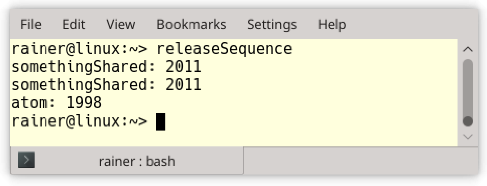
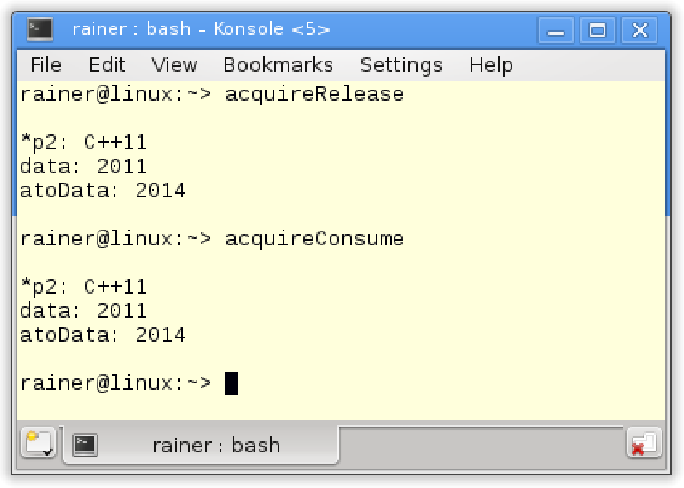
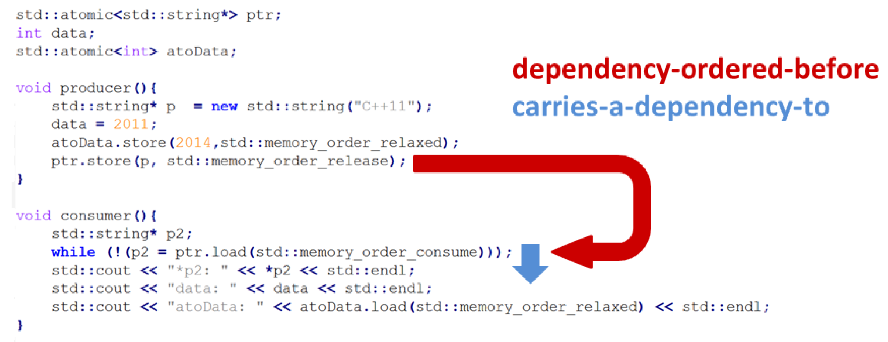

#同步和排序约束

虽然不能配置原子数据类型的原子性，但可以调整原子操作的同步和排序约束。这在C#或Java的内存模型中是不可能的，只有在C++中可行。

C++中有六种不同的内存模型。那这些内存模型分别是什么呢?

## C++中六种内存序

我们已经知道C++有六种不同的内存序。原子操作默认的内存序是`std::memory_order_seq_cst`，这表示顺序的一致性。此外，也可以显式地指定其他五个中的一个。那么剩余几个是什么呢?

C++中定义的内存序

```c++
enum memory_order{
  memory_order_relaxed,
  memory_order_consume,
  memory_order_acquire,
  memory_order_release,
  memory_order_acq_rel,
  memory_order_seq_cst
}
```

要对这六种内存序进行分类，需要回答两个问题:

1. 不同的原子操作应该使用哪种内存模型?
2. 6个内存序定义了哪些同步和排序约束?

My plan is quite simple: I answer both questions.

我的计划很简单 —— 回答这两个问题。

## 原子操作的种类

这里有三种不同类型的原子操作：

* *读*(read)操作: `memory_order_acquire`和`memory_order_consume`
* *写*(write)操作: `memory_order_release`
* *读改写*(read-modify-write)操作: `memory_order_acq_rel`和`memory_order_seq_cst`

`memory_order_relaxed`无同步和排序约束，所以它不适用于这种分类方式。

下表根据原子操作的读写特性对它们进行排序。

|        操作名称         | read | write | read-modify-write |
| :---------------------: | :--: | :---: | :---------------: |
|      test_and_set       |      |       |        yes        |
|          clear          |      |  yes  |                   |
|      is_lock_free       | yes  |       |                   |
|          load           | yes  |       |                   |
|          store          |      |  yes  |                   |
|        exchange         |      |       |        yes        |
| compare_exchange_strong |      |       |        yes        |
|  compare_exchange_weak  |      |       |                   |
|      fetch_add, +=      |      |       |        yes        |
|      fetch_sub, -=      |      |       |                   |
|      fetch_or, \|=      |      |       |        yes        |
|      fetch_and, &=      |      |       |                   |
|      fetch_xor, ^=      |      |       |                   |
|         ++, --          |      |       |        yes        |

“读改写”操作还有一个额外的保证：总是提供最新的值。这意味着，不同线程上的`atomVar.fetch_sub(1)`操作序列一个接一个地计数，无缝衔接或进行重复。

如果将原子操作`atomVar.load()`与“写”或“读改写”操作一起使用，那么“写”的部分将不起作用。结果就是：`atomVar.load(std::memory_order_acq_rel)`等价于`atomVar.load(std::memory_order_acquire)`，`atomVar.load(std::memory_order_release)`等价于`atomVar.load(std::memory_order_relax)`。

## 同步与排序约束的不同

大致说来，C++中有三种不同类型的同步和排序约束:

* 顺序一致性: `memory_order_seq_cst`
* 获取-释放(Acquire-release)：`memory_order_consume` , `memory_order_acquire` ,` memory_order_release`和`memory_order_acq_rel`
* 自由序(Relaxed): `memory_order_relaxed`

顺序一致性在线程之间建立全局顺序，而获取-释放语义为不同线程之间，对同一原子变量进行读写操作时建立顺序。自由语序只保证了原子变量的修改顺序，修改顺序是指对一个特定原子变量的所有修改都以某种特定的顺序发生。因此，由特定线程读取原子对象时，不会看到比线程已经观察到的值“更旧”的值。

不同的内存模型，及其对原子和非原子操作的影响，使建立C++内存模型有趣但又具有挑战性。下面我们来讨论顺序一致性、获得-释放语义和自由语义的同步和排序约束。

### 顺序一致性

让我们深入地研究一下顺序一致性，其关键是所有线程上的所有操作都遵从一个通用时钟。这个全球时钟让我们可以很直观的想象它的存在。

顺序一致性的直观性是有代价的，缺点是系统必须对线程进行同步。

下面的程序在顺序一致性的帮助下，同步生产者和消费者线程。

```c++
// producerConsumer.cpp

#include <atomic>
#include <iostream>
#include <string>
#include <thread>

std::string work;
std::atomic<bool> ready(false);

void consumer(){
  while(!ready.load()){}
  std::cout << work << std::endl;
}

void producer(){
  work = "done";
  ready = true;
}

int main(){
  std::thread prod(producer);
  std::thread con(consumer);
  prod.join();
  con.join();
}
```

这个程序的输出：


由于顺序一致性，程序执行结果是确定的，所以总是输出“done”。

The graphic depicts the sequence of operations. The consumer thread waits in the while-loop until the atomic variable ready is set to true . When this happens, the consumer threads continues its work.

下图描述了操作的顺序。消费者线程在`while`循环中等待，直到原子变量`ready`被生产者线程设置为`true`。当这种情况发生时，消费者线程将继续其工作。


理解程序总是返回“done”并不困难，只需要使用顺序一致性的两个特性：一方面，两个线程以源代码的顺序执行指令；另一方面，每个线程以相同的顺序查看另一个线程的操作。两个线程遵循相同的时钟。在`while(!ready.load()){}`循环中，这种同步也可以保持下去——用于同步生产者线程和消费者线程。

通过使用内存序，可以更正式地解释这个过程。以下是正式版本:

1. `work= "done"` 在序列中，位于 `ready = true`之前
   ⇒ `work= "done"` 先行与 `ready = true`
2. `while(!ready.load()){}`序列位位于 `std::cout << work << std::endl`之前
   ⇒ `while(!ready.load()){}`先行与`std::cout<< work << std::endl`
3. `ready= true`与`while(!ready.load()){}`同步
   ⇒ `ready= true`(线程间)先行于 `while (!ready.load()){}`
   ⇒ `ready= true`先行于`while (!ready.load()){}`

最终的结论：因为先行关系是可以传递的，所以`work = "done"`先行于`ready= true`，且先行于`while(!ready.load()){}`，更先行于`std::cout<< work << std::endl`。

顺序一致性中，一个线程可以看到另一个线程的操作，因此也可以看到所有其他线程的操作。如果使用原子操作的获取-释放语义，那么顺序一致性就不成立了。这是与C#和Java不同的地方，也是我们开始产生疑惑的地方。

### 获取-释放 语义

获取-释放语义中，线程间不存在全局同步：只有同一原子变量上的原子操作之间才进行同步。比如：一个线程上的写操作与另一个线程上的读操作，只有作用于同一个原子变量时才进行同步。

获取-释放语义的基本思想：释放操作与获取操作在同一原子上同步，并建立一个顺序约束。这意味着，在释放操作之后不能进行所有的读写操作，在获取操作之前不能进行所有的读写操作。

什么是获取/释放操作？使用`load`或`test_and_set`读取原子变量是一个获取操作。还有，锁或互斥锁的释放与获取是同步的，线程的构造与调用间是同步的，线程的完成与汇入调用间的操作是同步的，任务可调用的完成与等待或获取future的调用操作是同步的。所以，获取和释放操作是成对的。

下面这张图有利于对 获取-释放语义的理解：


> 贴士
>
> **内存模型——更深入地理解多线程**
>
> 这应该是要了解内存模型的主要原因。特别是，获取-释放语义也可以帮助您更好地理解高级同步原语，比如互斥锁。同样的原理也适用于线程的启动和线程的汇入。这两种操作都是获取-释放操作。接下来是`wait`和`notify_one`对条件变量的调用；`wait`是获取操作，`notify_one`是释放操作。那`notify_all`呢？当然，也是一个释放操作。

现在，我们再看`std::atomic_flag`小节中的自旋锁。因为同步是使用`atomic_flag flag`完成的，所以我们可以实现的更高效它，用的就是“获取-释放语义”。

```c++
// spinlockAcquireRelease.cpp

#include <atomic>
#include <thread>

class Spinlock{
  std::atomic_flag flag;
public:
  Spinlock():flag(ATOMIC_FLAG_INIT){}
  
  void lock(){
    while(flag.test_and_set(std::memory_order_acquire));
  }
  
  void unlock(){
    flag.clear(std::memory_order_release);
  }
};

Spinlock spin;

void workOnResource(){
	spin.lock();
  // shared resource
  spin.unlock();
}

int main(){
  
  std::thread t(workOnResource);
  std::thread t2(workOnResource);
  
  t.join();
  t2.join();
}
```

第16行` flag.clear `是清除标志，`test_and_set`在第12行调用一个获取操作，获取操作与释放操作同步。具有顺序一致性的两个线程的同步(重同步)(`std::memory_order_seq_cst`)被更轻量级的和性能更强的获取-释放语义(`std::memory_order_acquire`和`std::memory_order_release`)所取代，且程序行为不受影响。

虽然`flag.test_and_set(std::memory_order_acquire)`调用是一个"读改写"操作，但是获取语义已经足够了。总之，`flag`是原子的，因此可以保证其修改顺序。这也就意味着，对`flag`的所有修改都以某种特定的顺序进行。

获得-释放语义是可传递的。这意味着，如果两个线程(a,b)之间遵循获取-释放语义，且线程(b,c)之间也遵循获取-释放语义，那么在线程(a, c)之间则也遵循获取-释放语义。

#### 传递性

释放与获取操作在同一个原子变量上同步，并建立排序约束。如果它们作用于相同的原子变量，这些组件将以最高效的方式同步线程。如果两个线程没有共享的原子变量，会如何工作呢？我们不想使用顺序一致性，因为代价过高，我们想要更轻量级的获取-释放语义。

解决方式很简单，就是利用获取-释放语义的传递性，我们可以同步的独立线程。

下面的示例中，线程t2及其工作包`deliveryBoy`是两个独立线程t1和t3之间的连接线程。

```c++
// transitivity.cpp

#include <atomic>
#include <iostream>
#include <thread>
#include <vector>

std::vector<int> mySharedWork;
std::atomic<bool> dataProduced(false);
std::atomic<bool> dataConsumed(false);

void dataProducer(){
  mySharedWork = {1,0,3};
  dataProduced.store(true, std::memory_order_release);
}

void deliverBoy(){
  while(!dataProduced.load(std::memory_order_acquire));
  dataConsumed.store(true, std::memory_order_release);
}

void dataConsumer(){
  while(!dataConsumed.load(std::memory_order_acquire));
  mySharedWork[1] = 2;
}

int main(){
  std::cout << std::endl;
  
  std::thread t1(dataConsumer);
  std::thread t2(deliverBoy);
  std::thread t3(dataProducer);
  
  t1.join();
  t2.join();
  t3.join();
  
  for (auto v : mySharedWork){
    std::cout << v << " ";
  }
  
  std::cout << "\n\n";
  
}
```

程序的输出是唯一的，`mySharedWork`的值为`1, 2, 3`。


通过观察，得出两个结论：

1. 线程t2在第18行等待，直到线程t3将`dataProduced`设置为`true`(第14行)。
2. 线程t1在第23行等待，直到线程t2将`dataConsumed`设置为`true`(第19行)。

用图表来解下：


图中主要部分是箭头。

* 蓝色箭头是顺序关系，线程中的所有操作都是按源码顺序执行的。
* 红色的箭头是同步关系。原因是对同一原子变量的原子操作遵循的获取-释放语义。原子变量之间，以及线程同步发生在特定的点上。
* 顺序关系建立了先行关系，再使用线程间的先行关系建立了同步关系。

剩下的部分就好理解了，线程间的先行指令的顺序对应于从上到下箭头的方向。最后，能够保证执行`mySharedWork[1] == 2`。

释放-获取操作是同步的(同一个原子变量)，所以可以很容易地同步线程，不过…… 我们还要来了解几个误解。

#### 典型的误解

写关于获取-释放语义误解的动机是什么?我的许多读者和学生已经发现了这些陷阱。让我们来看一个简单的例子。

##### 等待

以一个简单的程序作为基点。

```c++
// acquireReleaseWithWaiting.cpp

#include <atomic>
#include <iostream>
#include <thread>
#include <vector>

std::vector<int> mySharedWork;
std::atomic<bool> dataProduced(false);

void dataProducer(){
  mySharedWork = {1,0,3};
  dataProduced.store(true, std::memory_order_release);
}

void dataConsumer(){
  while(!dataProduced.load(std::memory_order_acquire));
  mySharedWork[1] = 2;
}

int main(){
  
  std::cout << std::endl;
  
  std::thread t1(dataConsumer);
  std::thread t2(dataProducer);
  
  t1.join();
  t2.join();
  
  for (auto v: mySharedWork){
    std::cout << v << " ";
  }
    
  std::cout << "\n\n";
  
}
```

第17行的消费者线程t1持续等待，直到第13行的消费者线程t2将数据设置为`true`。`dataProduced`是一个保护，它保证对非原子变量`mySharedWork`的访问是同步的。这意味着生产者线程t2初始化`mySharedWork`，然后消费者线程t2通过设置`mySharedWork[1]`为2来完成工作。程序没有问题。


下图显示了线程中的先行关系和线程之间的同步关系。同步在线程间建立了先行关系，其余顺序可以根据先行关系的传递性推理得出。

最后，让`mySharedWork = {1, 0, 3} `先行于`mySharedWork[1] = 2 `。


有没有感觉这个推理过程中经常缺少什么？如果……

##### 如果……

如果第17行中的消费者线程t1没有等待生产者线程t2，会发生什么?

```c++
// acquireReleaseWithoutWaiting.cpp

#include <atomic>
#include <iostream>
#include <thread>
#include <vector>

std::vector<int> mySharedWork;
std::atomic<bool> dataProduced(false);

void dataProducer(){
  mySharedWork = {1,0,3};
  dataProduced.store(true, std::memory_order_release);
}

void dataConsumer(){
 	dataProduced.load(std::memory_order_acquire);
  myShraedWork[1] = 2;
}

int main(){
  
  std::cout << std::endl;
  
  std::thread t1(dataConsumer);
  std::thread t2(dataProducer);
  
  t1.join();
  t2.join();
  
  for (auto v : mySharedWork){
    std::cout << v << " ";
  }
  
  std::cout << "\n\n";
  
}
```

因为变量`mySharedWork`上存在数据竞争，所以该程序具有未定义的行为。当程序运行时，将得到以下结果。


问题在哪里呢？这里`dataProduced.store(true, std::memory_order_release)`与`dataProduced.load(std::memory_order_acquire)`同步。不过，并不意味着获取操作要对释操作进行等待，而这正是下图中的内容。图中，`dataProduced.load(std::memory_order_acquire)`在指令`dataProduced.store(true, std::memory_order_release)`。所以这里没有同步关系。


#### 解决办法

同步意味着：当`dataProduced.store(true, std::memory_order_release) `先行于`dataProduced.load(std::memory_order_acquire)`，那么`dataProduced.store(true, std::memory_order_release)`之前和`dataProduced.load(std::memory_order_acquire)`之后执行的操作是所有线程可见的。第一个程序中使用`while(! dataproduct .load(std::memory_order_acquire))`来保证同步关系。

再描述一次，使用正式的方式。

当满足条件：`dataProduced.store(true, std::memory_order_release)`先行于`dataProduced.load(std::memory_order_acquire) `时，`dataProduced.store(true, std::memory_order_release)`之前执行的操作先行于所有`dataProduced.load(std::memory_order_acquire)`之后执行的操作，

#### 释放顺序

A release sequence is a quite advanced concept when dealing with acquire-release semantic. So let first start with the acquire-release semantic in the following example.

Acquire-release without waiting

```c++

```

Left first look at the example without thread t3 . The atomic store on line 15 synchronizes-with the atomic load in line 19. The synchronisation guarantees that all that happens before the store is available after the load. This means in particular that the access to the non-atomic variable somethingShared is not a data race.

What changes if I use the thread t3 ? Now there seems to be a data race. As I already mentioned, the first call to atom.fetch_sub(1, std::memory_order_acquire) (line 19) has an acquire-release semanticwith atom.store(2, std::memory_order_release (line15);therefore, their is no data race on somethingShared .

This does not hold for the second call to atom.fetch_sub(1, std::memory_order_acquire) . It is a ready-modify-write operation without a std::memory_order_release tag. This means in particular that the second call to atom.fetch_sub(1, std::memory_order_acquire) does not synchronize-
with the first call and a data race may occur on sharedVariable . May because thanks to the release sequence this does not happen. The release sequence is extended to the second call to atom.fetch_sub(1, std::memory_order_acquire) ;therefore,the second call atom.fetch_sub(1, std::memory_order_acquire) has a happens-before relation with the first call.

Finally, here is the output of the program.



More formally the definition of a release sequence by the [N4659: Working Draft, Standard for Programming Language C++]( http://www.open-std.org/jtc1/sc22/wg21/docs/papers/2017/n4659.pdf).

> 知识点
>
> **释放顺序**
>
> A release sequence headed by a release operation A on an atomic object M is a maximal contiguous sub-sequence of side effects in the modification order of M, where the first operation is A, and every subsequent operation * is performed by the same thread that performed A, or * is an atomic read-modify-write operation.

If you carefully follow my explanation such as the one in the subsection Challenges, you probably expect Relaxed Semantic to come next; however I’ll look first at the memory model std::memory_order_consume which is quite similar to std::memory_order_acquire 

#### std::memory_order_consume

std::memory_order_consume is the most legendary of the six memory orderings. That is for two reasons: first, std::memory_order_consume is extremely hard to understand and second - and this may change in the future - no compiler supports it currently. With C++17 the situation gets even worse. Here is the official wording: “The specification of release-consume ordering is being revised, and the use of memory_order_consume is temporarily discouraged.”

How can it be that a compiler that implements the C++11 standard doesn’t support the memory model std::memory_order_consume ? The answer is that the compiler maps std::memory_order_consume to std::memory_order_acquire . This is acceptable because both are load or acquire operations. std::memory_order_consume requires weaker synchronisation and ordering constraints than std::memory_order_acquire .Therefore, the release-acquire ordering is potentially slower than the release-consume ordering but - and this is the key point - well-defined.

To get an understanding of the release-consume ordering, it is a good idea to compare it with the release-acquire ordering. I speak in the following subsection explicitly about the release-acquire ordering and not about the acquire-release semantic to emphasise the strong relationship of std::memory_order_consume and std::memory_order_acquire .

#### Release-acquire排序

As a starting point, let us use the following program with two threads t1 and t2 . t1 plays the role of the producer, t2 the role of the consumer. The atomic variable ptr helps to synchronise the producer and consumer.

Release-acquire ordering

```c++

```

Before analysing the program, I want to introduce a small variation.

#### Release-consume排序

I replace the memory order std::memory_order_acquire in line 21 with std::memory_order_consume 

Release-acquire ordering

```c++

```

Now the program has undefined behaviour. This statement is very hypothetical because my GCC 5.4 compiler implements std::memory_order_consume byusing std::memory_order_acquire .Under the hood, both programs do the same thing.

#### Release-acquire versus Release-consume ordering

The outputs of the programs are identical.



At the risk of repeating myself, I want to add a few words explaining why the first program acquireRelease.cpp is well-defined.

The store operation on line 16 synchronizes-with the load operation in line 21. The reason is that the store operation uses std::memory_order_release and the load operation uses std::memory_order_acquire . This is the synchronisation. What are the ordering constraints for the release-acquire
operations? The release-acquire ordering guarantees that the results of all operations before the store operation (line 16) are available after the load operation (line 21). So also, the release-acquire
operation orders the access to the non-atomic variable data (line14) and the atomic variable atoData (line 15). That holds, although atoData uses the std::memory_order_relaxed memory ordering.

The crucial question is: what happens if I replace std::memory_order_acquire with std::memory_order_consume ?

#### Data dependencies with std::memory_order_consume

std::memory_order_consume deals with data dependencies on atomics. Data dependencies exist in two ways. First, let us look at carries-a-dependency-to in a thread and dependency-ordered before between two threads. Both dependencies introduce a happens-before relation. These are the kind of relations we are looking for. What does carries-a-dependency-to and dependency-order-before mean?

* carries-a-dependency-to: if the result of operation A is used as an operand in operation B, then: A carries-a-dependency-to B.
* dependency-ordered-before: a store operation (with std::memory_order_release, std::memory_order_acq_rel, or std::memory_order_seq_cst) is dependency-ordered-before a load operation B (with std::memory_order_consume) if the result of load operation B is used in a further operation C in the same thread. It is important to note that operations B and C have to be in the same thread.

I know from personal experience that both definitions might not be easy to digest. Here is a graphic to visualise them.



The expression ptr.store(p, std::memory_order_release) is dependency-ordered-before the expression while (!(p2 = ptr.load(std::memory_order_consume))) , because the following line std::cout << "*p2: " << *p2 << std::endl is be read as the result of the load operation. Furthermore it holds that: while (!(p2 = ptr.load(std::memory_order_consume)) carries-a-dependency-to std::cout << "*p2: " << *p2 << std::endl , because the output of *p2 uses the result of the ptr.load operation.

We have no guarantee regarding the output of data and atoData . That’s because neither has a carries-a-dependency relation to the ptr.load operation. It gets even worse: since data is a non-atomic variable, there is a race condition on the variable data . The reason is that both threads can access data at the same time, and thread t1 wants to modify data . Therefore the program has undefined behaviour.

Finally, we have reached the relaxed semantic.

### Relaxed Semantic

The relaxed semantic is the other end of the spectrum. The relaxed semantic is the weakest of all memory models and only guarantees the modification order of atomics. This means all modifications on an atomic occur in some particular total order.

#### No synchronisation and ordering constraints

This is quite easy. If there are no rules, we can not violate them. However, that is too easy; the program should have well-defined behaviour. This means in particular that you typically use synchronisation and ordering constraints of stronger memory orderings to control operations with relaxed semantic. How does this work? A thread can see the effects of another thread in arbitrary order, so you have to make sure there are points in your program where all operations on all threads get synchronised.

A typical example of an atomic operation, in which the sequence of operations doesn’t matter, is a counter. The critical observaion for a counter is not in which order the different threads increment the counter; the critical observation for a counter is that all increments are atomic and that all threads’ tasks are done at the end. Have a look at the following example.

A counter with relaxed semantic

```c++

```

The three most exciting lines are 13, 24, and 26.

In line 13 the atomic number count is incremented using the relaxed semantic, so we have a guarantee that the operation is atomic. The fetch_add operation establishes an ordering on count . The function add (lines 10 - 15) is the work package of the threads. Each thread gets its work package on line 21.

Thread creation is one synchronisation point. The other one being t.join() on line 24.

The creator thread synchronises with all its children in line 24. It waits with the t.join() call until all its children are done. t.join() is the reason that the results of the atomic operations are published. To say it more formally: t.join() is a release operation.

In conclusion, there is a happens-before relation between the increment operation in line 13 and the reading of the counter count in line 26.

The result is that the program always returns 10000. Boring? No, it’s reassuring!


A typical example of an atomic counter which uses the relaxed semantic is the reference counter of std::shared_ptr . This only holds for the increment operation. The key property for incrementing the reference counter is that the operation is atomic. The order of the increment operations does not matter. This does not hold for the decrement of the reference counter. These operations need an acquire-release semantic for the destructor.

> 知识点
>
> **The add algorithm is wait-free**
>
> Have a closer look at the function add in line 10. There is no synchronisation involved in the increment operation (line 13). The value 1 is just added to the atomic count 
>
> Therefore, the algorithm is not only lock-free but it is also wait-free.

The fundamental idea of std::atomic_thread_fence is to establish synchronisation and ordering constraints between threads without an atomic operation.