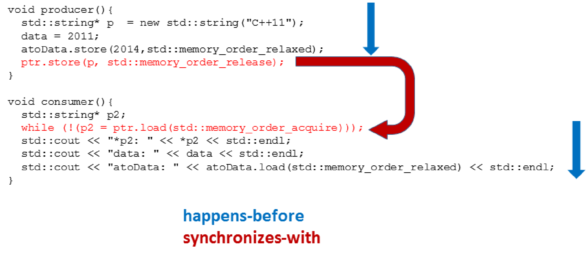
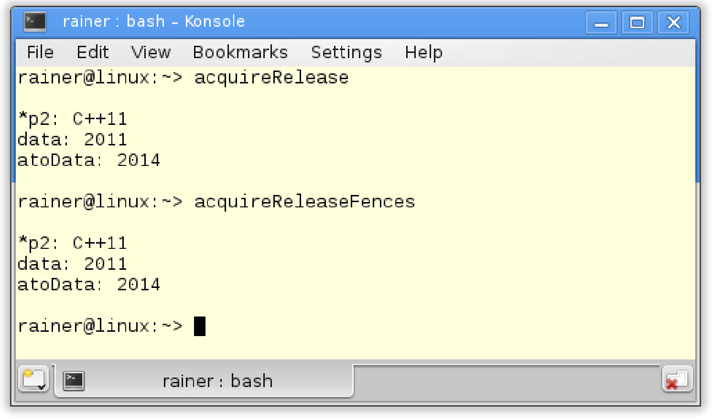
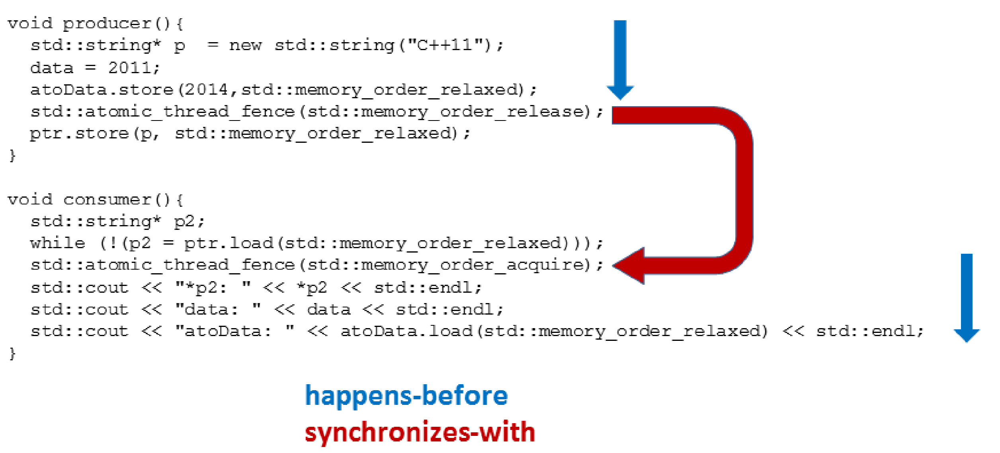

# 栅栏

C++支持两种类型的栅栏类型：`std::atomic_thread_fence`和`std::atomic_signal_fence`。

* `std::atomic_thread_fence` : 同步线程间的内存访问。
* `std::atomic_signal_fence` : 线程内处理信号和代码之间的同步。

**`std::atomic_thread_fence`**

`std::atomic_thread_fence`可以阻止特定的操作翻过栅栏。

`std::atomic_thread_fence`不需要原子变量，通常称为栅栏或内存屏障。那就先来了解一下`std::atomic_thread_fence`。

## 栅栏当做内存屏障

这个小节的标题什么意思呢？特定的操作不能翻过内存屏障。那什么样的操作属于“特殊操作”呢？我们现在有两种操作：读写操作或加载/存储操作。` if(resultRead) return result `就是一个加载操作后跟一个存储操作。

有四种不同的方式来组合加载和存储操作：

* 加载-加载：一个加载操作后跟一个加载操作。
* 加载-存储：一个加载操作后跟一个存储操作。
* 存储-加载：一个存储操作后跟一个加载操作。
* 存储-存储：一个存储操作后跟一个存储操作。

当然，还有由多个加载和存储(`count++`)组成的更复杂的操作，这些操作都可由以上四个操作组成。

那么内存屏障呢？如果在加载-加载、加载-存储、存储-加载或存储-存储等操作之间设置内存屏障，则可以保证不会对特定的操作进行重新排序。如果使用非原子或具有自由语义的原子操作，则存在重新排序的风险。

## 三种栅栏类型

通常，栅栏有三种，分别是：全栅(full fence)、获取栅栏(acquire fence)和释放栅栏(release fence)。提醒一下，获取是一个加载操作， 释放是一个存储操作。如果在加载和存储操作的四种组合之间，放一个内存屏障中会发生什么情况呢?

* 全栅: 任意两个操作之间使用完整的栅栏`std::atomic_thread_fence()`，可以避免这些操作的重新排序。不过，对于存储-加载操作来说，这就不能保证了，它们可能会被重新排序。
*  获取栅栏: `std::atomic_thread_fence(std::memory_order_acquire)`避免在获取栅栏之前的读操作，被获取栅栏之后的读或写操作重新排序。
* 释放栅栏: `std::atomic_thread_fence(std::memory_order_release)`避免释放栅栏之后的写操作，在释放栅栏之前通过读或写操作重新排序。

为了获得和释放栅栏的定义，以及它们对无锁编程的影响，我们花费了大量的精力对其进行整理。特别难以理解的是，这种栅栏与原子操作获取-释放语义之间的差别。先用图来说明一些上面的定义。

哪种操作可以翻过内存屏障？先瞧瞧下面的三张图。如果箭头与红色横杠交叉，意味着栅栏会阻止这种操作。

**全栅**


当然，可以显式地调用`std::atomic_thread_fence(std::memory_order_seq_cst)`，而不是`std::atomic_thread_fence()`。默认情况下，栅栏使用内存序为顺序一致性。如果对全栏使用顺序一致性，那么`std::atomic_thread_fence`也将遵循全局序。

**获取栅栏**


**释放栅栏**


三种内存屏障可以描述得更简单。

**所有栅栏一览图**


获取-释放栅栏与原子类的获取-释放语义有着相似的同步方式和排序约束。

## 获取-释放栅栏

获取-释放栅栏与原子类的获取-释放语义最明显的区别是，栅栏不需要原子操作。还有一个更微妙的区别：获取-释放栅栏比原子操作更重量级。

### 原子操作 vs. 栅栏

简单起见，现在使用栅栏或带有获取语义的原子操作时引用获取操作。释放操作也是如此。

获取-释放操作的主要思想是，在线程间建立同步和排序约束。这些同步和排序约束也适用于，使用自由语义的原子操作或非原子操作。注意，获取-释放操作是成对出现的。此外，对获取-释放语义的原子变量的操作，必须作用在相同的原子变量上。不过，我现在是将这些操作分开来看待的。

让我们从获取操作开始对比。

### 获取操作

在原子变量(内存序为`std::memory_order_acquire`)上进行的加载 (读取)操作是一个获取操作。


将`std::atomic_thread_fence`内存序设置为`std::memory_order_acquire`，这对内存访问重排增加了更严格的约束:


比较中可以总结了两点:

1. 具有获取语义的栅栏会建立更强的排序约束。虽然，原子变量和栅栏上的获取操作，要求在获取操作之前不能进行任何读或写操作，但是对获取栅栏有另一种方式。获取栅栏后不能进行读操作。
2. 自由语义足以读取原子变量`var`。由于`std::atomc_thread_fence(std::memory_order_acquire)`，所以这个操作在获取栅栏之后不能进行读取。

对于释放栅栏也可以进行类似的试验。

### 释放操作

对内存序为`std::memory_order_release`的原子变量，进行存储(写)操作时，这些操作属于释放操作。


还有，释放栅栏。


除了释放操作对原子变量`var`的约束外，释放栅栏有两个属性:

1. 存储的操作不能在栅栏前进行。
2. 变量`var`使用自由语义就足够了。

现在，就使用栅栏写一段程序。

## 使用原子变量或栅栏进行同步

之前，我们已经用获取-释放语义，实现了一个典型的消费者-生产者工作流。先使用原子的是原子操作，再切换到栅栏。

### 原子操作

我们从原子操作开始，因为大家对它们应该都很熟悉。

```c++
// acquireRelease.cpp

#include <atomic>
#include <thread>
#include <iostream>
#include <string>

using namespace std;

atomic<string*> ptr;
int data;
atomic<int> atoData;

void producer(){
  string *p = new string("C++11");
  data = 2011;
  atoData.store(2014, memory_order_relaxed);
  ptr.store(p, memory_order_release);
}

void consumer(){
  string* p2;
  while(!(p2 = ptr.load(memory_order_acquire)));
  cout << "*p2: " << *p2 << endl;
  cout << "data: " << data << endl;
  cout << "atoData: " << atoData.load(memory_order_relaxed) << endl;
}

int main(){
  
  cout << endl;
  
  thread t1(producer);
  thread t2(consumer);
  
  t1.join();
  t2.join();
  
  cout << endl;
  
}
```

这个程序应该很熟悉，这是我们在`std:: memory_order_consumption`小节中使用的示例。下图强调了消费者线程t2看到来自生产者线程t1的所有值。



这段程序定义良好，因为先行关系是可传递的。只需要把三种发生前关系结合起来:

1. 第15-17行先行于第18行`ptr.store(p, std:: memory_order_release)`。
2. 第23行`while(!(p2= ptrl.load(std::memory_order_acquire)))` 先行于第24-26行。
3. 第18行与第23行同步⇒第18行线程内先行于第23行。

现在，事情变得更有趣了，我们要来聊聊栅栏了。有关C++内存模型的文献中，栅栏几乎完全被忽略了。

### 栅栏

将程序改成到使用栅栏非常容易。

```c++
// acquireReleaseFences.cpp

#include <atomic>
#include <thread>
#include <iostream>
#include <string>

using namespace std;

atomic<string*> ptr;
int data;
atomic<int> atoData;

void producer() {
  string* p = new string("C++11");
  data_ = 2011;
  atoData.store(2014, memory_order_relaxed);
  atomic_thread_fence(memory_order_release);
  ptr.store(p, memory_order_release);
}

void consumer() {
  string* p2;
  while (!(p2 = ptr.load(memory_order_relaxed)));
  atomic_thread_fence(memory_order_acquire);
  cout << "*p2: " << *p2 << endl;
  cout << "data: " << data_ << endl;
  cout << "atoData: " << atoData.load(memory_order_relaxed) << endl;
}

int main() {

  cout << endl;

  thread t1(producer);
  thread t2(consumer);

  t1.join();
  t2.join();
  
  delete ptr;

  cout << endl;

}
```

第一步是添加栅栏(使用释放和获取语义，第18行和第25行)。接下来，将原子操作从获取或释放语义很容易的改为自由语义(第19和24行)。当然，只能用相应的栅栏替换获取或释放操作。关键的是，释放栅栏建立了与获取栅栏的同步，因此线程间的也有了先行关系。

下图是程序的输出：



为了更直观的呈现给读者，下图是描述了这里的整个关系。



关键问题是：为什么获取栅栏之后的操作，会看到释放栅栏之前的操作呢？这很有趣，因为数据是一个非原子变量`atoData.store`以自由语义使用，这意味着它们可以被重新排序；不过，因为`std::atomic_thread_fence(std::memory_order_release)`与`std::atomic_thread_fence(std::memory_order_acquire)`相结合，所以两个操作都不能重新排序。

为了更清晰，以更简洁的形式进行解释。

1.  获取-释放栅栏阻止了原子和非原子操作跨栅栏的重排序。
2. 消费者线程t2正在等待`while (!(p2= ptr.load(std::memory_order_relaxed)))`循环跳出，直到在生产者线程t1中设置对指针进行设置`ptr.store(p,std::memory_order_relaxed) `。
3.  释放栅栏与获取栅栏同步。
4.  最后，自由操作或非原子操作的所有结果(在释放栅栏之前)，在获得栅栏之后都是可见的。

> 知识点
>
> **释放栅栏和获取栅栏之间的同步**
> 
>这两个定义来自于[N4659: Working Draft, Standard for Programming Language C++](http://www.open-std.org/jtc1/sc22/wg21/docs/papers/2017/n4659.pdf) ，并且标准文档的文字比较难懂：“如果操作X和操作Y对原子对象M的操作存在有原子操作，释放栅栏A同步于获取栅栏B；那么A的操作顺序位于X之前，X对M进行修改，Y位于B之前，并且Y读取X写入的值，或在进行释放操作时，释放序列X中的任何操作所写的值将被读取。”
> 
>让我借由acquireReleaseFence.cpp解释一下这段话：
> 
>* `atomic_thread_fence(memory_order_release)` (第18行)是一个释放栅栏A。
> * `atomic_thread_fence(memory_order_acquire)` (第25行)是一个获取栅栏B。
> * `ptr`(第10行)是一个原子对象M。
> * `ptr.store(p, memory_order_relaxed)` (第19行) 是一个原子存储操作X。
> * `while (!(p2 = ptr.load(memory_order_relaxed)))` (第24行)是一个原子加载操作Y。

你可以在acquireRelease.cpp程序中的原子变量上混合获取和释放操作(使用获取和释放栅栏)，而不影响同步关系。

#### std::atomic_signal_fence

`std::atomic_signal_fence`在线程和执行信号句柄间，建立非原子和自由原子访问的内存同步序。下面的程序展示了`std::atomic_signal_fence`的用法。

```c++
// atomicSignal.cpp

#include <atomic>
#include <cassert>
#include <csignal>

std::atomic<bool> a{false};
std::atomic<bool> b{false};

extern "C" void handler(int){
  if (a.load(std::memory_order_relaxed)){
    std::atomic_signal_fence(std::memory_order_acquire);
    assert(b.load(std::memory_order_relaxed));
  }
}

int main(){
  
  std::signal(SIGTERM, handler);
  
  b.store(true, std::memory_order_relaxed);
  std::atomic_signal_fence(std::memory_order_release);
  a.store(true, std::memory_order_relaxed);
  
}
```

首先，在第19行中为特定的信号SIGTERM设置了处理句柄。SIGTERM是程序的终止请求。` std::atomic_signal_handler`在释放操作`std:: signal_fence(std::memory_order_release)`(第22行)和获取操作`std:: signal_fence(std::memory_order_acquire)`(第12行)之间建立一个获取-释放栅栏。这意味着，释放操作不能跨越释放栅栏进行重排序(第22行)，而获取操作不能跨越获取栅栏进行重排序(第11行)。因此，第13行`assert(b.load(std::memory_order_relax)`的断言永远不会触发，因为`a.store(true, std:: memory_order_relaxed)`(第23行)执行了的话, `b.store(true, std::memory_order_relax)`(第21行)就一定执行过。

