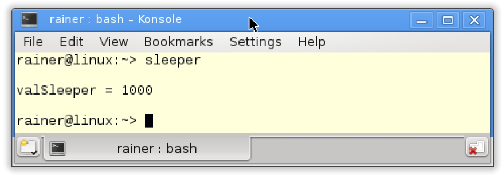
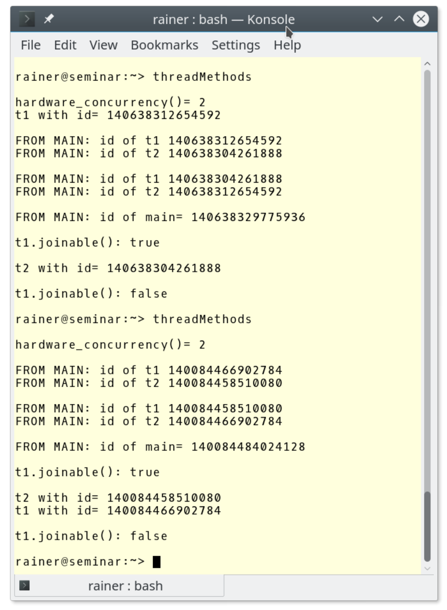

#线程

要用C++标准库启动一个线程，就必须包含`<thread>`头文件。

## 创建线程

线程`std::thread`对象表示一个可执行单元。当工作包是可调用单元时，工作包可以立即启动。线程对象不是可复制构造或可复制构造的，但可移动构造或可移动赋值的。

可调用单元是行为类似于函数。当然，它可以是一个函数，也可以是一个函数对象，或者一个Lambda表达式。可调用单元的返回值通常被忽略。

介绍完简单的理论知识之后，我们来动手写一个小例子。

```c++
// createThread.cpp

#include <iostream>
#include <thread>

void helloFunction() {
  std::cout << "Hello from a function." << std::endl;
}

class HelloFUncitonObject {
public:
  void operator()()const {
    std::cout << "Hello from a function object." << std::endl;
  }
};

int main() {
  
  std::cout << std::endl;

  std::thread t1(helloFunction);
  HelloFUncitonObject helloFunctionObject;
  std::thread t2(helloFunctionObject);

  std::thread t3([] {std::cout << "Hello from a lambda." << std::endl; });

  t1.join();
  t2.join();
  t3.join();

  std::cout << std::endl;

}
```

三个线程(t1、t2和t3)都会将其信息写入控制台。线程t2的工作包是一个函数对象(第10 - 15行)，线程t3的工作包是一个Lambda函数(第26行)。第28 - 30行，主线程在等待它的子线程完成工作。

看一下输出。


三个线程以任意顺序执行，这三个输出操作也可以交错。这应该不难理解吧。

线程的创建者(例子中是主线程)负责管理线程的生命周期，让我们来了解一下线程的生命周期。

##线程的生命周期

父母需要照顾自己的孩子，这个简单的原则对线程的生命周期非常重要。下面的程序(子线程最后没有汇入)，用来显示线程ID。

```c++
#include <iostream>
#include <thread>

int main() {
  
  std::thread t([] {std::cout << std::this_thread::get_id() << std::endl; });
  
}
```

程序出现了错误，不过依旧打印了线程的ID。


那是什么原因引起的异常呢？

**汇入和分离**

线程`t`的生命周期终止于可调用单元执行结束，而创建者有两个选择：

1. 等待线程完成: `t.join()`
2. 与创建线程解除关系:`t.detach() `

当后续代码依赖于线程中调用单元的计算结果时，需要使用`t.join()`。`t.detach()`允许线程与创建线程分离执行；因此，分离线程的生命周期与可执行文件的运行周期相关。通常，服务器上长时间运行的后台服务，会使用到分离线程进行。

如果`t.join()`和`t.detach()`都没有执行，那么线程`t`是可汇入的。可汇入线程的析构函数会抛出`std::terminate`异常，这也就是threadWithoutJoin.cpp程序产生异常的原因。如果在线程上多次调用`t.join()`或`t.detach()`，则会产生`std::system_error`异常。

解决问题的方式很简单：使用`t.join()`。

```c++
#include <iostream>
#include <thread>

int main() {
  
  std::thread t([] {std::cout << std::this_thread::get_id() << std::endl; });
  
  t.join();
  
}
```

现在就能得到满意的输出了。


线程ID是`std::thread`唯一的标识符。

> 注意
>
> **分离线程的挑战**
>
> 当然，可以在最后一个程序中使用`t.detach()`代替`t.join()`。这样，线程`t`不能汇入了；因此，它的析构函数没有调用`std::terminate`函数。但现在有另一个问题：未定义行为。主程序可能在线程`t`前结束，所以由于主线程的生存期太短，无法显示ID。详细信息，可以参考变量的生存期。

>贴士
>
>**Anthony Williams提出的scoped_thread**
>
>如果手动处理线程的生命周期可能有些麻烦，可以在包装器类中封装`std::thread`。如果线程仍然是可汇入的，这个类应该在其析构函数中自动调用`t.join()`，也可以反过来调用`t.detach()`，但分离处理也有问题。
>
>Anthony Williams提出了这样一个类，并在他的优秀著作[《C++ Concurrency in Action》](https://www.manning.com/books/c-plus-plus-concurrency-in-action)中介绍了它。他将包装器称为`scoped_thread`。`scoped_thread`在构造函数中获取一个线程对象，并检查线程对象是否可汇入。如果传递给构造函数的线程对象不可汇入，则不需要`scoped_thread`。如果线程对象可汇入，则析构函数调用`t.join()`。因为，拷贝构造函数和拷贝赋值操作符被声明为`delete`，所以`scoped_thread`的实例不能被复制或赋值。
>
>```c++
>// scoped_thread.cpp
>
>#include <thread>
>#include <utility>
>
>class scoped_thread{
>std::thread t;
>public:
>	explicit scoped_thread(std::thread t_): t(std::move(t_)){
>		if (!t.joinable()) throw std::logic_error("No thread");
>	}
>	~scoped_thread(){
>		t.join();
>	}
>	scoped_thread(scoped_thread&)= delete;
>	scoped_thread& operator=(scoped_thread const &)= delete;
>};
>```

## 线程参数

和任意的函数一样，线程可以通过复制、移动或引用来获取参数。`std::thread`是一个[可变参数模板]( http://en.cppreference.com/w/cpp/language/parameter_pack)，可以传入任意数量的参数。

线程通过引用的方式获取数据的情况，必须非常小心参数的生命周期和数据的共享方式。

### 拷贝或引用

我们来看一个代码段。

```c++
std::string s{"C++11"}

std::thread t1([=]{ std::cout << s << std::endl; });
t1.join();

std::thread t2([&]{ std::cout << s << std::endl; });
t2.detach();
```

线程`t1`通过拷贝的方式获取参数，线程`t2`通过引用的方式获取参数。

> 知识点
>
> **线程的“引用”参数**
>
> 实际上，我骗了你。线程`t2`不是通过引用获取其参数，而是Lambda表达式通过引用捕获的参数。如果需要引用将参数传递给线程，则必须将其包装在[引用包装器](http://en.cppreference.com/w/cpp/utility/functional/reference_wrapper)中，使用[std::ref](http://en.cppreference.com/w/cpp/utility/functional/ref)就能完成这项任务。`std::ref`在`<functional>`头文件中定义。
>
> ```c++
> <functional>
> ...
> void transferMoney(int amount, Account& from, Account& to){
> ...
> }
> ...
> std::thread thr1(transferMoney, 50, std::ref(account1), std::ref(account2));
> ```
>
> 线程`thr1`执行`transferMoney`函数。`transferMoney`的参数是使用引用的方式传递；因此，线程`thr1`通过引用获取`account1`和`account2`。

这几行代码中隐藏着什么问题呢？线程`t2`通过引用获取其字符串`s`，然后从其创建者的生命周期中分离。字符串`s`与创建者的生存期周期绑定，全局对象`std::cout`与主线程的生存周期绑定。因此，`std::cout`的生存周期可能比线程`t2`的生存周期短。现在，我们已经置身于未定义行为中了。

不相信？来看看未定义行为是什么样的。

```c++
// threadArguments.cpp

#include <chrono>
#include <iostream>
#include <thread>

class Sleeper {
public:
  Sleeper(int& i_) :i{ i_ } {};
  void operator()(int k) {
    for (unsigned int j = 0; j <= 5; ++j) {
      std::this_thread::sleep_for(std::chrono::microseconds(100));
      i += k;
    }
    std::cout << std::this_thread::get_id() << std::endl;
  }
private:
  int& i;
};


int main() {

  std::cout << std::endl;

  int valSleepr = 1000;
  std::thread t(Sleeper(valSleepr), 5);
  t.detach();
  std::cout << "valSleeper = " << valSleepr << std::endl;

  std::cout << std::endl;

}
```

问题在于：`valSleeper`在第29行时值是多少？`valSleeper`是一个全局变量。线程`t`获得一个函数对象，该函数对象的实参为变量`valSleeper`和数字5(第27行)，而线程通过引用获得`valSleeper`(第9行)，并与主线程(第28行)分离。接下来，执行函数对象的调用操作符(第10 - 16行)，它从0计数到5，在每100毫秒的中休眠，将`k`加到`i`上。最后，屏幕上显示它的id。[Nach Adam Riese](https://de.wikipedia.org/wiki/Liste_gefl%C3%BCgelter_Worte/N#Nach_Adam_Riese) (德国成语：真是精准的计算呀！)，期望的结果应该是1000 + 6 * 5 = 1030。

然而，发生了什么？结果为什么完全不对？



这个输出有两个奇怪的地方：首先，`valSleeper`是1000；其次，ID没有显示。

这段程序至少有以下两个错误：

1. `valSleeper`是由所有线程共享的。这会导致数据竞争，因为线程可能同时读写`valSleeper`。
2. 主线程的生命周期很可能在子线程执行其计算，或将其ID写入`std::cout`之前结束。

这两个问题都是构成竞争状态的条件，因为程序的结果取决于操作的交错。构成竞态的条件也是导致数据竞争的原因。

解决数据竞争也非常容易：使用锁或原子保护`valSleeper`。为了解决`valSleeper`和`std::cout`生命周期的问题，必须汇入线程而不是分离它。

修改后的主函数体。

```c++
int main(){
  
  std::cout << std::endl;
  
  int valSleeper= 1000;
  std::thread t(Sleeper(valSleeper),5);
  t.join();
  std::cout << "valSleeper = " << valSleeper << std::endl;
  
  std::cout << std::endl;
  
}
```

现在，我们得到了正确的结果。当然，执行速度会变慢。


为了更完整的了解`std::thread`，接下来了解其成员函数。

###成员函数

下面是`std::thread`的接口，在一个简洁的表中。更多详情请访问[cppreference.com](http://de.cppreference.com/w/cpp/thread/thread)。

|                  函数名称                  |                    描述                    |
| :----------------------------------------: | :----------------------------------------: |
|                 `t.join()`                 |            等待，直到线程t完成             |
|                `t.detach()`                |        独立于创建者执行创建的线程t         |
|               `t.joinable()`               |       如果线程t可以汇入，则返回true        |
| `t.get_id()`和`std::this_thread::get_id()` |                返回线程的ID                |
|   `std::thread::hardware_concurrency()`    |          返回可以并发运行的线程数          |
|  `std::this_thread::sleep_until(absTime)`  | 将线程t置为睡眠状态，直到absTime时间点为止 |
|   `std::this_thread::sleep_for(relTime)`   | 将线程t置为睡眠状态，直到休眠了relTime为止 |
|        `std::this_thread::yield()`         |           允许系统运行另一个线程           |
|     `t.swap(t2)`和`std::swap(t1, t2)`      |                交换线程对象                |

静态`std::thread::hardware_concurrency`函数，返回实现支持的并发线程数量，如果运行时无法确定数量，则返回0(这是根据C++标准编写的)。`sleep_until`和`sleep_for`操作需要一个时间点或持续时间作为参数。

> 知识点
>
> **访问特定系统的实现**
>
> 线程接口是底层实现的包装器，可以使用`native_handle`来访问(特定于系统的实现)。这个底层实现的句柄可用于线程、互斥对象和条件变量。

线程不能复制，但可以移动。交换方法在(可能的情况)下执行移动。

作为对本小节的总结，下面是在实践中提到的一些方法。

```c++
// threadMethods.cpp

#include <iostream>
#include <thread>

using namespace std;

int main() {

  cout << boolalpha << endl;

  cout << "hardware_concurrency() = " << thread::hardware_concurrency() << endl;

  thread t1([] {cout << "t1 with id = " << this_thread::get_id() << endl; });
  thread t2([] {cout << "t2 with id = " << this_thread::get_id() << endl; });

  cout << endl;

  cout << "FROM MAIN: id of t1 " << t1.get_id() << endl;
  cout << "FROM MAIN: id of t2 " << t2.get_id() << endl;

  cout << endl;
  swap(t1, t2);

  cout << "FROM MAIN: id of t1 " << t1.get_id() << endl;
  cout << "FROM MAIN: id of t2 " << t2.get_id() << endl;

  cout << endl;

  cout << "FROM MAIN: id of main= " << this_thread::get_id() << endl;

  cout << endl;

  cout << "t1.joinable(): " << t1.joinable() << endl;

  cout << endl;

  t1.join();
  t2.join();

  cout << endl;

  cout << "t1.joinable(): " << t1.joinable() << endl;

  cout << endl;

}
```

与输出相结合来看，应该很容易理解。



结果可能看起来有点奇怪，线程`t1`和`t2`(第14行和第15行)在不同时间点上运行。无法确定每个线程何时运行，只能确定在第38和39行`t1.join()`和`t2.join()`语句之前两个线程是肯定运行了的。

线程共享的可变(非const)变量越多，多线程程序的风险就越大。

