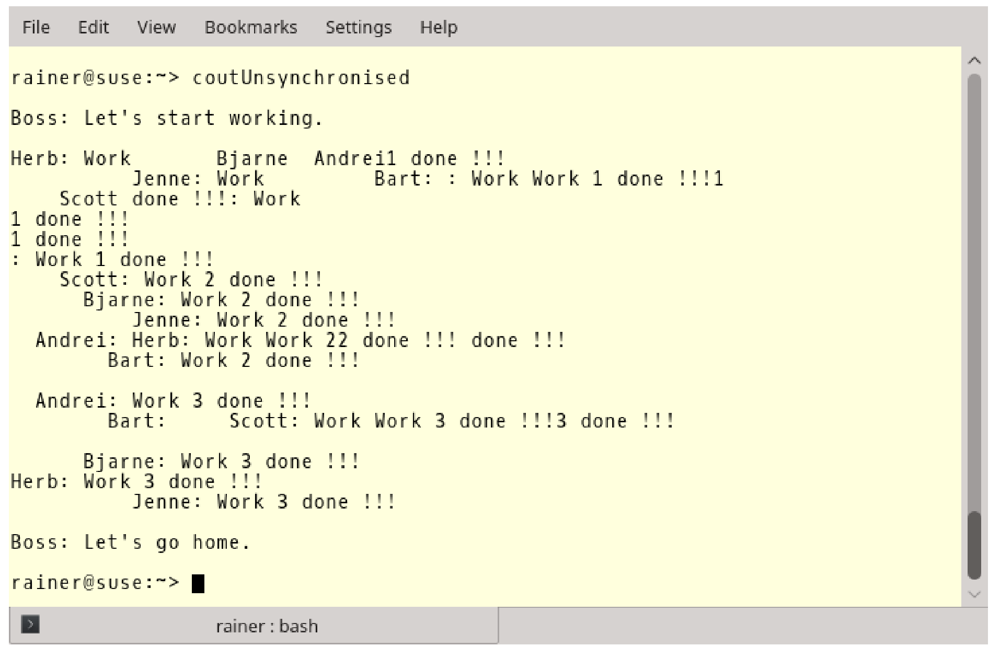
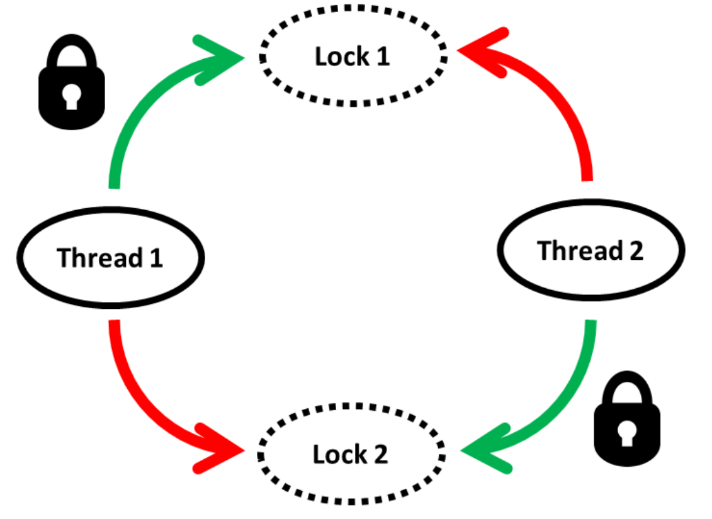
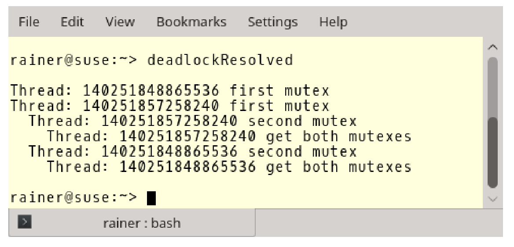
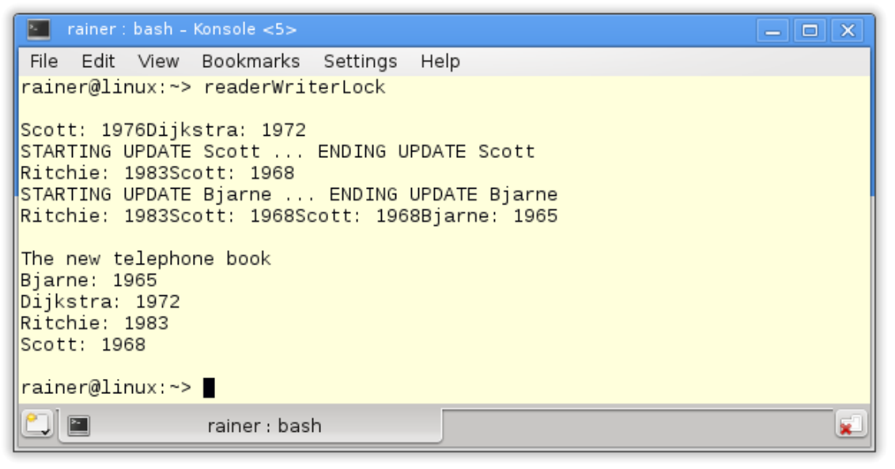
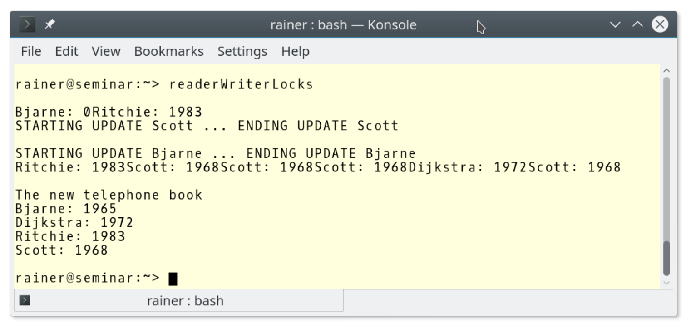
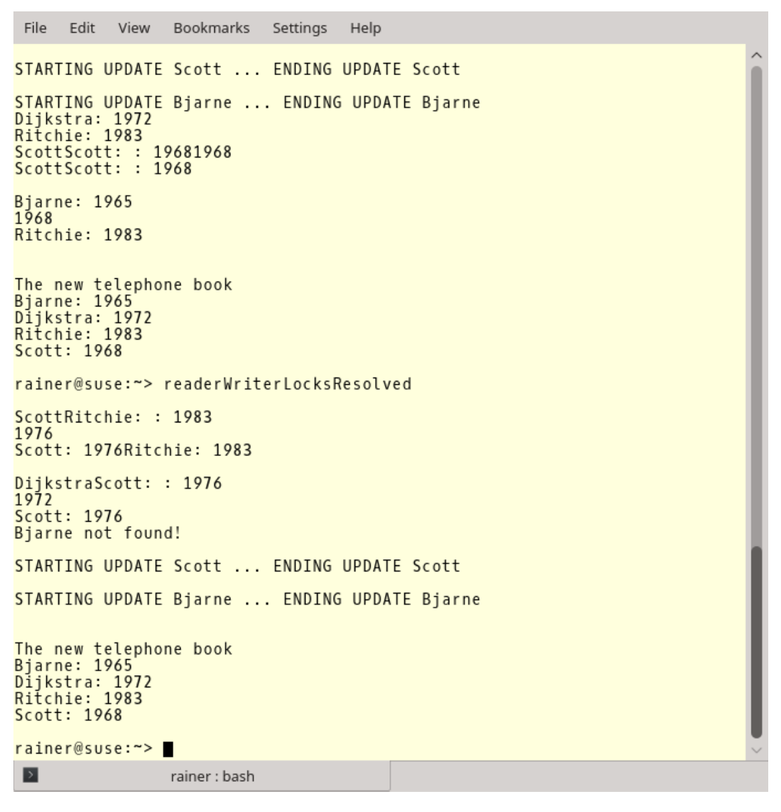

#共享数据

为了更清楚地说明这一点，需要考虑共享数据的同步，因为共享数据很容易发生数据竞争。如果并发的对数据进行非同步读写访问，则程序会产生未定义行为。

验证并发、未同步的读和写操作的最简单方法，就是向`std::cout`写入一些内容。

让我们来看一下，使用不同步的方式进行`std::cout`打印输出。

```c++
// coutUnsynchronised.cpp

#include <chrono>
#include <iostream>
#include <thread>

class Worker {
public:
  Worker(std::string n) :name(n) {}
  void operator()() {
    for (int i = 1; i <= 3; ++i) {
      // begin work
      std::this_thread::sleep_for(std::chrono::microseconds(200));
      // end work
      std::cout << name << ": " << "Work " << i << " done !!!" << std::endl;
    }
  }
private:
  std::string name;
};


int main() {
  
  std::cout << std::endl;

  std::cout << "Boss: Let's start working.\n\n";

  std::thread herb = std::thread(Worker("Herb"));
  std::thread andrei = std::thread(Worker(" Andrei"));
  std::thread scott = std::thread(Worker("  Scott"));
  std::thread bjarne = std::thread(Worker("   Bjarne"));
  std::thread bart = std::thread(Worker("    Bart"));
  std::thread jenne = std::thread(Worker("     Jenne"));


  herb.join();
  andrei.join();
  scott.join();
  bjarne.join();
  bart.join();
  jenne.join();

  std::cout << "\n" << "Boss: Let's go home." << std::endl;

  std::cout << std::endl;

}
```

该程序描述了一个工作流程。老板有六个工人(第29 - 34行)。每个工人必须处理3个工作包。工作包需要200毫秒(第13行)完成。当工人完成了他的所有工作包时，他向老板报告(第15行)。当老板收到所有员工的完工，他就会把他们送回家(第43行)。

这么简单的工作流程，输出却是如此混乱。



让输出变清晰的最简单解决方法，就是使用互斥量。

##互斥量

Mutex是互斥(**mut**ual **ex**clusion)的意思。它确保，在任何时候只有一个线程可以访问临界区。

通过使用互斥锁，工作流程的混乱变的和谐许多。

```c++
// coutSynchronised.cpp

#include <chrono>
#include <iostream>
#include <mutex>
#include <thread>

std::mutex coutMutex;

class Worker {
public:
  Worker(std::string n) :name(n) {}
  void operator()() {
    for (int i = 1; i <= 3; ++i) {
      // begin work
      std::this_thread::sleep_for(std::chrono::microseconds(200));
      // end work
      coutMutex.lock();
      std::cout << name << ": " << "Work " << i << " done !!!" << std::endl;
      coutMutex.unlock();
    }
  }
private:
  std::string name;
};


int main() {
  
  std::cout << std::endl;

  std::cout << "Boss: Let's start working.\n\n";

  std::thread herb = std::thread(Worker("Herb"));
  std::thread andrei = std::thread(Worker(" Andrei"));
  std::thread scott = std::thread(Worker("  Scott"));
  std::thread bjarne = std::thread(Worker("   Bjarne"));
  std::thread bart = std::thread(Worker("    Bart"));
  std::thread jenne = std::thread(Worker("     Jenne"));


  herb.join();
  andrei.join();
  scott.join();
  bjarne.join();
  bart.join();
  jenne.join();

  std::cout << "\n" << "Boss: Let's go home." << std::endl;

  std::cout << std::endl;

}
```

第8行中`coutMutex`保护了`std::cout`。第19行中的`lock()`和第21行中的`unlock()`调用确保工作人员不会同时进行报告。


> 贴士
>
> **std:: cout是线程安全的**
>
> 在C++11标准下，对`std::cout`不需要额外的保护。每个字符都是原子式书写的。可能会有更多类似示例中的输出语句交织在一起。这只是一个视觉问题，不过程序是定义良好的。此标记对所有全局流对象都有效，插入和提取全局流对象(`std::cout`、`std::cin`、`std::cerr`和`std::clog`)都是线程安全的。
>
> 更正式地说法：写入`std::cout`并不是数据竞争，而是一个竞争条件。这意味着输出内容的情况，完全取决于交错运行的线程。

C++11有4个不同的互斥锁，它们可以递归地、暂时地锁定，并且不受时间限制。

|     成员函数     | mutex | recursive_mutex | timed_mutex | recursive_timed_mutex |
| :--------------: | :---: | :-------------: | :---------: | :-------------------: |
|      m.lock      |  yes  |       yes       |     yes     |          yes          |
|    m.try_lock    |  yes  |       yes       |     yes     |          yes          |
|  m.try_lock_for  |       |                 |     yes     |          yes          |
| m.try_lock_until |       |                 |     yes     |          yes          |
|     m.unlock     |  yes  |       yes       |     yes     |          yes          |

递归互斥锁允许同一个线程多次锁定互斥锁。互斥锁保持锁定状态，直到它被解锁的次数与被锁定的次数相等。可以锁定互斥锁的最大次数并未指定。如果达到最大数量，则会抛出[std::system_error]( http://en.cppreference.com/w/cpp/error/system_error)异常。

C++14中有`std::shared_timed_mutex`，C++17中有`std::shared_mutex`。`std::shared_mutex`和`std::shared_timed_mutex`非常相似。使用锁可以都是互斥或共享的。另外，使用`std::shared_timed_mutex`可以指定时间点或持续时间。

|        成员函数         | shared_timed_mutex | shared_mutex |
| :---------------------: | :----------------: | :----------: |
|         m.lock          |        yes         |     yes      |
|       m.try_lock        |        yes         |     yes      |
|     m.try_lock_for      |        yes         |              |
|    m.try_lock_until     |        yes         |              |
|        m.unlock         |        yes         |     yes      |
|      m.lock_shared      |        yes         |     yes      |
|    m.try_lock_shared    |        yes         |     yes      |
|  m.try_lock_shared_for  |        yes         |              |
| m.try_lock_shared_until |        yes         |              |
|     m.unlock_shared     |        yes         |     yes      |

`std::shared_timed_mutex(std::shared_mutex`)可以用来实现读写锁。这意味着，可以使用`std::shared_timed_mutex(std::shared_mutex)`进行独占或共享锁定。如果将`std::shared_timed_mutex(std::shared_mutex)`放入`std::lock_guard`或`std::unique_lock`，就会得到一个独占锁;如果将`std::shared_timed_mutex(std::shared_lock)`放入`std::shared_lock`中，就会得到一个共享锁。`m.try_lock_for(relTime)`和`m.try_lock_shared_for(relTime)`需要一个时间段；`m.try_lock_until(absTime)`和`m.try_lock_shared_until(absTime)`需要一个绝对的时间点。

`m.try_lock(m.try_lock_shared)`尝试锁定互斥锁并立即返回。成功时，它返回true，否则返回false。相比之下，`m.try_lock_for(m.try_lock_shared_for)`和`m.try_lock_until(m.try_lock_shared_until)`尝试锁定锁，直到超时发生或锁定被获取，以先发生的为准。应该使用一个稳定的时钟来限制时间(稳定的时钟是不能调整的)。

不应该直接使用互斥对象，应该将互斥锁放入锁中。下面解释下原因。

### 互斥量的问题

互斥锁的问题可以归结为一个：死锁。

> **死锁**
>
> 死锁是两个或两个以上的个线程处于阻塞状态，并且每个线程在释放之前都要等待其他线程的释放。

结果就是程序完全静止。试图获取资源的线程，通常会永久的阻塞程序。形成这种困局很简单，有兴趣了解一下吗?

### 异常和未知代码

这个小代码段有很多问题。

```c++
std::mutex m;
m.lock();
sharedVariable = getVar();
m.unlock();
```

问题如下：

1. 如果函数`getVar()`抛出异常，则互斥量`m`不会被释放。
2. 永远不要在持有锁的时候调用函数。因为`m`不是递归互斥锁，如果函数`getVar`试图锁定互斥锁`m`，则程序具有未定义的行为。大多数情况下，未定义行为会导致死锁。
3. 避免在持有锁时调用函数。可能这个函数来自一个库，但当这个函数发生改变，就有危险陷入僵局。

程序需要的锁越多，程序的风险就越高(非线性)。

### 不同顺序锁定的互斥锁

下面是一个典型的死锁场景，死锁是按不同顺序进行锁定的。



线程1和线程2需要访问两个资源来完成它们的工作。当资源被两个单独的互斥体保护并，且以不同的顺序被请求(线程1:锁1，锁2;线程2:锁2，锁1)时，线程交错执行，线程1得到互斥锁1，然后线程2得到互斥锁2，从而程序进入停滞状态。每个线程都想获得另一个互斥锁，但需要另一个线程释放其需要的互斥锁。“死亡拥抱”这个形容，很好地描述了这种状态。

将这上图转换成代码也很容易。

```c++
// deadlock.cpp

#include <iostream>
#include <chrono>
#include <mutex>
#include <thread>

struct CriticalData {
  std::mutex mut;
};

void deadLock(CriticalData& a, CriticalData& b) {

  a.mut.lock();
  std::cout << "get the first mutex" << std::endl;
  std::this_thread::sleep_for(std::chrono::microseconds(1));
  b.mut.lock();
  std::cout << "get the second mutext" << std::endl;
  // do something with a and b
  a.mut.unlock();
  b.mut.unlock();

}

int main() {

  CriticalData c1;
  CriticalData c2;

  std::thread t1([&] {deadLock(c1, c2); });
  std::thread t2([&] {deadLock(c2, c1); });

  t1.join();
  t2.join();

}
```

线程t1和t2调用死锁函数(第12 - 23行)，向函数传入了c1和c2(第27行和第28行)。由于需要保护c1和c2不受共享访问的影响，它们在内部各持有一个互斥锁(为了保持本例简短，关键数据除了互斥锁外没有其他函数或成员)。

第16行中约1毫秒的短睡眠就足以产生死锁。


惟一选择是按CTRL+C终止进程。

互斥锁不能解决所有问题，但在很多情况下，锁可以帮助我们解决这些问题。

### 锁

锁使用RAII方式处理它们的资源。锁在构造函数中自动绑定互斥锁，并在析构函数中释放互斥锁，这大大降低了死锁的风险。

锁有四种不同的形式：`std::lock_guard`用于简单程序，`std::unique_lock`用于高级程序。从C++14开始就可以用`std::shared_lock`来实现读写锁了。在C++17中，添加了`std::scoped_lock`，它可以在一个原子步骤中锁定更多的互斥对象。

首先，来看简单程序。

**std::lock_guard**

```c++
std::mutex m;
m.lock();
sharedVariable = getVar();
m.unlock();
```

互斥量`m`确保对`sharedVariable = getVar()`的访问是有序的。有序意味着，每个线程都可以依次访问临界区。代码很简单，但是容易出现死锁。如果临界区抛出异常或者忘记解锁互斥锁，就会出现死锁。使用`std::lock_guard`，将可以很优雅的解决这些问题：

```c++
{
  std::mutex m,
  std::lock_guard<std::mutex> lockGuard(m);
  sharedVariable = getVar();
}
```

代码很简单，但是前后的花括号是什么意思呢？`std::lock_guard`的生存期受其作用域的限制，作用域由[花括号](http://en.cppreference.com/w/cpp/language/scope#Block_scope)决定。这意味着它的生命周期在达到右花括号时结束。那时，`std::lock_guard`析构函数被调用，并且互斥量被释放。这是自动发生的，如果`sharedVariable = getVar()`中的`getVar()`抛出异常，也会发生这种情况。函数作用域和循环作用域也会限制实例对象的生命周期。

**std::scoped_lock**

C++17中，添加了`std::scoped_lock`。它与`std::lock_guard`非常相似，但是`std::scoped_lock`可以原子地锁定任意数量的互斥对象。

1. 如果`std::scoped_lock`调用一个互斥锁，它的行为就类似于`std::lock_guard`，并锁定互斥锁`m`: `m.lock`。如果`std::scoped_lock`被多个互斥对象调用`std::scoped_lock(mutextypes&…)`，则使用`std::lock(m…)`函数进行锁定操作。
2. 如果当前线程已经拥有了互斥量，但这个互斥量不是递归的，那么这个行为就是未定义的，很有可能出现死锁。
3. 您只需要获得互斥锁的所有权，而不需要锁定它们。在这种情况下，必须将标志`std::adopt_lock_t`提供给构造函数：`std::scoped_lock(std::adopt_lock_t, mutextypes&…m)`。

通过使用`std::scoped_lock`，可以优雅地解决之前的死锁。下一节中，将讨论如何杜绝死锁。

**std::unique_lock**

`std::unique_lock`比`std::lock_guard`更强大，也更重量级。

除了包含`std::lock_guard`提供的功能之外，`std::unique_lock`还允许：

* 创建无需互斥量的锁。
* 可以不锁定互斥量的情况下创建锁。
* 可以显式地/重复地设置或释放关联的互斥锁量。
* 可以递归的锁定互斥量。
* 可以移动互斥量。
* 可以尝试锁定互斥量。
* 可以延迟锁定关联的互斥量。

下表展示了`std::unique_lock lk`的方法：

|                           成员函数                           |            功能描述            |
| :----------------------------------------------------------: | :----------------------------: |
|                          lk.lock()                           |         锁定相关互斥量         |
| lk.try_lock()、lk.try_lock_for(relTime)、lk.try_lock_until(absTime) |       尝试锁定相关互斥量       |
|                         lk.unlock()                          |         解锁相关互斥量         |
|                         lk.release()                         | 释放互斥量，互斥量保持锁定状态 |
|               lk.swap(lk2)和std::swap(lk, lk2)               |             交换锁             |
|                          lk.mutex()                          |    返回指向相关互斥量的指针    |
|                  lk.owns_lock()和bool操作符                  |  检查锁`lk`是否有锁住的互斥量  |

`try_lock_for(relTime)`需要传入一个时间段;`try_lock_until(absTime)`需要传入一个绝对的时间点。`lk.try_lock_for(lk.try_lock_until)`会调用关联的互斥量`mut`的成员函数`mut.try_lock_for(mut.try_lock_until) `。相关的互斥量需要支持定时阻塞，这就需要使用稳定的时钟来限制时间。稳定时钟是不能调整的。

`lk.try_lock`尝试锁定互斥锁并立即返回。成功时返回true，否则返回false。相反，`lk.try_lock_for`和`lk.try_lock_until`则会让锁`lk`阻塞，直到超时或获得锁为止。如果没有关联的互斥锁，或者这个互斥锁已经被`std::unique_lock`锁定，那么`lk.try_lock`、`lk.try_lock_for`和`lk.try_lock_for`则抛出`std::system_error`异常。

`lk.release()`返回互斥锁；因此，必须手动对其进行解锁。

Thanks to std::unique_lock , it is quite easy to lock many mutexes in one atomic step. Therefore you can overcome deadlocks by locking mutexes in a different order. Remember the deadlock from the subsection Issues of Mutexes?

多亏了`std::unique_lock`，在原子步骤中锁定多个互斥对象变得非常容易。因此，可以通过以不同的顺序锁定互斥锁来避免死锁。还记得在互斥锁的子问题中出现的死锁吗?

```c++
// deadlock.cpp

#include <iostream>
#include <chrono>
#include <mutex>
#include <thread>

struct CriticalData {
  std::mutex mut;
};

void deadLock(CriticalData& a, CriticalData& b) {

  a.mut.lock();
  std::cout << "get the first mutex" << std::endl;
  std::this_thread::sleep_for(std::chrono::microseconds(1));
  b.mut.lock();
  std::cout << "get the second mutext" << std::endl;
  // do something with a and b
  a.mut.unlock();
  b.mut.unlock();

}

int main() {

  CriticalData c1;
  CriticalData c2;

  std::thread t1([&] {deadLock(c1, c2); });
  std::thread t2([&] {deadLock(c2, c1); });

  t1.join();
  t2.join();

}
```

让我们来解决死锁问题。死锁必须原子地锁定它的互斥对象，这正是下面的程序中所展示的。

Delayed locking of mutexes

```c++
// deadlockResolved.cpp

#include <iostream>
#include <chrono>
#include <mutex>
#include <thread>

using namespace std;

struct CriticalData {
  mutex mut;
};

void deadLock(CriticalData& a, CriticalData& b) {

  unique_lock<mutex> guard1(a.mut, defer_lock);
  cout << "Thread: " << this_thread::get_id() << " first mutex" << endl;

  this_thread::sleep_for(chrono::milliseconds(1));

  unique_lock<mutex> guard2(b.mut, defer_lock);
  cout << " Thread: " << this_thread::get_id() << " second mutex" << endl;

  cout << "  Thread: " << this_thread::get_id() << " get both mutex" << endl;
  lock(guard1, guard2);
  // do something with a and b
}

int main() {

  cout << endl;

  CriticalData c1;
  CriticalData c2;

  thread t1([&] {deadLock(c1, c2); });
  thread t2([&] {deadLock(c2, c1); });

  t1.join();
  t2.join();

  cout << endl;

}
```

如果使用`std::defer_lock`对`std::unique_lock`进行构造，则底层的互斥量不会被自动锁定。此时(第16行和第21行)，`std::unique_lock`就是互斥量的所有者。由于`std::lock`是可变参数模板，锁操作可在一个原子步骤中执行(第25行)。

> 知识点
>
> **使用std::lock进行原子锁定**
>
> `std::lock`可以在一个原子步骤中锁定它的互斥对象。`std::lock`是一个可变参数模板，因此可以接受任意数量的参数。`std::lock`尝试使用避免死锁的算法在一个原子步骤获得所有锁。互斥量会被一系列操作锁定，比如：`lock`、`try_lock`和`unlock`。如果对锁或解锁的调用异常，则在解锁操作会在异常重新抛出之前执行。

本例中，`std::unique_lock`管理资源的生存期，`std::lock`锁定关联的互斥量，也可以反过来做。第一步中锁住互斥锁，第二步中`std::unique_lock`管理资源的生命周期。下面是第二种方法的例子：

```c++
std::lock(a.mut, b.mut);
std::lock_guard<std::mutex> guard1(a.mut, std::adopt_lock);
std::lock_guard<std::mutex> guard2(b.mut, std::adopt_lock);
```

这两个方式都能解决死锁。



> 知识点
>
> **使用std::scoped_lock解决死锁**
>
> 在C++17中解决死锁非常容易。有了`std::scoped_lock`帮助，可以原子地锁定任意数量的互斥。只需使用`std::scoped_lock`，就能解决所有问题。下面是修改后的函数死锁：
>
> ```c++
> // deadlockResolvedScopedLock.cpp
> ...
> void deadLock(CriticalData& a, CriticalData& b) {
>   cout << "Thread: " << this_thread::get_id() << " first mutex" << endl;
>   this_thread::sleep_for(chrono::milliseconds(1));
>   cout << " Thread: " << this_thread::get_id() << " second mutex" << endl;
>   cout << " Thread: " << this_thread::get_id() << " get both mutex" << endl;
> 
>   std::scoped_lock(a.mut, b.mut);
>   // do something with a and b
> }
> 
> ...
> ```

**std::shared_lock**

**std::shared_lock**

C++14中添加了对`std::shared_lock`的支持。

`std::shared_lock`与`std::unique_lock`的接口相同，但与`std::shared_timed_mutex`或`std::shared_mutex`一起使用时，行为会有所不同。许多线程可以共享一个`std::shared_timed_mutex (std::shared_mutex)`，从而实现读写锁。读写器锁的思想非常简单，而且非常有用。执行读操作的线程可以同时访问临界区，但是只允许一个线程写。

读写锁并不能解决最根本的问题——线程争着访问同一个关键区域，但确实有助于将瓶颈最小化。

电话本就是使用读写锁的典型例子。通常，许多人想要查询电话号码，但只有少数人想要更改。让我们看一个例子：

```c++
// readerWriterLock.cpp

#include <iostream>
#include <map>
#include <shared_mutex>
#include <string>
#include <thread>

std::map<std::string, int> teleBook{ {"Dijkstra", 1972}, {"Scott", 1976},
                                                          {"Ritchie", 1983} };

std::shared_timed_mutex teleBookMutex;

void addToTeleBook(const std::string& na, int tele) {
  std::lock_guard<std::shared_timed_mutex> writerLock(teleBookMutex);
  std::cout << "\nSTARTING UPDATE " << na;
  std::this_thread::sleep_for(std::chrono::milliseconds(500));
  teleBook[na] = tele;
  std::cout << " ... ENDING UPDATE " << na << std::endl;
}

void printNumber(const std::string& na) {
  std::shared_lock<std::shared_timed_mutex> readerLock(teleBookMutex);
  std::cout << na << ": " << teleBook[na];
}

int main() {

  std::cout << std::endl;

  std::thread reader1([] {printNumber("Scott"); });
  std::thread reader2([] {printNumber("Ritchie"); });
  std::thread w1([] {addToTeleBook("Scott",1968); });
  std::thread reader3([] {printNumber("Dijkstra"); });
  std::thread reader4([] {printNumber("Scott"); });
  std::thread w2([] {addToTeleBook("Bjarne", 1965); });
  std::thread reader5([] {printNumber("Scott"); });
  std::thread reader6([] {printNumber("Ritchie"); });
  std::thread reader7([] {printNumber("Scott"); });
  std::thread reader8([] {printNumber("Bjarne"); });

  reader1.join();
  reader2.join();
  reader3.join();
  reader4.join();
  reader5.join();
  reader6.join();
  reader7.join();
  reader8.join();
  w1.join();
  w2.join();

  std::cout << std::endl;

  std::cout << "\nThe new telephone book" << std::endl;
  for (auto teleIt : teleBook) {
    std::cout << teleIt.first << ": " << teleIt.second << std::endl;
  }

  std::cout << std::endl;

}
```

第9行中的电话簿是共享变量，必须对其进行保护。八个线程要查询电话簿，两个线程想要修改它(第31 - 40行)。为了同时访问电话簿，读取线程使用`std::shared_lock<std::shared_timed_mutex>`(第23行)。写线程相反，写线程需要独占访问临界区。第15行中的`std::lock_guard<std::shared_timed_mutex>`具有独占性。最后，程序显示了更新后的电话簿(第55 - 58行)。



屏幕截图显示，读线程的输出是重叠的，而写线程是一个接一个地执行。这就意味着，读取操作应该是同时执行的。

这很容易让“电话簿”有未定义行为。

### 未定义行为

程序有未定义行为。更准确地说，它有一个数据竞争。啊哈！？在继续之前，停下来想几秒钟。顺便说一下，并发的使用`std::cout`没有问题。

The characteristic of a data race is that at least two threads access the shared variable at the same time and at least one of them is a writer. This exact scenario may occur during program execution. One of the features of the associative container is that reading of the container using the index operator can modify it. This happens if the element is not available in the container. If “Bjarne” is not found in the telephone book, a pair (“Bjarne”, 0) is created from the read access. You can force the data race by putting the printing of Bjarne in line 40 in front of all the threads (lines 31 - 40). Let’s have a look.

数据竞争的特征是，至少有两个线程同时访问共享变量，并且其中至少有一个线程是写线程。这种情况很可能在程序执行时发生。使用索引操作符读取容器中的值，并可以修改它。如果元素在容器中不存在，就会发生这种情况。如果在电话簿中没有找到“Bjarne”，则从读访问中创建一对`(“Bjarne”，0)`。可以通过在第40行前面打印Bjarne的数据，强制数据竞争。

你可以在最上面看到，Bjarne的值是0。



修复这个问题的一个明显的方法是，使用`printNumber`函数中的读取操作:

```c++
// readerWriterLocksResolved.cpp

...

void printNumber(const std::string& na){
  std::shared_lock<std::shared_timed_mutex> readerLock(teleBookMutex);
  auto searchEntry = teleBook.find(na);
  if(searchEntry != teleBook.end()){
    std::cout << searchEntry->first << ": " << searchEntry->second << std::endl;
  }
  else{
    std::cout << na << " not found!" << std::endl;
  }
}
...
```

如果电话簿里没有相应键值，就把键值写下来，并且向控制台输出“找不到!”。



在第二个程序执行的输出中，可以看到Bjarne的信息没有找到。在第一个程序执行中，首先执行了`addToTeleBook`，所以Bjarne被找到了。

### 线程安全的初始化

如果变量从未被修改过，那么就不需要使用锁或原子变量来进行同步。只需确保以线程安全的方式初始化就可以了。

C++中有三种方法以线程安全的方式初始化变量。

* 常量表达式
* `std::call_once`与`std::once_flag`结合的方式
* 具有作用域的静态变量

> 贴士
>
> **在主线程中的安全初始化**
>
> 以线程安全的方式初始化变量的最简单方法是，在创建任何子线程之前在主线程中初始化变量。

**常数表达式**

常量表达式是，编译器可以在编译时计算的表达式，隐式线程安全的。将关键字`constexpr`放在变量前面，会使该变量成为常量表达式。常量表达式必须初始化。

```c++
constexpr double pi = 3.14;
```

此外，用户定义的类型也可以是常量表达式。不过，必须满足一些条件才能在编译时初始化。

* 不能有虚方法或虚基类。
* 构造函数必须为空，且本身为常量表达式。
* 必须初始化每个基类和每个非静态成员。
* 它们的成员函数在编译时应该是可调用的，必须是常量表达式。

`MyDouble`的实例满足所有这些需求，因此可以在编译时实例化。这个实例化是线程安全的。

```c++
// constexpr.cpp

#include <iostream>

class MyDouble {
private:
  double myVal1;
  double myVal2;
public:
  constexpr MyDouble(double v1, double v2):myVal1(v1),myVal2(v2){}
  constexpr double getSum() const { return myVal1 + myVal2; }
};

int main() {

  constexpr double myStatVal = 2.0;
  constexpr MyDouble myStatic(10.5, myStatVal);
  constexpr double sumStat = myStatic.getSum();

}
```

**std::call_once和std::once_flag**

通过使用`std::call_once`函数，可以注册一个可调用单元。`std::once_flag`确保已注册的函数只调用一次。可以通过相同的`std::once_flag`注册其他函数。只能调用注册函数组中的一个函数。

`std::call_once`遵循以下规则:

*  只执行其中一个函数的一次，未定义选择哪个函数执行。所选函数与`std::call_once`在同一个线程中执行。
* 上述所选函数的执行成功完成之前，不返回任何调用。
* 如果函数异常退出，则将其传播到调用处。然后，执行另一个函数。

这个短例演示了`std::call_once`和`std::once_flag`的应用，它们都在头文件`<mutex>`中声明。

```c++
// callOnce.cpp

#include <iostream>
#include <thread>
#include <mutex>

std::once_flag onceFlag;

void do_once() {
  std::call_once(onceFlag, [] {std::cout << "Only once." << std::endl; });
}

void do_once2() {
  std::call_once(onceFlag, [] {std::cout << "Only once2." << std::endl; });
}

int main() {
  
  std::cout << std::endl;

  std::thread t1(do_once);
  std::thread t2(do_once);
  std::thread t3(do_once2);
  std::thread t4(do_once2);

  t1.join();
  t2.join();
  t3.join();
  t4.join();

  std::cout << std::endl;

}
```

程序从四个线程开始(第21 - 24行)。其中两个调用do_once，另两个调用do_once2。预期的结果是“Only once”或“Only once2”只显示一次。


单例模式保证只创建类的一个实例，这在多线程环境中是一个具有挑战性的任务。由于`std::call_once`和`std::once_flag`的存在，实现这样的功能就非常容易了。

现在，单例以线程安全的方式初始化。

```c++
// singletonCallOnce.cpp

#include <iostream>
#include <mutex>

using namespace std;

class MySingleton {

private:
  static once_flag initInstanceFlag;
  static MySingleton* instance;
  MySingleton() = default;
  ~MySingleton() = default;

public:
  MySingleton(const MySingleton&) = delete;
  MySingleton& operator=(const MySingleton&) = delete;

  static MySingleton* getInstance() {
    call_once(initInstanceFlag, MySingleton::initSingleton);
    return instance;
  }

  static void initSingleton() {
    instance = new MySingleton();
  }
};

MySingleton* MySingleton::instance = nullptr;
once_flag MySingleton::initInstanceFlag;

int main() {

  cout << endl;

  cout << "MySingleton::getInstance(): " << MySingleton::getInstance() << endl;
  cout << "MySingleton::getInstance(): " << MySingleton::getInstance() << endl;

  cout << endl;

}
```

我们首先看看静态变量`initInstanceFlag`。它在第11行声明，在第31行初始化。静态方法`getInstance`(第20 - 23行)使用`initInstanceFlag`标志，来确保静态方法`initSingleton`(第25 - 27行)只执行一次。

> 知识点
>
> **default和delete修饰符**
>
> 可以使用关键字`default`向编译器申请函数实现，编译器可以为我们创建并实现它们。
>
> 用`delete`修饰一个成员函数的话，则该函数不可用，因此不能被调用。如果您尝试使用它们，您将得到一个编译时错误。这里有[default和delete](https://isocpp.org/wiki/faq/cpp11-language-classes)的详细信息。

`MySingleton::getIstance() `函数显示了单例的地址。


### 有作用域的静态变量

具有作用域的静态变量只创建一次，并且是惰性的。惰性意味着它们只在使用时创建。这一特点是基于Meyers单例的基础，以[Scott Meyers](https://en.wikipedia.org/wiki/Scott_Meyers)命名。这是迄今为止C++中单例模式最优雅的实现。C++11中，带有作用域的静态变量有一个额外的特点，它们可以以线程安全的方式初始化。

下面是线程安全的Meyers单例模式。

```c++
// meyersSingleton.cpp

class MySingleton {
public:
  static MySingleton& getInstance() {
    static MySingleton instance;
    return instance;
  }

private:
  MySingleton();
  ~MySingleton();
  MySingleton(const MySingleton&) = delete;
  MySingleton& operator=(const MySingleton&) = delete;
  
};

MySingleton::MySingleton()= default;
MySingleton::~MySingleton()= default;


int main(){
  
  MySingleton::getInstance();
  
}
```

> 注意
>
> **编译器对静态变量的支持**
>
> 如果在并发环境中使用Meyers单例，请确保编译器对于C++11的支持。开发者经常依赖于C++11的静态变量语义，但是有时他们的编译器不支持这项特性，结果可能会创建多个单例实例。

讨论了这么多，而在`thread_local`数据中就没有共享变量的问题。