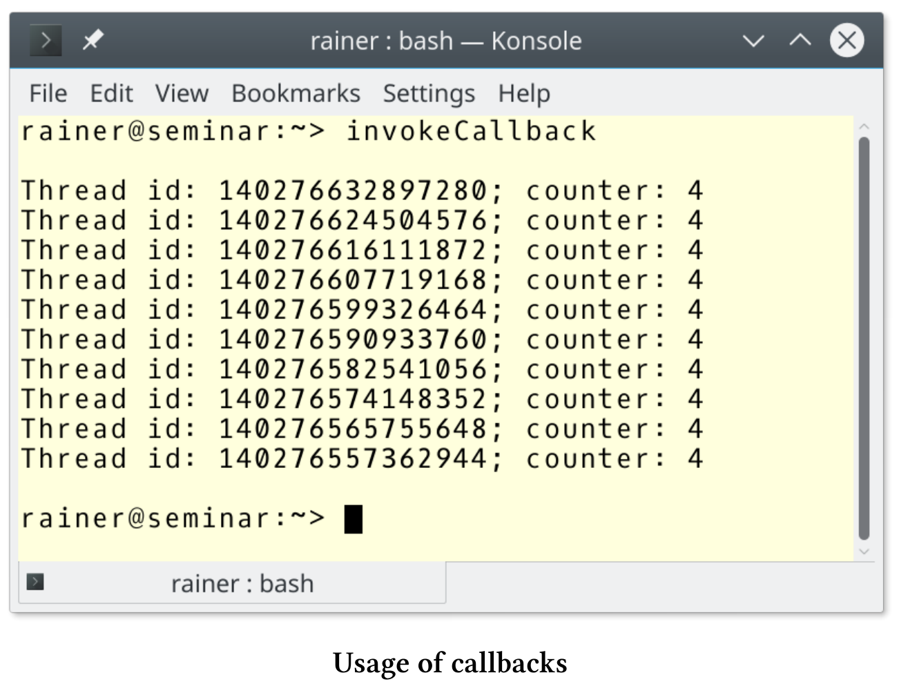

# 可中断的协程

`std::jthread`代表协作线程，除了C++11添加的`std::thread`外，`std::jthread`还可以自动汇入启动的线程，并发出中断信号。它的特性在提案[P0660R8](http://www.open-std.org/jtc1/sc22/wg21/docs/papers/2019/p0660r8.pdf)中进行了详细描述：可中断的协程。

## 自动汇入

下面`std::thread`的行为并不乐观。如果`std::thread`仍是可汇入的，则在其析构函数中调用`std::terminate`。如果调用了`thre .join()`或`thre .detach()`，则线程`thr`是可汇入的。

```c++
// threadJoinable.cpp

#include <iostream>
#include <thread>

int main() {

  std::cout << std::endl;
  std::cout << std::boolalpha;

  std::thread thr{ [] {std::cout << "Joinable std::thread" << std::endl; } };

  std::cout << "thr.joinable(): " << thr.joinable() << std::endl;

  std::cout << std::endl;

}
```

程序执行的时候，会崩溃掉。


运行了两次，`std::thread`都会非法终止。第二次运行时，线程`thr`有显示了消息:“Joinable std::thread”。

下一个示例中，我将头文件`<thread>`替换为`“jthread.hpp”`。并使用C++20标准中的`std::jthread`。

```c++
// jthreadJoinable.cpp

#include <iostream>
#include "jthread.hpp"

int main() {

  std::cout << std::endl;
  std::cout << std::boolalpha;

  std::jthread thr{ [] {std::cout << "Joinable std::thread" << std::endl; } };

  std::cout << "thr.joinable(): " << thr.joinable() << std::endl;

  std::cout << std::endl;

}
```

现在，如果线程`thr`会在调用析构时还是可汇入的，则会自动汇入。


## 中断std::jthread

为了理解其中的思想，我举一个简单的例子。

```c++
// interruptJthread.cpp

#include "jthread.hpp"
#include <chrono>
#include <iostream>

using namespace ::std::literals;

int main() {

  std::cout << std::endl;

  std::jthread nonInterruptable([] {
    int counter{ 0 };
    while (counter < 10) {
      std::this_thread::sleep_for(0.2s);
      std::cerr << "nonInterruptable: " << counter << std::endl;
      ++counter;
    }
    });

  std::jthread interruptable([](std::stop_token stoken) {
    int counter{ 0 };
    while (counter < 10) {
      std::this_thread::sleep_for(0.2s);
      if (stoken.stop_requested()) return;
      std::cerr << "interruptable: " << counter << std::endl;
      ++counter;
    }
    });

  std::this_thread::sleep_for(1s);

  std::cerr << std::endl;
  std::cerr << "Main thread interrupts both jthreads" << std::endl;
  nonInterruptable.request_stop();
  interruptable.request_stop();

  std::cout << std::endl;

}
```

主程序中启动了两个线程`nonInterruptable`和`interruptable`(第13行和第22行)。与线程`nonInterruptable`不同，线程`interruptable `会获取一个`std::stop_token`，并在26行使用它来检查线程是否被中断:`stoken.stop_requested()`。在中断的情况下返回Lambda函数，然后线程结束。`interruptable.request_stop() `(第37行)触发线程的结束。而`nonInterruptable.request_stop()`并没有什么效果。


下面来了解停止令牌、汇入线程和条件变量的更多细节。

## 停止令牌

协程的附加功能基于`std::stop_token`、`std::stop_callback`和`std::stop_source`。

**std::stop_token , std::stop_source 和std::stop_callback**

`std::stop_token`、`std::stop_callback`或`std::stop_source`使其能够异步请求执行停止，或查询执行是否收到了停止信号。可以将`std::stop_token`传递给操作，然后使用它来主动轮询停止请求的令牌，或者通过`std::stop_callback`注册回调。停止请求由`std::stop_source`发送，这个信号影响所有相关的`std::stop_token`。`std::stop_source`、`std::stop_token`和`std::stop_callback`共享停止状态的所有权，其中`request_stop()`、`stop_requested()`和`stop_possible()`是原子操作。

`std::stop_source`和`std::stop_token`组件为停止处理提供了以下属性。

`std::stop_source src`的成员函数

|       成员函数       |                           功能描述                           |
| :------------------: | :----------------------------------------------------------: |
|   src.get_token()    | 如果!stop_possible()，则构造一个不共享stop的stop_token对象状态；否则，构造一个stop_token对象，并共享使用*this的停止状态 |
| src.stop_possible()  |             如果停止源可以用于请求停止，则为true             |
| src.stop_requested() | 如果其中一个所有者调用了stop_possible()和request_stop()，则为true。 |
|  src.request_stop()  | 如果!stop_possible()或stop_requested()，则调用没有效果；否则，提出一个停止请求，以便同步调用stop_requested() == true和所有已注册的回调。 |

` std::stop_token stoken`的成员函数

|        成员函数         |                           功能描述                           |
| :---------------------: | :----------------------------------------------------------: |
| stoken.stop_possible()  |        如果后续调用stop_required()将永远不会返回true         |
| stoken.stop_requested() | 如果在相关的std::stop_source上调用了request_stop()，则为true，否则为false |

如果`std::stop_token`临时禁用了，那么可以用默认构造的令牌替换它。默认构造的令牌无效。下面的代码片段展示了，如何禁用和启用线程接受信号的功能。

临时禁用一个`std::stop_token`

```c++
std::jthread jthr([](std::stop_token stoken){
 ...
 std::stop_token interruptDisabled;
 std::swap(stoken, interruptDisabled);
 ...
 std::swap(stoken, interruptDisabled);
 ...
}
```

`std::stop_token interruptDisabled`是无效的。这意味着，从第4行到第5行停止令牌被禁用，第6行才启用。

下面的示例展示了回调的用法。

```c++
// invokeCallback.cpp

#include "jthread.hpp"
#include <chrono>
#include <iostream>
#include <vector>

using namespace ::std::literals;

auto func = [](std::stop_token stoken) {
  int counter{ 0 };
  auto thread_id = std::this_thread::get_id();
  std::stop_callback callBack(stoken, [&counter, thread_id] {
    std::cout << "Thread id: " << thread_id
      << "; counter : " << counter << std::endl;
    });
  while (counter < 10) {
    std::this_thread::sleep_for(0.2s);
    ++counter;
  }
};

int main() {

  std::cout << std::endl;

  std::vector<std::jthread> vecThreads(10);
  for (auto& thr : vecThreads)thr = std::jthread(func);

  std::this_thread::sleep_for(1s);

  for (auto& thr : vecThreads)thr.request_stop();

  std::cout << std::endl;

}
```

这10个线程中的每个都调用Lambda函数func(第10 - 21行)。第13 - 16行中的回调显示线程id和计数器。由于主线程的睡眠时间为1秒，子线程的睡眠时间为1秒，所以调用回调时计数器为4。`request_stop()`会在每个线程上触发回调。



**汇入线程**

`std::jhread`是一个`std::thread`变种，它具有发出中断信号，并自动汇入的附加功能。为了支持这个功能，它需要一个`std::stop_token`。

`std::jthread jthr`停止令牌的成员函数

|        成员函数        |         功能描述         |
| :--------------------: | :----------------------: |
| jthr.get_stop_source() |      返回stop_token      |
|  jthr.request_stop()   | 与src.request_stop()相同 |

**condition_variable_any成员函数wait的新重载**

`std::condition_variable_any`的三个`wait`变体`wait_for`和`wait_until`将有新的重载，新的重载会使用`std::stop_token`。

```c++

```

This new overloads require a predicate. The versions ensure to get notified if an interrupt is signaled for the passed std::stop_token stoken . The three overloads are equivalent to the following expressions.

Equivalent expression for the three overloads

```c++
template <class Predicate>
 bool wait_until(Lock& lock,
 Predicate pred,
 stop_token stoken);

template <class Clock, class Duration, class Predicate>
 bool wait_until(Lock& lock,
 const chrono::time_point<Clock, Duration>& abs_time,
 Predicate pred,
 stop_token stoken);

template <class Rep, class Period, class Predicate>
 bool wait_for(Lock& lock,
 const chrono::duration<Rep, Period>& rel_time,
 Predicate pred,
 stop_token stoken);
```

这个新的重载需要一个谓词函数。该版本在传入的`std::stop_token stoken`发出中断信号时，得到通知。这三个重载相当于下面的表达式。

```c++
// wait_until in lines 1 - 4
while(!pred() && !stoken.stop_requested()) {
  wait(lock, [&pred, &stoken] {
  	return pred() || stoken.stop_requested();
  });
}
return pred();

// wait_until in lines 6 - 10
while(!pred() && !stoken.stop_requested() && Clock::now() < abs_time) {
  cv.wait_until(lock,
  abs_time,
  [&pred, &stoken] {
  	return pred() || stoken.stop_requested();
  });
}
return pred();

// wait_for in lines 12 - 16
return wait_until(lock, chrono::steady_clock::now() + rel_time, std::move(pred), std\
::move(stoken));
```

调用`wait`之后，可以对停止请求进行检查。

```c++
cv.wait_until(lock, predicate, stoken);
if (stoken.stop_requested()){
	// interrupt occurred
}
```

